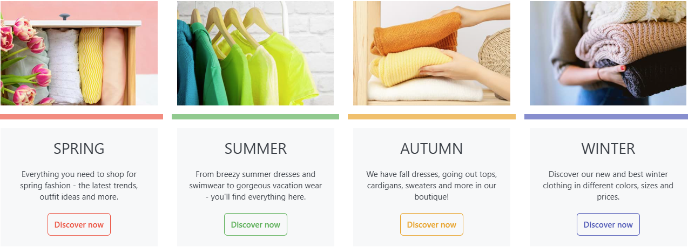

# Data Binding

Enables binding products, categories, and manufacturers to a block. This allows current data of these shop entities such as product name, price, or description to be displayed using placeholders within a block. It is also possible to link the block to the desired shop page.

Two block types support data binding:

• Text

• Image

So when you include one of these two block types, unlike other blocks, you will see the Data Binding tab in the configuration view of the block.



In this way, you can easily create stories that directly promote individual products or a product selection from manufacturers or categories. If changes are made to one of the products, all data within the story is automatically up to date.

## Settings

Enables binding products, categories & manufacturers to a block. To link a block with, for example, a product, you simply need to select the desired entity within the Block Editor under the Data Binding tab. If an item has been assigned to the block, placeholders can be inserted into input fields like Title, Tagline, Text, or URL at the push of a button. These placeholders ensure that product-related information is displayed directly in the story.

The following placeholders & constructs are available:

| Description               | Placeholder Code                             |
| ------------------------- | -------------------------------------------- |
| Name / Title              | `{{ Name }}`                                 |
| Manufacturer / Tagline    | `{{ TagLine }}`                              |
| Short Description / Intro | `{{ Description }}`                          |
| Price                     | `{{ Price }}`                                |
| Old Price                 | `{{ Regular Price }}`                        |
| Link                      | `{{ Url }}`                                  |
| Check for Content         | `` Then... `` |

In some cases, it makes sense to check a placeholder for specific content. As an example, you could check if a `RegularPrice` (old price) has been assigned to the item. If this is the case, special text should be output to alert the customer. Such functionality could look like this:

```
 Special Offer! Instead of {{ RegularPrice }} you pay  only {{ Price }}
```

With such a query, your text could look like this:

With value: “Special Offer! Instead of €69.90 you pay only €29.90”

Without value: “only €29.90”

With this methodology, it is possible to create dynamic, appealing, and always current product-related stories.

For a closer look at this topic, watch our [Data Binding Video](https://www.youtube.com/watch?v=gs52tRjfqyA\&list=PLog4smYIQ2NSZ5gfInsPxi-qGxMKCOf-s\&index=6\&t=1s).

**Note:** Data binding is only supported for the Text and Image blocks.
