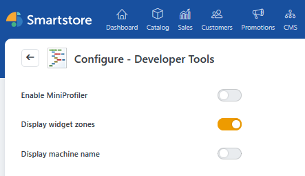
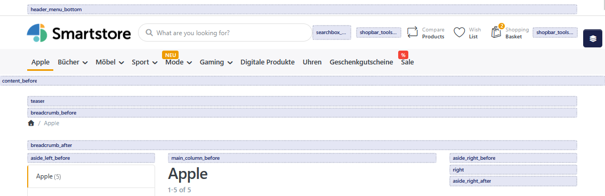
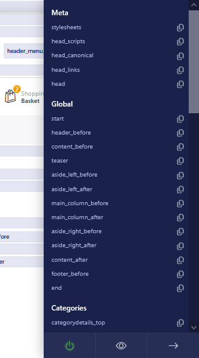
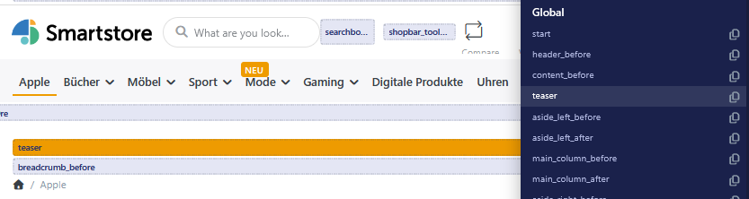
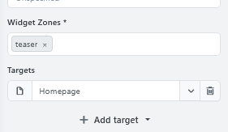

# Widget zones

Widget zones are predefined positions on the pages of your store. They determine **where** content appears, for example above the page content, within a specific page area, or before the footer.

Widget zones can be used for the following content, among other things:

- widgets from installed plugins,
- stories created with the [Page Builder](../plugins/pagebuilder.md),
- custom content created under [Managing Pages & Topics](managing-pages-topics.md).

The widget zones themselves are not visible to customers.

## Enabling the widget zone display

Before you can see the available widget zones in the store, their display must be enabled in Developer Tools.

1. In the backend, go to **Plugins > Developer Tools**.
2. Enable **Display widget zones**.
3. Save the configuration.
4. Open your store's frontend.

Widget zones are displayed only when you are signed in with an administrator account. They remain hidden from regular customers.


Developer Tools must be installed and enabled before widget zones can be displayed in the frontend.


## Displaying widget zones in the store

Since Smartstore 5.1, widget zones are displayed in a dedicated menu on the right side of the store frontend. This replaced the previous view in which a zone's name was displayed only directly on the page.

Open the widget zone menu using the layers icon on the right side of the browser window.

The menu contains a list of the widget zones available on the current page, grouped by page area.

You can use the menu as follows:

| Action | Function |
| --- | --- |
| **Select widget zone** | Scrolls to the corresponding position on the page and briefly highlights it. |
| **Copy icon** | Copies the name of the widget zone to the clipboard. |
| **On/off switch** | Determines whether widget zones remain permanently displayed. |
| **Eye icon** | Temporarily shows or hides the markers. |
| **Close** | Closes the widget zone menu. |

You can also show or hide the markers using **Alt + K**.


The menu displays the widget zones of the currently open page. Switch between the home page, a product page, and a category page, for example, to check the positions available on each page.


## Using a widget zone

Placing content usually requires two settings:

1. **Target page:** Specifies the page or content for which the output is rendered.
2. **Widget zone:** Determines the position within that page.

For example, a Page Builder story can target a product page and use a widget zone above the product description.

The available widget zones depend on the respective page, active theme, and feature being used. Some plugins determine their widget zone automatically.

## Selecting the appropriate position

Widget zone names often indicate their position. Suffixes such as **before** and **after**, for example, identify areas before or after specific page content.

To select a position:

1. Open the desired page in the store.
2. Open the widget zone menu.
3. Select a zone to highlight its position.
4. Copy the zone name if required.
5. Assign this widget zone to the desired content.

Then check the result directly on the intended page.

## Multiple items in a widget zone

If several items are assigned to the same widget zone, their display order determines the rendering sequence.

For plugin widgets, you can change the order under **CMS > Widgets** using drag and drop. For more information, see [Arranging Widgets](arranging-widgets.md).

## If content is not displayed

Check the following:

- Is the content published or enabled?
- Was the correct target page selected?
- Has an appropriate widget zone been assigned?
- Is the widget zone available on the page being viewed?
- Is the display restricted by a time period, store, or customer role setting?
- Does the display order place the content higher or lower than expected?

To check different themes or stores, use the preview described under [Previewing a Theme](../configuration/working-with-themes.md#previewing-a-theme).
