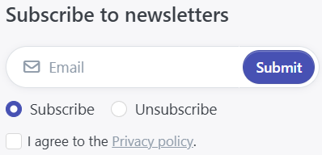

# Manage Newsletter Campaigns

Marketing is a crucial topic for shop operators. Therefore, every shop operator places a special focus on acquiring new customers through search engine optimization and other forms of online marketing. Newsletter marketing is a significant form of online marketing, as it allows you to leverage the potential of your existing customer base. If customers have had a good experience shopping in your store, they are more likely to purchase from you again. Therefore, you should remind your customers every now and then that you still offer an interesting product selection and inform them about special discounts or new products.

Use the setting **Configuration > Settings > Customer Settings > Hide newsletter box** to enable or disable the newsletter registration form in the footer of your shop. This is where your shop visitors can subscribe to or unsubscribe from your newsletter.

## Manage Campaigns

You can manage your campaigns by navigating to **Admin > Marketing > Campaigns**. To create a new campaign, click on **AddNew**. You can now specify a **Name** for the campaign for internal use, a **Subject** for the email to be created, and the text of the HTML **Body**, which represents the content of the email.

### Message Placeholders

Message placeholders (internally referred to as MessageTokens) are replaced at runtime with values that you have configured in your shop or with values related to data valid in the given context.

The available placeholders are displayed as soon as you click on **+ Select placeholder**.

Examples of possible message placeholders for newsletter campaigns are listed in the following table.

| Token | Description |
| :--- | :--- |
| %Store.Name% | Name of the store for which the campaign is being sent. |
| %Store.URL% | The URL of the store for which the campaign is being sent. |
| %Store.Email% | The email address of the store for which the campaign is being sent. |
| %NewsLetterSubscription.Email% | The email address of the customer to whom the campaign is sent. |
| %NewsLetterSubscription.ActivationUrl% | The link used to activate the email address to receive newsletters from your shop. |
| %NewsLetterSubscription.DeactivationUrl% | The link used to deactivate email addresses that should no longer receive newsletters from your shop. |
| %Store.SupplierIdentification% | The Supplier Identification is an HTML table populated by various data you configured in the settings. It includes information about your company, such as the company name, company address, contact, and billing details. |

In the **Stores** tab, you can restrict the campaign to specific stores. Once you have saved the campaign, it can be sent to all your subscribers by clicking **Send Mass Email**. You can also send a test email by clicking **Preview**. A preview window will open where you can enter the recipient of the test newsletter in the **Test email to...** field. We **strongly** recommend sending a test email so you can preview your newsletter before sending it to thousands of your customers.

## Manage Subscribers

To manage your newsletter subscribers, go to **Admin > Marketing > Newsletter Subscribers**. There you will see a list of all your customers who have signed up for your newsletter. You can search the list and manually activate or deactivate individual subscribers. If you have previously managed your newsletter campaigns with another tool, you can import your subscriber list into Smartstore using a CSV file. The list must contain values in the first column indicating the subscriber's email address. It can also contain two additional values per row. For example, the second column can contain a value indicating whether the subscriber is active, and the third column can specify a specific store (e.g., via the respective Store ID). Headers for the rows are not necessary.

Create an [Import Profile](../datenaustausch/import/importprofile-verwalten.md) to import your newsletter subscribers. Create an [Export Profile](../datenaustausch/export/exportprofile-verwalten.md) if you wish to export newsletter subscribers.