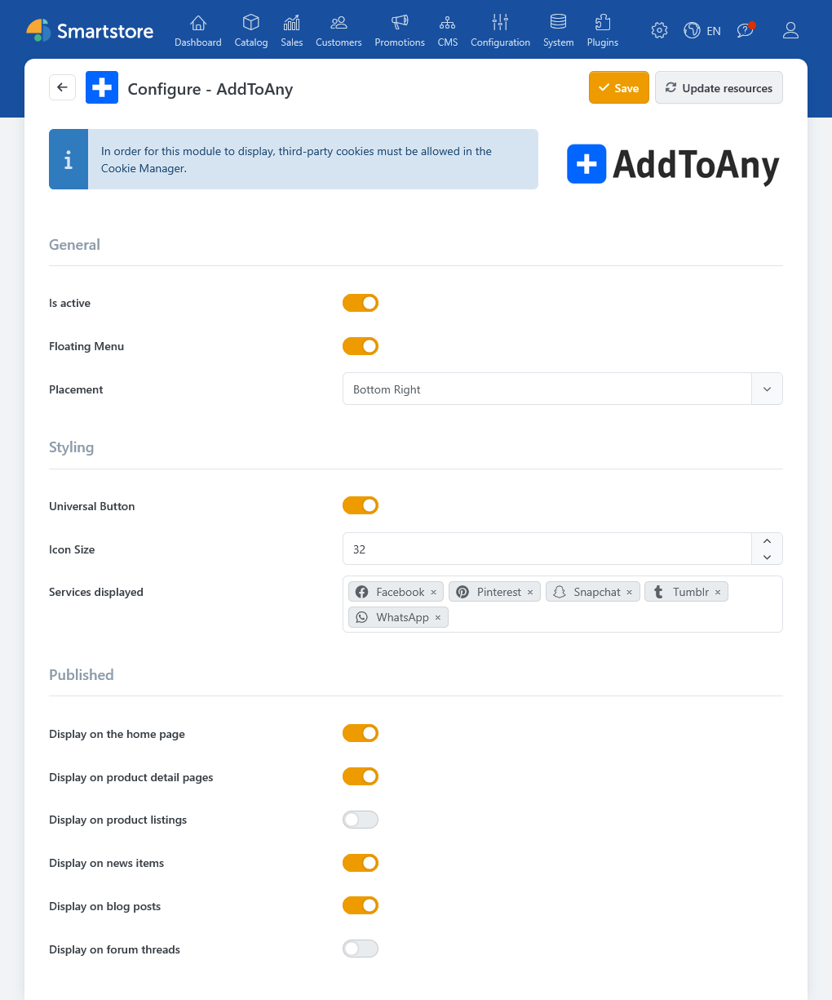

# AddToAny

The [AddToAny](https://www.addtoany.com/) plugin adds a widget to specified pages, allowing visitors to share content via various social media platforms and communication services.

## Requirements:

For the widget to display, the following conditions must be met:

- Third-party cookies must be allowed in the cookie manager.

## Configuration

The configuration is done through the plugin settings (Plugins &rarr; AddToAny). Among other things, you can specify the placement and design of the widget, offered services, and the applicable pages.

The services available in the widget can be selected and added via the dropdown menu.

