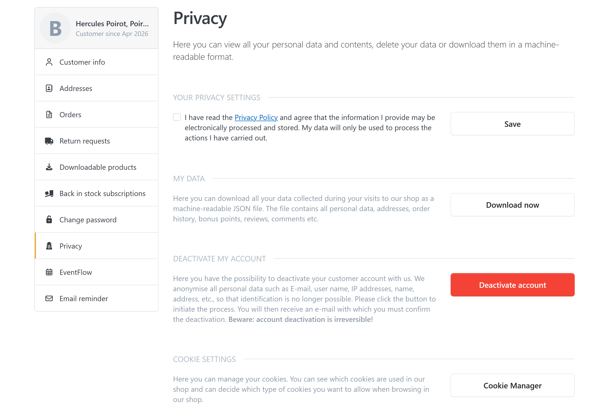
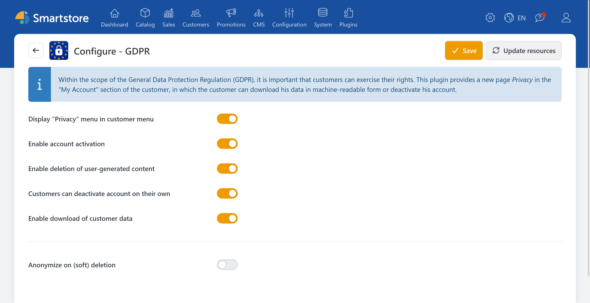

# GDPR

Since Smartstore version **3.1.5**, Smartstore supports the requirements of the General Data Protection Regulation (GDPR) through corresponding features in the shop context. The goal is to help customers and shop operators represent data-protection-relevant processes in a legally compliant way and to implement specific rights of data subjects.

As part of the GDPR functionality, Smartstore in particular covers the following areas:

- **EU Cookie Directive**: Transparent and controllable use of cookies via suitable notices and settings.
- **Deletion or restriction of customer data**: Support for deletion requests that ultimately reduce the customer’s identifiability (e.g., through anonymization).
- **Anonymization of customer data**: A feature that alters data so that direct association with a person is no longer possible.
- **Download functionality for customer data**: Customers can view their own data or receive it as an export (JSON format) in order to exercise their rights under the GDPR.

In this context, it is especially important that, depending on the selected setting, actions are either:

- triggered directly in the customer account (e.g., deactivate account),
- require an additional confirmation step,
- or start optional backend post-processing (e.g., automatic anonymization after a deletion process).

It is also taken into account that Smartstore **generally does not fully remove customer data records from the database**, but instead **marks them as deleted** and then (if configured) anonymizes them. This ensures technical integrity and traceable processes in the system, while at the same time reducing the identifiability of the record.

## Configuration

| **Input field / Option** | **Description** |
| :--- | :--- |
| Display "Privacy" menu in customer menu | Determines whether a new item "Privacy" should be offered in the "My Account" customer menu. |
| Offer account deactivation | When deactivating an account, all data that could identify a customer (email, IP address, name, address, etc.) is anonymized. |
| Offer deletion of user-generated content | User-generated content includes product reviews, forum posts, news and blog comments, etc. Data is merely masked/pseudonymized. Actual deletion at the record level never takes place. |
| Customers can deactivate account independently | Determines whether a customer can deactivate their account independently or whether a request must first be sent to the shop operator. In both cases, multiple confirmations by the customer are required. |
| Enable download of customer data | Determines whether a customer can download their data independently in JSON format. |
| Anonymize automatically after deletion process | Determines whether anonymization should occur automatically after a customer deletion process in the backend. Please note: in Smartstore, customer records are generally not removed from the database, but merely marked as deleted. |