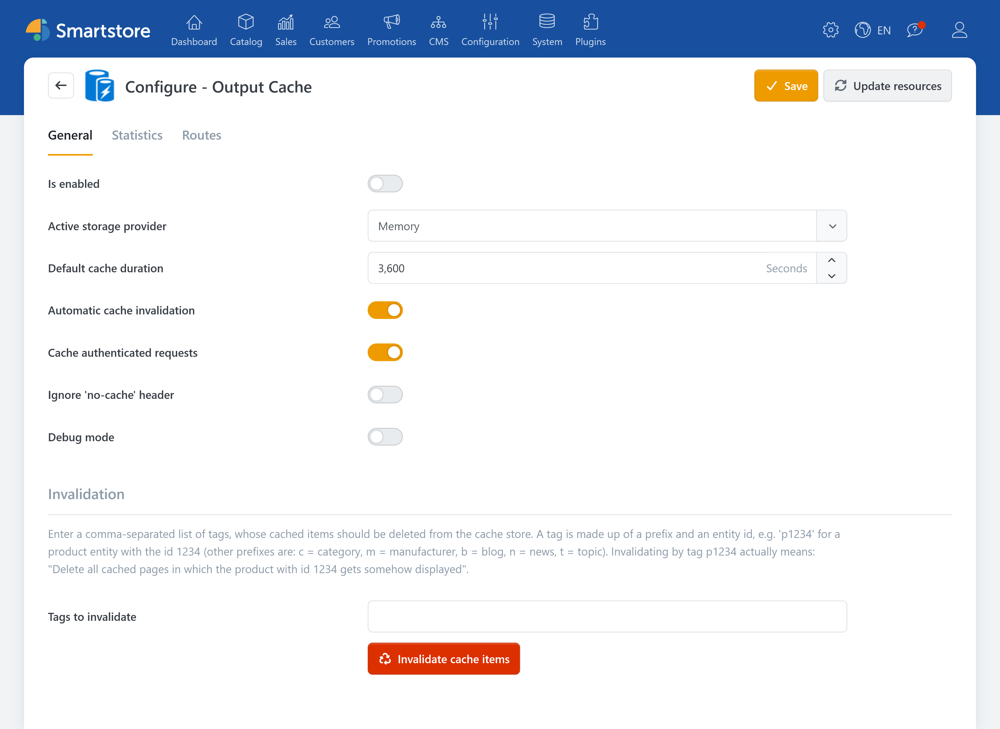
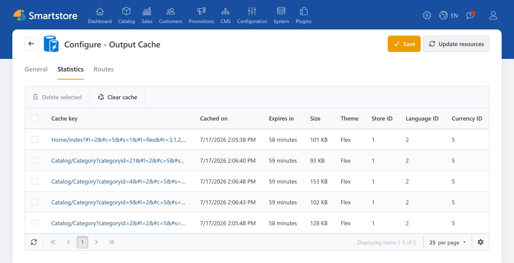

# Output Cache

With **Output Cache**, the finished versions of complete shop pages are cached. That means Smartstore doesn’t have to recalculate and regenerate everything from scratch for every request. Instead, the page can be delivered from the cache for matching requests. This saves processing time and makes pages load faster, especially on high-traffic pages such as categories, list views, or overview pages with content.

The cache runs on the server and can optionally be configured to refresh when important content in the shop changes. This keeps the shop fast while also making it as up to date as possible.

## Benefits

### Faster page load times
Pages that are visited frequently don’t have to be fully rebuilt every time. This reduces waiting time, especially on pages that are called often.

### Less load on the system
Smartstore has to do less computation because the ready-made page content can be reused. That means fewer repeated processing steps for every request and the shop runs smoother overall.

### More stable user experience during high traffic
When many visitors are active in the shop at the same time, it’s more likely that some pages load slower because many requests need to be recalculated in parallel. With the Output Cache, part of that work is done ahead of time and reused, so performance remains more consistent.

### Control over how long content is kept
You can set how long a page remains in the cache before it’s regenerated. This determines how strongly “speed” is prioritized over “maximum freshness.” Short cache durations keep content more current, while longer cache durations improve performance.

## Configuration

| **Input field / Option**                 | **Description**                                                                                                                                                                                                                          |
| ---------------------------------------- | ---------------------------------------------------------------------------------------------------------------------------------------------------------------------------------------------------------------------------------------- |
| Is active                                | Determines whether output caching is active.                                                                                                                                                                                             |
| Active storage provider                  | Determines the active storage provider. 'Local storage' is the fastest, but not suitable for web farms. Choose 'Database' or another distributed storage mechanism - e.g., 'Redis' - if you are running a web farm.                      |
| Default cache duration                   | Sets the duration in seconds that pages should be cached on the server by default.                                                                                                                                                       |
| Automatically invalidate pages           | Determines whether cached pages should be automatically invalidated if at least one dependency has changed (dependencies are entities such as product, category, blog entry, etc.).                                                      |
| Allow caching for authenticated requests | Determines whether caching is active even when the customer is logged in. However, note that variation occurs only by customer roles, not by individual customers. Disable this option if your shop generates customer-specific content. |
| Ignore 'no-cache' headers                | Determines whether pages should be loaded from the cache despite 'Content-cache: no-cache' headers. Recommended for testing.                                                                                                             |
| Debug mode                               | Outputs general information in the response header ((X-SmartStore-Cached-On, X-SmartStore-Cached-Until)).                                                                                                                                |


**Attention**

The Routes and Invalidation options should only be used/changed by experienced users.


## Statistics

Under the Statistics tab, the pages stored in the cache are displayed and can also be deleted from the cache there.

