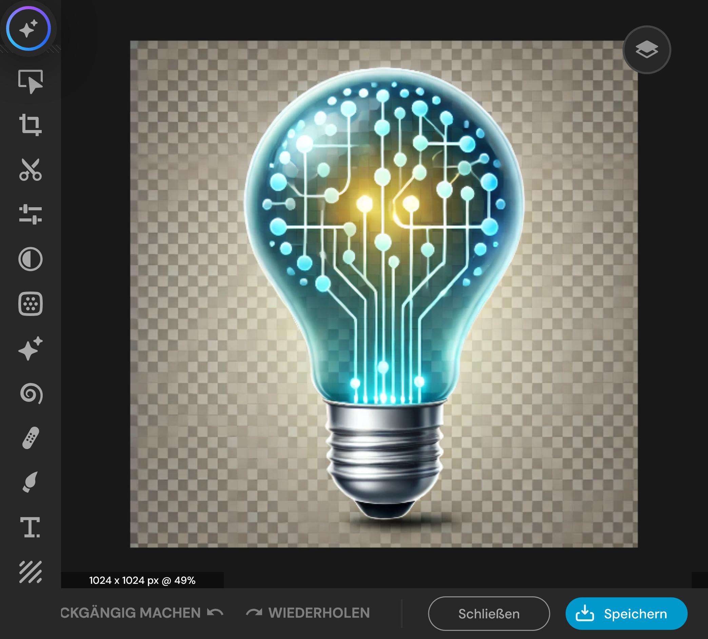
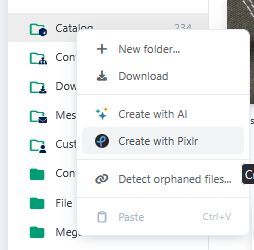
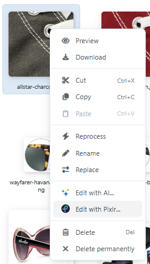
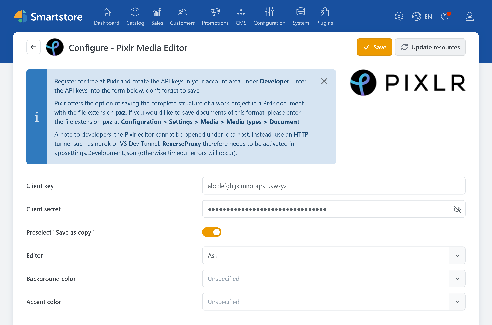

# Pixlr

Allows you to create and edit images directly in the Media Manager.

## Usage in Media Manager

Pixlr functionality is integrated into the Media Manager starting with Smartstore v6. To access it, navigate to **CMS** → **Media** in the backend. We offer two ways to use Pixlr:

* With the option **Create with Pixlr**, which appears after right-clicking a folder, you can create new content.

  

* Editing can be started by right-clicking an image and selecting **Edit with Pixlr**.

  

Both variants open the Pixlr editor, which allows for a multitude of editing possibilities.


Since the editor is provided by Pixlr itself, we cannot list all functions or answer questions about them. Please check the [Pixlr webpage](https://pixlr.com/) and contact [Pixlr Support](https://pixlr.com/support/) if you have any questions.


After you have saved the image in Pixlr, a Smartstore dialog appears. This offers the option to overwrite the old file or to create a new file under a new name. After you have made a selection, the edited image is located in the Media Manager and can be used anywhere.

## Configuration

| **Option** | **Description** |
| --- | --- |
| Client key | Sets the Pixlr client key to be used. |
| Client secret | Sets the Pixlr client secret to be used. |
| Editor | Determines whether the extended Pixlr editor should be used. |
| Preselect “Save as copy” | By default, selects the option “Save as copy” in the save dialog. |
| Background color | Sets the editor’s background color (workspace). |
| Accent color | Sets the accent color for certain elements in the editor (e.g., buttons and tooltips). |