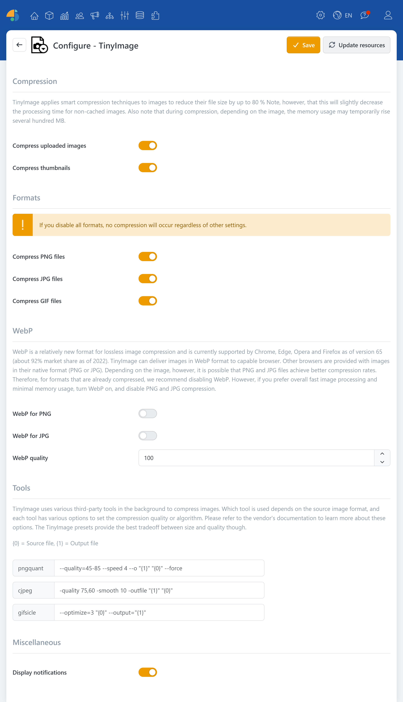

# TinyImage

> Image compression up to 80%

TinyImage is a plugin that can significantly reduce the file size of uploaded images without requiring you to manually recompress every image. You get slimmer media files, shorter loading times, and an overall smoother user experience, especially on pages with lots of images (e.g., product listings, blogs, or content pages).

In the background, TinyImage uses intelligent compression strategies: depending on the image format and the image content, suitable methods are applied to reduce the amount of storage needed. As a result, the image file size can be noticeably reduced, depending on the original image. Dynamically generated thumbnails are also taken into account, so the optimization applies not only to uploaded originals, but also to the preview images used in the display.

## Use cases

* **Compress uploads**: Compresses images directly during upload.
* **Compress thumbnails**: Dynamically optimizes generated thumbnails.

## Formats

TinyImage works format-dependently and supports the image formats [PNG](https://en.wikipedia.org/wiki/PNG), [JPG](https://en.wikipedia.org/wiki/JPEG) and [GIF](https://en.wikipedia.org/wiki/GIF).

### WebP

[WebP](https://en.wikipedia.org/wiki/WebP) is a modern image format that compresses relatively efficiently and—depending on the use case—can deliver good results in terms of file size and quality. TinyImage can generate WebP as an output format, so WebP-capable browsers receive the optimized versions.


Browsers that do not support WebP will continue to receive images in the original format (PNG or JPG).


## Configuration

| **Option** | **Description** |
| ------------------------ | ------------------------------------------------------------------------------------------------------------------------------------------------------------------------------------------------------------------------------------------------------------------------------------------------------------------------------------------------------------------------------------------------------------------------------------------------------------------------------------------------------------------------------------------------------------------------------------------------------- |
| **Compression** | TinyImage applies intelligent compression techniques to images to reduce their file size by up to 80%. However, please note that this slightly decreases processing speed for images that are not yet cached. Also note that during compression - depending on the image - memory usage may temporarily increase by several hundred MB. |
| Compress uploads         | Applies compression to uploaded images. |
| Compress thumbnails      | Applies compression to dynamically generated thumbnails. |
| **Formats** | **Info**  If you disable all formats, no compression will take place, regardless of other options. |
| Compress PNG files       | Reduces the size of PNG files by selectively decreasing the number of colors. |
| Compress JPG files       | Reduces the size of JPG files. Also generates 'progressive' JPEGs if the source file is larger than 10 KB. |
| Compress GIF files       | Reduces the size of (animated) GIF files. |
| **WebP** | WebP is a relatively new format for lossless image compression and is currently supported by Chrome, Chrome Mobile, and Opera (approx. 70% market share as of 2018). TinyImage can deliver images in WebP format to the browser if supported. Other browsers are served images in their original format (PNG or JPG). Depending on the image, however, better compression rates may be achieved for PNG and JPG files. Therefore, we recommend disabling WebP for formats that are already being compressed. However, if you value overall fast image processing and minimal memory usage, turn on WebP and turn off PNG and JPG compression. |
| WebP instead of PNG      | Generates and delivers WebP instead of PNG files to WebP-enabled browsers. |
| WebP instead of JPG      | Generates and delivers WebP instead of JPG files to WebP-enabled browsers. |
| **Tools** | TinyImage uses various third-party tools in the background for compression, with the selection depending on the file format. Each tool offers various options for defining output quality. The TinyImage default settings offer the best compromise between file size and quality. If you still wish to make adjustments, visit the provider sites for more information. |
| **Miscellaneous** | |
| Display notifications    | Displays a short summary of the achieved compression rate after a file upload. |