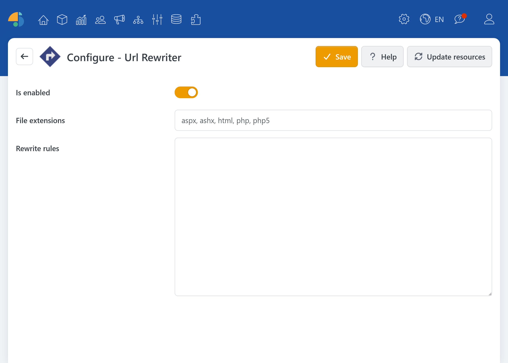

# UrlRewriter

With the UrlRewriter plugin, you can define URL redirection rules in the shop backend. This is especially useful when pages have been moved, product or category URLs have changed, or when you want to route to different targets for specific domains or stores (e.g., in a multi-store environment).

The plugin uses a syntax based on **Apache mod_rewrite** with reduced functionality. This allows you to set a clear rule per line and control the redirect behavior via optional switches.

## Rules

The rules are entered in the plugin configuration area and are structured line by line:

* Exactly **one** Rewrite rule per line (without the `RewriteRule` directive).
* Comments are allowed and start with `#` or `//` at the beginning of a line.

The plugin supports a `mod_rewrite`-compatible syntax, but without the following directives: `RewriteBase`, `RewriteCond`, `RewriteRule`, `RewriteMap`, `RewriteEngine`.

This makes the tool particularly suitable for common use cases such as **301 redirects**, pattern-based substitutions (e.g., folders/subpaths), and **host-specific rules**.

### Examples

Typical rules consist of a pattern (how an incoming URL is recognized) and a target (where the URL should be redirected to).

* **Simple Redirect**: old URL &rarr; new URL `/old-page /new-page [R=301,NC]`
* **Pattern with path parts**: e.g. for categories/folders, so the part after the folder is kept `/pdfs/(.*)$ /documents/pdfs/$1 [R=301,NC]`
* **Host-dependent rules**: In multi-store setups, the target URL can vary depending on the domain `/old-url$ /new-url [R=301, NC, H=myshop1.de]`

### Advanced Usage

The following details about **the switches**, **escaping** (which characters should be treated as special characters during input), and the option to provide rewrite rules **additionally/optionally via external files** are available directly using **the help button (Configuration &rarr; Help)**. That is where the relevant options, file names (for mod_rewrite or IIS Rewrite), and the rule priority between plugin rules and file rules are clearly summarized.

## Configuration

| **Option** | **Description** |
| ------------------------ | ---------------------------------------------- |
| Is enabled | Determines whether the redirect rules are currently effective. Disable this option to temporarily switch off changes. |
| File extensions | For static files: comma-separated list of file extensions (without the dot) that should be considered when processing the rewrite rules. |
| Rewrite rules | Enter the rules here line by line, with which incoming URLs are matched and redirected to target URLs. |