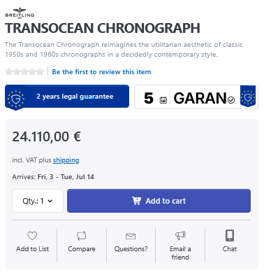
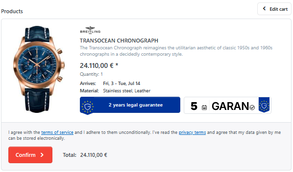
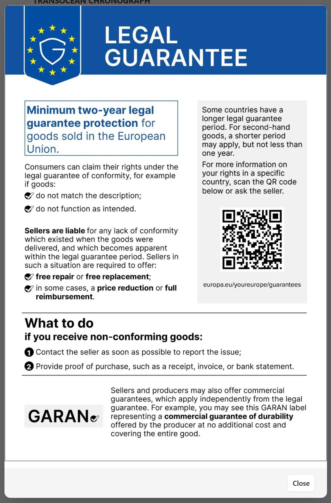
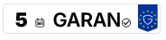
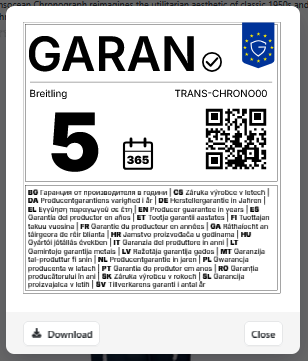
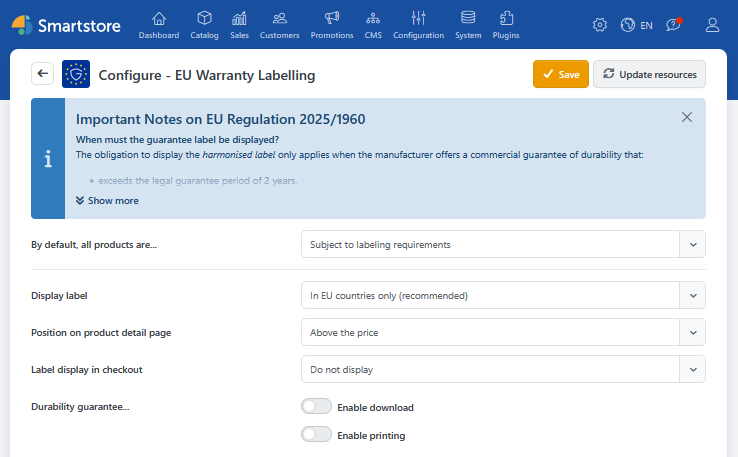
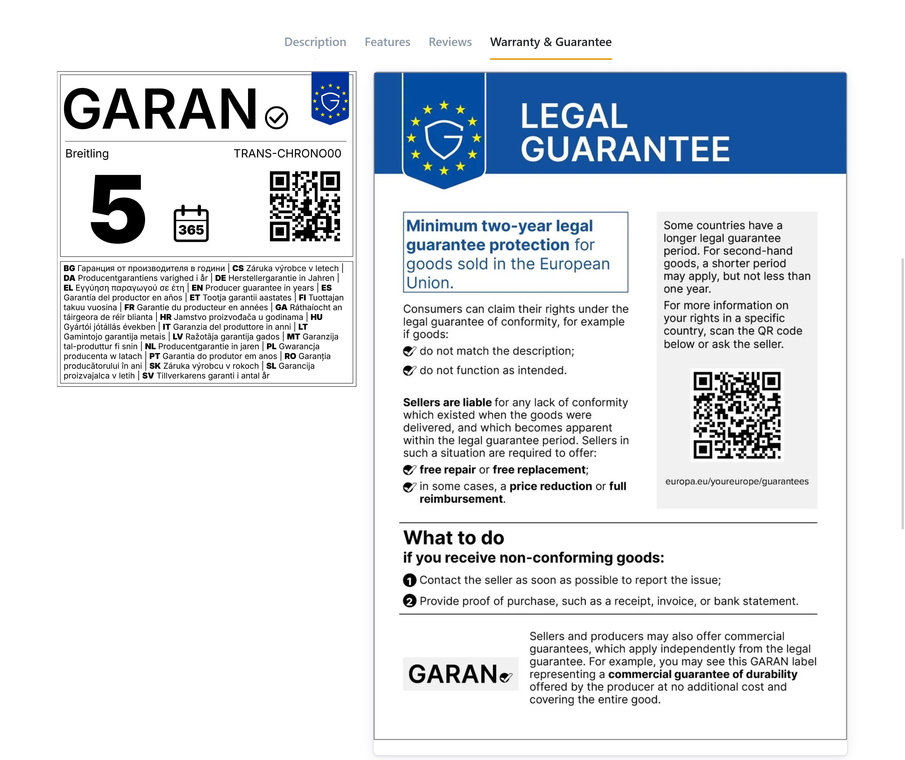
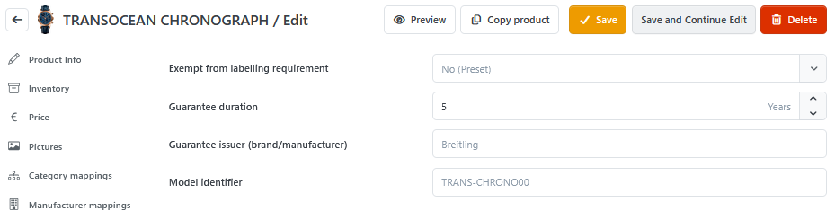

# EU Warranty Labelling

This plugin allows you to configure and display the harmonized EU labels for warranty and guarantee on the product detail page and, if necessary, at checkout.

## Warranty

Depending on the plugin's configuration, the warranty label is displayed either on the product detail page or on the order confirmation page during the checkout process. Both areas can be [controlled separately](warranty.md#plugin-configuration).

When clicked, the warranty label opens a pop-up with information about the legal warranty.

## Guarantee

The warranty label is only issued if data is entered for the fields "Guarantee issuer" and "Model identifier" and a warranty period of more than two years is set.

Just like with the warranty label, a pop-up with information is displayed when you click on the guarantee label. The label is automatically generated from the data entered in [the product editor](warranty.md#product-editor).


The **Download** and **Print** buttons can be [switched on and off separately](warranty.md#plugin-configuration).


## Settings

### Plugin Configuration

The labels' settings, as well as their placement and the optional buttons, can be set in the configuration.


Further setup information, import instructions, and general tips, can be found in the blue notice box.


#### Display as a tab

If "Dedicated tab" is selected as the position on the product detail page, the "Warranty" or "Warranty & Guarantee" tab will be added depending on the product data. This contains the content of the corresponding pop-ups.

### Product-Editor

In the "EU Warranty" tab of the product editor, you can enter product-specific warranty information. Based on this information, the label is then generated in the front end.

The default settings for the individual fields are as follows:

|Option|Description|
|---|---|
|Exempt from labeling requirements|The setting **By default, all products are...** from the plugin configuration.|
|Guarantee duration|No entry &rarr; The warranty label is not displayed.|
|Guarantee issuer (brand/manufacturer)|The manufacturer of the product.|
|Model identifier|The manufacturer's product number (MPN) of the product.|

## Import

The data for the warranty label can also be entered via product import.

The import file must contain the key field "SKU" as well as the fields "DurabilityGuaranteeIssuer", "DurabilityGuaranteeDurationYears" and "ModelIdentifier".


A sample file is available for download in the plugin configuration notice box.
