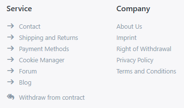
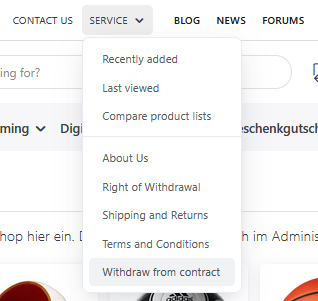
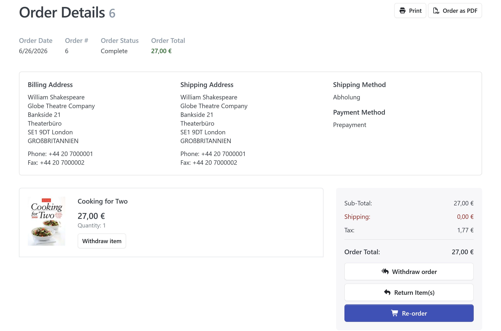
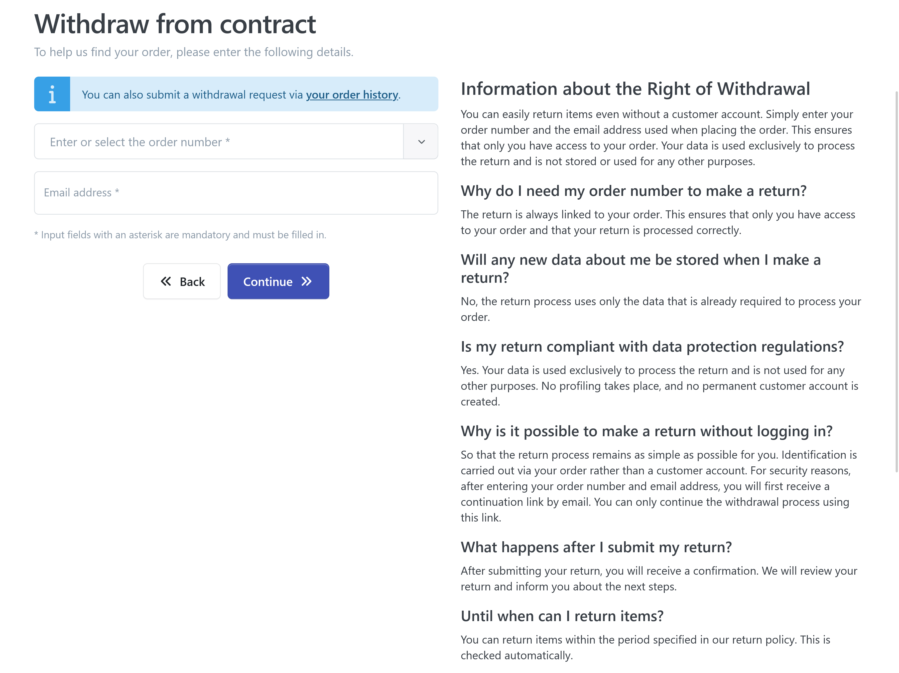
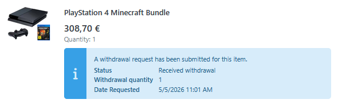
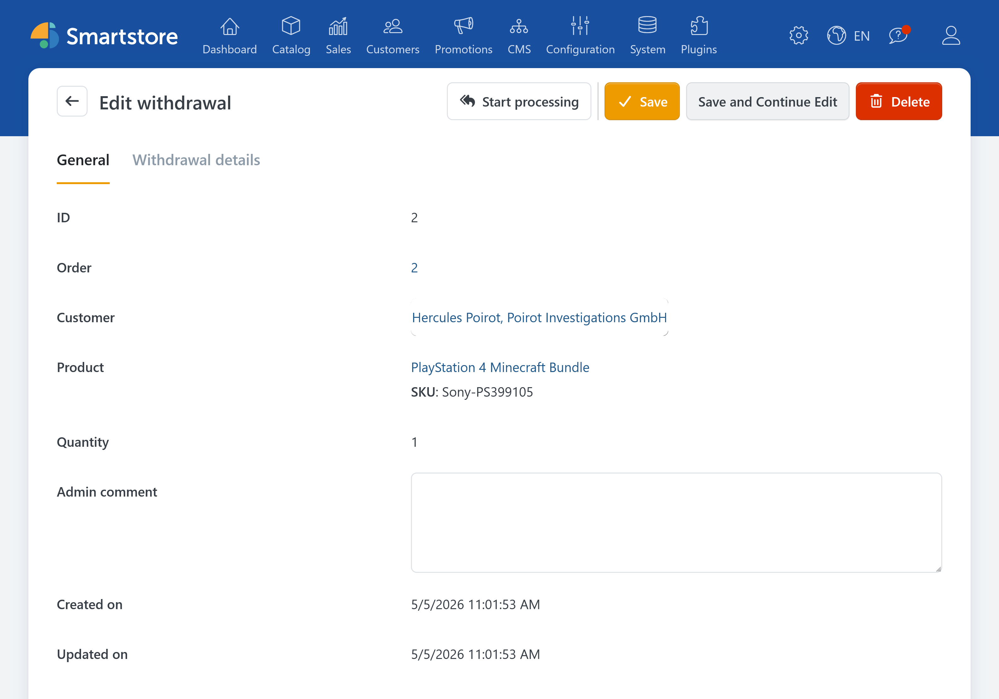
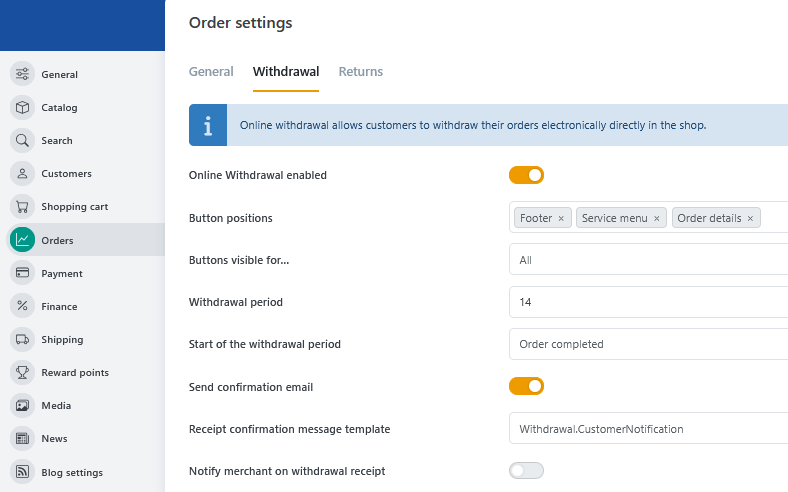

# Withdrawal

The "Withdrawal" plugin supports every step of the online order withdrawal process: from the request to the verification and confirmation to the tracking.

## Withdrawal vs. Return

The "Return items" option is still available within the return process, but has been updated.

Standard workflow:

1. A customer/guest sends a withdrawal request.
2. The shop owner is notified.
3. The shop owner converts the withdrawal into a return request.
4. The return process remains the same.

## The road to Withdrawal

### General

Both the Service Footer and the Service Menu have a "Withdraw from contract" option for canceling your contract. This button is visible to all users, including guests.

| Withdrawal in the footer                                        | Withdrawal in the menu                                               |
| --------------------------------------------------------- | -------------------------------------------------------------- |
|  |  |


Registered customers can withdraw their purchase on the order details page in the "My Account" section.



Next, an information page about the withdrawal will appear, on which the corresponding order will be selected. To withdraw an order, guests must provide their order number and email address. Registered customers can choose the order via a dropdown menu.

After selecting the order to be withdrawn, either the entire order or only individual products or items can be withdrawn.

To verify their email account, guests will receive an email with a proceed link. The withdrawal is only complete after this link has been confirmed.


Emails with the proceed link are sent directly and do not appear in the email management.


Once the withdrawal is complete, the customer will be notified by email, as will the shop owner if this option is selected (see configuration).

The status of the withdrawal can be viewed in the order details in the "My Account" section.

## Backend

### Listing

A list of all returns can be viewed together with the return requests under **Sales** &rarr; **Withdrawals and Returns**.

Clicking on the ID of a withdrawal displays the withdrawal and allows it to be edited. In the "Withdrawal details" tab, you can view the data provided by the buyer regarding the withdrawal.

#### Order details

The status of the withdrawal is displayed in the order details in the "Products" tab below the product listing.

### Configuration

The configuration is done in the order settings (**Configuration** &rarr; **Settings** &rarr; **Orders**) in the tab "Withdrawal".

The position and visibility of the buttons, as well as the withdrawal period, its start and the sending of emails to customers and shop owners, can be defined here.

In addition to the global setting, the withdrawal period can be set for individual products or for a category (if it should apply to all products in that category). If the value 0 (days) is set here, the product can generally not be withdrawn.

By default, the withdrawal and return functions are activated simultaneously after installing the plugin.


Optionally, returns can be deactivated in the order settings (**Configuration** &rarr; **Settings** &rarr; **Orders**). This is useful if you do not want the return request button to be displayed alongside the cancellation button in the order details of the "My Account" section.


## Customization

The withdrawal button and related notifications can be customized to match the design of the shop.

### Message templates

The following message templates can be used to adjust the texts that are sent in connection with the withdrawal process.

| Message template              | Meaning|
| ------------------------------- | --------------------------------------------------------------------------------- |
| Withdrawal.CustomerNotification | Notification that customers receive after a successful withdrawal.          |
| Withdrawal.MerchantNotification | Notification that the shop owner receives after a successful withdrawal. |
| Withdrawal.ProceedLink          | Security check that the customer receives before completing the withdrawal.         |

### Change the link's appearance

To customize the withdrawal link, you can add your own CSS instructions to the file "_user.scss". The selector `a[href='/withdrawal/']` allows for targeted adjustment of the appearance of this link.

The resource for the text of the withdrawal link can be changed in [the language settings](../configuration/managing-languages.md#how-to-add-or-edit-a-single-resource) under `Plugins.Smartstore.Withdrawal.WithdrawContract`.

### Add link manually

The withdrawal link is automatically included by default. If you want it to be displayed in an additional or customized position, you can also insert it manually. For the link to work properly, it must:

* point to `/withdrawal/`
* have the **rel** attribute set to `nofollow`

Example: `<a href="/withdrawal/" rel="nofollow">Withdraw from contract</a>`
