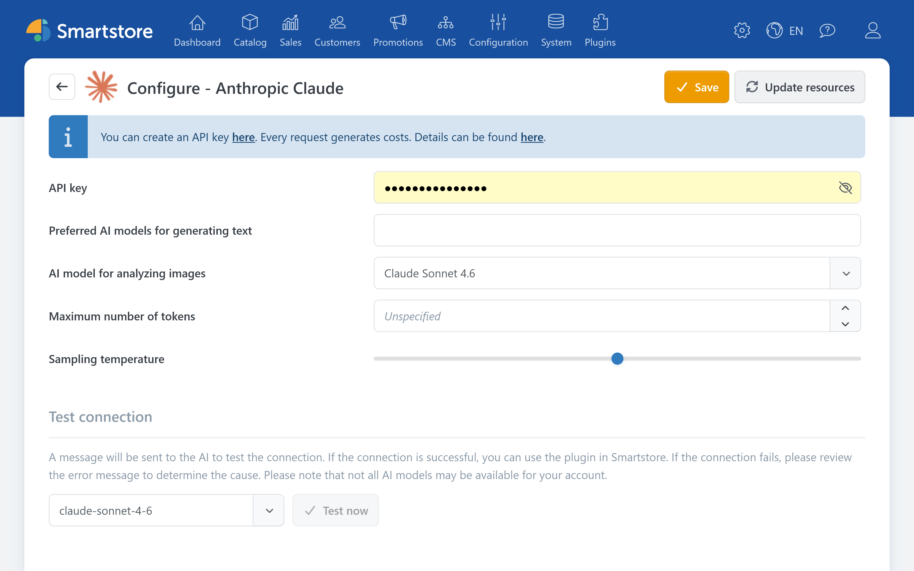

# Anthropic Claude

The Anthropic Claude plugin enables Smartstore's AI features to generate text, translate content, and analyze images.


The Anthropic Claude plugin provides the connection to Anthropic. The features for creating and editing content are provided by the [AI plugin](../ai.md).


For information about API access, refer to the [official Anthropic documentation](https://docs.anthropic.com/en/docs/intro-to-claude).

## Configuration

| **Option** | **Description** |
| --- | --- |
| API key | Authenticates Smartstore with the Anthropic API. A Claude subscription does not automatically include use of the Anthropic API. |
| Preferred AI models for generating text | Defines which available text models are offered in Smartstore's AI dialogs. If left empty, Smartstore uses the provider's preferred default models. |
| AI model for analyzing images | Defines which model analyzes image content and generates information such as titles, alt text, and tags. |
| Maximum number of tokens | Limits the length of a response. Setting this value too low can result in incomplete longer outputs. The available upper limit depends on the selected model. |
| Sampling temperature | Controls response variation. Lower values generally produce more predictable results, while higher values produce more varied results. |

The plugin does not provide image-generation settings. Claude can analyze images but does not generate images in Smartstore.

### Verification

1. Save the settings.
2. Click **Reload models** to reload the available models.
3. Under **Test connection**, select a text model and click **Test now**.

If the connection cannot be established, check the API key, available API credits, usage limits, and whether your API account can access the selected model.


API requests can incur usage-based costs.

