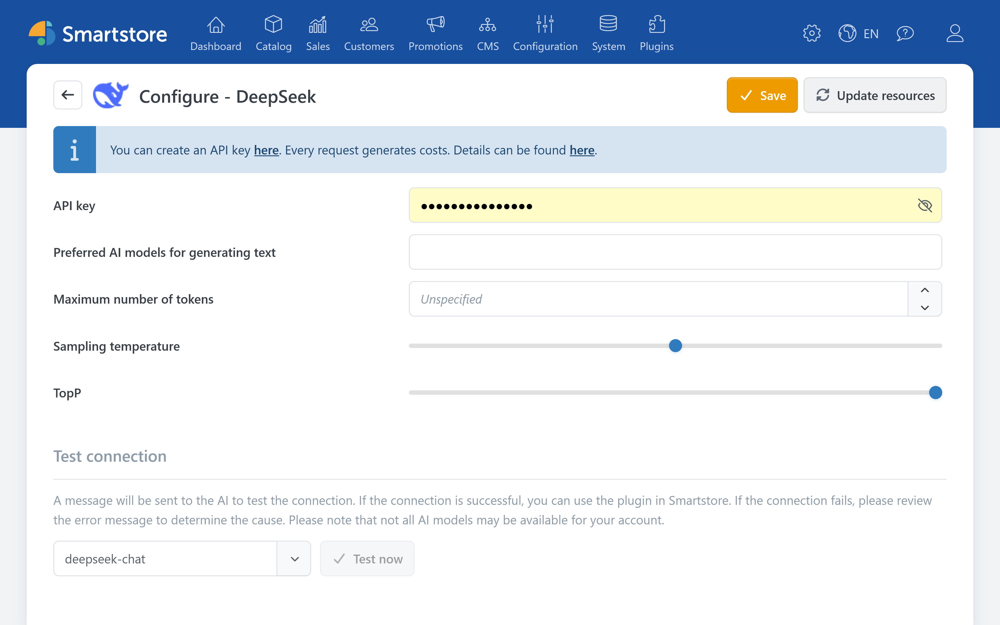

# DeepSeek

The DeepSeek plugin enables Smartstore's AI features to generate text and translate content.


The DeepSeek plugin provides the connection to DeepSeek. The features for creating and editing content are provided by the [AI plugin](../ai.md).


For information about API access, refer to the [official DeepSeek documentation](https://api-docs.deepseek.com/).

## Configuration

| **Option** | **Description** |
| --- | --- |
| API key | Authenticates Smartstore with the DeepSeek API. |
| Preferred AI models for generating text | Defines which available text models are offered in Smartstore's AI dialogs. If left empty, Smartstore uses the provider's preferred default models. |
| Maximum number of tokens | Limits the length of a response. Setting this value too low can result in incomplete longer outputs. The available upper limit depends on the selected model. |
| Sampling temperature | Controls response variation. Lower values generally produce more predictable results, while higher values produce more varied results. |
| TopP | An alternative method for controlling response variation. Usually, either TopP or the sampling temperature should be adjusted, but not both. |

The plugin does not support image generation or image analysis in Smartstore. The corresponding selection fields are therefore not displayed.

### Verification

1. Save the settings.
2. Click **Reload models** to reload the available models.
3. Under **Test connection**, select a text model and click **Test now**.

If the connection cannot be established, check the API key, available balance, usage limits, and the availability of the selected model.


API requests can incur usage-based costs.

