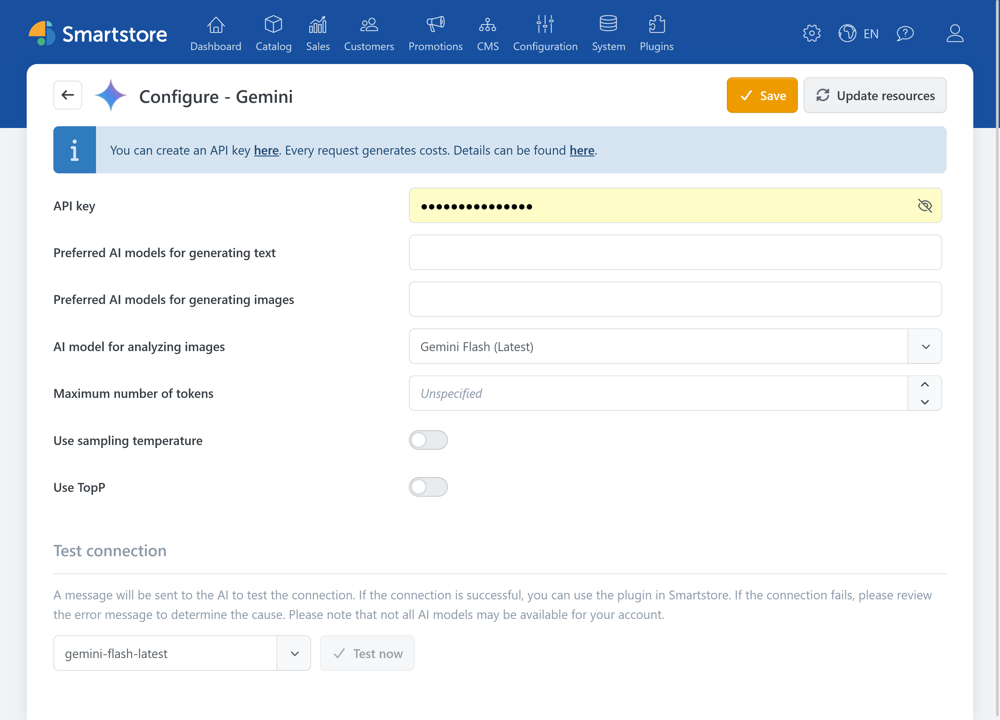

# Google Gemini

The Google Gemini plugin enables Smartstore's AI features to generate text and images and to analyze images.


The Google Gemini plugin provides the connection to Google. The features for creating and editing content are provided by the [AI plugin](../ai.md).


For information about API access, refer to the [official Gemini documentation](https://ai.google.dev/gemini-api/docs).

## Configuration

| **Option** | **Description** |
| --- | --- |
| API key | Authenticates Smartstore with the Gemini API. The API key is associated with a Google Cloud project through which usage and billing are also managed. |
| Preferred AI models for generating text | Defines which available text models are offered in Smartstore's AI dialogs. If left empty, Smartstore uses the provider's preferred default models. |
| Preferred AI models for generating images | Defines which available image models are offered in Smartstore's AI dialogs. |
| AI model for analyzing images | Defines which model analyzes image content and generates information such as titles, alt text, and tags. |
| Maximum number of tokens | Limits the length of a response. Setting this value too low can result in incomplete longer outputs. The available upper limit depends on the selected model. |
| Apply sampling temperature | Overrides the sampling temperature specified by the selected model with the value configured below. When disabled, Gemini uses the model's default value. |
| Sampling temperature | Controls response variation. Lower values generally produce more predictable results, while higher values produce more varied results. |
| Apply TopP | Overrides the TopP value specified by the selected model with the value configured below. When disabled, Gemini uses the model's default value. |
| TopP | An alternative method for controlling response variation. Usually, either TopP or the sampling temperature should be adjusted, but not both. |

### Verification

1. Save the settings.
2. Click **Reload models** to reload the available models.
3. Under **Test connection**, select a text model and click **Test now**.

If the connection cannot be established, check the API key, the status of the associated project, its billing or quota, and the availability of the selected model.


Depending on the plan and usage volume, API requests can incur costs.

