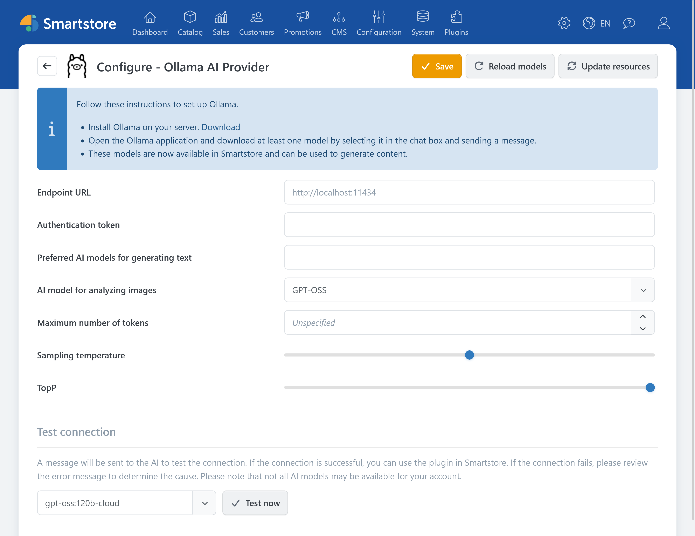

# Ollama

The Ollama plugin connects Smartstore's AI features to an accessible Ollama instance. The available features depend on the models installed on that instance.


The Ollama plugin provides the connection to Ollama. The features for creating and editing content are provided by the [AI plugin](../ai.md).


For information about installation and operation, refer to the [official Ollama documentation](https://docs.ollama.com/).

## Configuration

Before configuration, the Ollama instance must be accessible from the Smartstore server. At least one suitable model must be installed in Ollama.

| **Option** | **Description** |
| --- | --- |
| Endpoint URL | Base address of the Ollama HTTP API. If Ollama runs on the same server as Smartstore, the displayed default address can usually be used. Otherwise, enter an absolute URL that is accessible from the Smartstore server. |
| Authentication token | Optional bearer token for an Ollama instance exposed through a secured reverse proxy, for example. Leave this field empty for local access without upstream authentication. |
| Preferred AI models for generating text | Defines which text models available in Ollama are offered in Smartstore's AI dialogs. If left empty, Smartstore uses the preferred available models. |
| AI model for analyzing images | Defines an image-capable model installed in Ollama. This field is available only when Smartstore can determine the relevant model information. |
| Maximum number of tokens | Limits the length of a response. Setting this value too low can result in incomplete longer outputs. The available upper limit depends on the installed model. |
| Sampling temperature | Controls response variation. Lower values generally produce more predictable results, while higher values produce more varied results. |
| TopP | An alternative method for controlling response variation. Usually, either TopP or the sampling temperature should be adjusted, but not both. |

### Verification

1. Save the settings.
2. Click **Reload models** to reload the available models from the Ollama instance.
3. Under **Test connection**, select a text model and click **Test now**.

If no models are displayed, check that Ollama is running, at least one model is installed, and the endpoint URL is accessible from the Smartstore server. For a remote instance, also check the network, firewall, reverse proxy, and authentication token if applicable.


Do not expose an Ollama instance to a public network without protection. Whether data is processed locally or transmitted to external services also depends on the selected model and the configuration of the Ollama instance.

