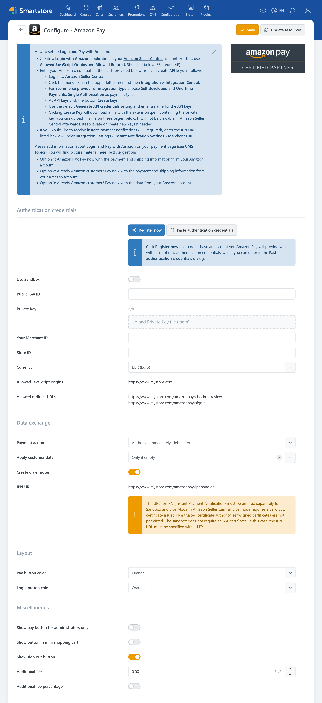

# Amazon Pay

The **Amazon Pay** plugin integrates the Amazon Pay payment provider with Smartstore. Customers can pay for an order using the payment and address information stored in their Amazon account. The plugin can also provide **Sign in with Amazon** as an [external authentication method](external-auth.md).

Amazon Pay is launched from the cart as an express payment method. After selecting a payment method and address with Amazon, the customer returns to the store to review the order. The plugin supports immediate capture or authorization followed by later capture, full and partial refunds, and payment status updates through IPN messages.


Amazon Pay and **Sign in with Amazon** can be activated independently. For a comparison with other payment plugins, see [Payment Providers and Payment Methods](paymentproviders.md).


To use the plugin, you need:

- an approved Amazon Pay merchant account
- an application configured in Amazon Seller Central
- a Merchant ID, Store ID, and Public Key ID
- the corresponding Private Key as a `.pem` file
- a publicly accessible store domain
- HTTPS with a valid SSL certificate.


The plugin supports the primary store currencies EUR, GBP, USD, and JPY. The Amazon Pay buttons are not displayed if the store uses a different primary currency.


After completing the configuration, activate Amazon Pay under **Configuration > Payment methods**. For more information about activating, sorting, and restricting payment methods, see [Setting up Payment Methods](../configuration/setting-up-payment-methods.md).

## Configuration

The configuration connects Smartstore to your Amazon Pay merchant account and defines the behavior of the payment and sign-in processes.

| Setting | Description |
|---|---|
| **Use Sandbox** | Uses the Amazon Pay test environment. The sandbox and live environments each require matching credentials and a separate IPN configuration. |
| **Public Key ID** | Identifies the public API key used to communicate with Amazon Pay. |
| **Private Key** | The private key from the `.pem` file provided by Amazon. The saved key is not displayed as plain text. |
| **Your Merchant ID** | The unique identifier of the Amazon Pay merchant account. |
| **Store ID** | Identifies the store configuration set up in Amazon Seller Central. |
| **Currency** | Determines the Amazon region and the language of the embedded Amazon Pay interface. The selection must match the primary store currency. |
| **Payment action** | Determines whether the amount is captured immediately during the order or only authorized initially. |
| **Apply customer data** | Determines whether the email address and telephone number from Amazon Pay are copied to the customer account. |
| **Create order notes** | Creates internal order notes containing information about status changes for relevant IPN messages. |
| **Pay button color** | Determines the color of the Amazon Pay payment button. |
| **Login button color** | Determines the color of the **Sign in with Amazon** button. |
| **Show pay button for administrators only** | Displays the Amazon Pay button only to signed-in administrators. This allows the integration to be tested in a live store without making it available to all customers. |
| **Show button in mini shopping cart** | Also displays the Amazon Pay button in the slide-out mini cart. |
| **Show sign out button** | Displays the **Sign out from Amazon** button after the order has been completed. |
| **Additional fee** | Defines a surcharge for payments made with Amazon Pay. |
| **Additional fee percentage** | Calculates the entered fee as a percentage. If this option is not enabled, the value is used as a fixed amount in the store's primary currency. |


Payment surcharges may be restricted or prohibited depending on the country, customer group, and payment method. Check the requirements that apply to your store before enabling an additional fee.


### Preparing Amazon Seller Central

An application for Amazon Pay and **Login with Amazon** must be configured in Amazon Seller Central. The Smartstore configuration displays the required values:

- allowed JavaScript origins
- allowed redirect URLs
- IPN URL.

Copy these values to Amazon Seller Central without changing them. Protocol, domain, port, and path must match the URL displayed by the store.

In a multi-store system, each store domain and redirect URL must be taken into account. Before configuring the plugin, select the store scope you want to use. For more information, see [Multi-Store Configuration](../configuration/general-settings-preferences/defining-the-scope-of-settings.md).

The Amazon credentials can be entered manually or copied from the registration data provided by Amazon. The Private Key must be uploaded separately as a `.pem` file.


Keep the `.pem` file provided by Amazon in a secure location. The Private Key it contains may not be available for download again in Amazon Seller Central.


### Authorization and capture

With the **Authorize immediately, debit later** payment action, Amazon Pay initially reserves the amount. The merchant can then capture the payment in Smartstore's order management.

This option can be useful when the order or product availability needs to be reviewed before capture.

With **Immediately debit**, authorization and capture are performed together during the order process. Use this option only if your operating process and the Amazon Pay requirements allow it.

For more information about general automatic capture settings, see [Payment](../configuration/general-settings-preferences/payment.md).

### Applying customer data

The plugin can copy the email address and telephone number from Amazon Pay to the customer account:

- **Not specified:** Existing customer data is not supplemented or replaced.
- **Only if empty:** Existing customer data remains unchanged.
- **Always:** Existing values can be replaced with the data provided by Amazon.

The email address is copied to the customer account only for registered customers. The telephone number is stored as a customer attribute. Billing and shipping addresses are processed for the order independently of this setting.

## Amazon Pay in the cart and checkout

The Amazon Pay button is displayed in the standard cart and, optionally, in the mini cart. After clicking the button, the Amazon Pay interface opens. There, the customer selects a payment method and, if required, a shipping address.

Smartstore transfers the billing and shipping addresses provided by Amazon to the checkout. The following conditions apply:

- The country must exist in Smartstore.
- The country must be enabled for billing or shipping addresses.
- Existing matching customer addresses are reused.
- New addresses can be assigned to the customer account.
- When Quick Checkout is enabled, they can be saved as default addresses.
- If an address is missing or not permitted, the customer must select another Amazon address.

After Amazon Pay has been selected, Smartstore skips the standard payment method selection. Depending on the order, the customer may still need to select a shipping method in the store.


The Amazon Pay buttons are added to the store as widgets. If a button is missing, check whether the corresponding widget is active. For more information, see [Arranging Widgets](../content-management/arranging-widgets.md).


## IPN and payment status

Amazon Pay uses Instant Payment Notifications, or IPN, to notify Smartstore of subsequent payment status changes. The **IPN URL** displayed in the plugin configuration must be entered as the Merchant URL in Amazon Seller Central.

Separate IPN settings are required for the sandbox and live environments. In the live environment, the URL must be accessible over HTTPS and use a valid certificate issued by a trusted certificate authority.

IPN messages can cover the following events in particular:

- successful or declined authorization
- successful capture
- payment cancellation
- full or partial refund
- reversal or chargeback.

When **Create order notes** is enabled, Smartstore records relevant messages as internal order notes. These notes can include the Amazon message ID, message type, transaction ID, and the previous and new payment statuses.

Chargebacks are also recorded as internal order notes. Further processing takes place in Amazon Seller Central.


Amazon may initially accept an authorization for further review. In this case, Smartstore displays a corresponding notice to the customer. The final payment status is then updated through IPN.


## Managing payments

The Amazon Pay plugin supports further payment processing in Smartstore's order management. Depending on the current payment status, the following actions are available:

- capturing a previously authorized payment
- issuing a full refund
- issuing a partial refund
- canceling or voiding an open authorization.

Amazon Pay uses the Charge ID and Charge Permission ID to associate these operations with the order. Refund IDs are stored to prevent the same refund from being processed more than once.

For more information about the order view, see [Managing Orders](../sales/managing-orders.md). For an overview of the management features provided by payment plugins, see [Payment Plugin Features](../configuration/setting-up-payment-methods.md#payment-plugin-features).

## Sign in with Amazon

In addition to the payment method, the plugin provides an external authentication method. Customers can use their Amazon account to sign in to or register with the store. After completing the configuration, activate the method under **Customers > External authentication methods**.

Amazon provides the following data during authentication:

- the customer's name
- the email address
- a unique Amazon buyer ID.

Smartstore uses this data to sign in or register the customer. Billing addresses, shipping addresses, and telephone numbers are not requested during the sign-in process alone.

Whether a new customer account can be created automatically during the first sign-in depends on the store's customer and registration settings. For more information, see [Setting up External Authentication](external-auth.md) and [Customer Settings](../configuration/general-settings-preferences/customer-settings.md).

## Cookies and privacy

When Amazon Pay is active as a payment method or **Sign in with Amazon** is enabled, the plugin classifies the associated cookies as technically required. They are needed to display and process the payment or sign-in transaction.

The plugin does not process visible credit card or bank account data. Customers select the payment method in the interface provided by Amazon.

Include Amazon Pay in your privacy policy and in the information about the payment methods you offer. For more information about managing cookie notices, see [Cookie Manager](../configuration/cookie-manager.md).

## Further information

- [Payment Providers and Payment Methods](paymentproviders.md)
- [Setting up Payment Methods](../configuration/setting-up-payment-methods.md)
- [Payment settings](../configuration/general-settings-preferences/payment.md)
- [Managing Orders](../sales/managing-orders.md)
- [Setting up External Authentication Methods](../customers/setting-up-external-authentication-methods.md)
- [Multi-Store Configuration](../configuration/general-settings-preferences/defining-the-scope-of-settings.md)
- [Arranging Widgets](../content-management/arranging-widgets.md)
- [Cookie Manager](../configuration/cookie-manager.md)
