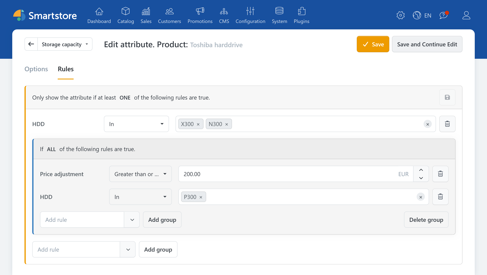
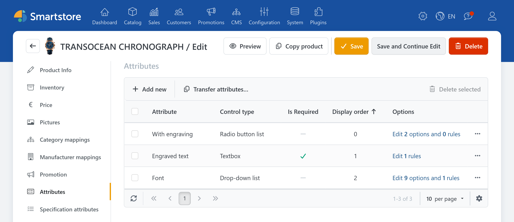
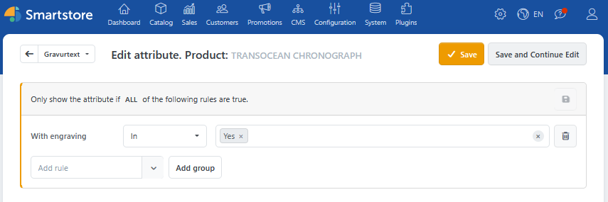
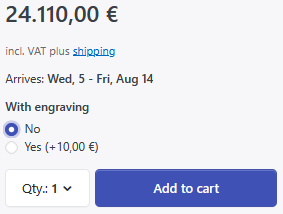
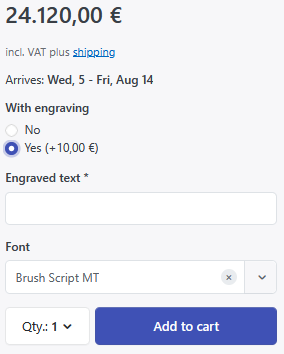
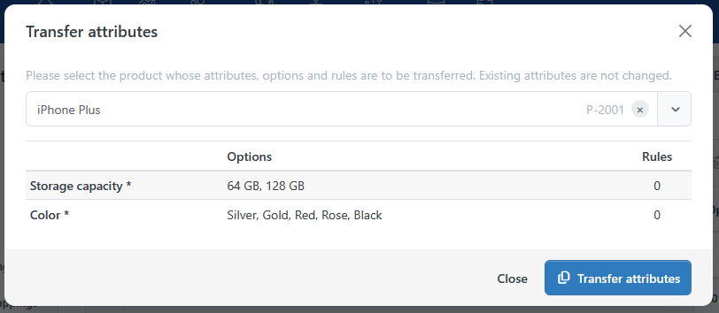

# AttributeRules

With **AttributeRules**, you control which product attributes are displayed based on the current product selection. This keeps extensive product configurations clear and organized: Additional fields appear only when they are actually needed.

Typical use cases include optional engravings, prints, accessory packages, or additional choices for a specific product variant.


Product attribute rules are configured directly on the respective attribute of a product. They are not part of the rule sets under **System** &rarr; **Rules** and do not need to be assigned to a separate action. For general information about creating a condition and using comparison operators, see [Rules](../configuration/rules.md).


## Practical Example: Optional Engraving

A watch should be available to order with an optional engraving. If the customer decides against the engraving, the associated input fields remain hidden. When an engraving is selected, a required field for the engraving text and a font selection are displayed.

The following attributes are assigned to the product for this configuration:

| Attribute | Control and values | Setting |
| --- | --- | --- |
| **With engraving** | Radio button list with **No** and **Yes** | For example, an additional charge of 10 euros can be set for **Yes**. |
| **Engraving text** | Text field | Mark as required. |
| **Font** | Dropdown list with the available fonts | Create the desired fonts as values. |

### Setting Up the Rule for the Engraving Text

1. Under **Catalog** &rarr; **Products**, open the edit view for the watch.
2. Switch to the **Attributes** tab.
3. Open the edit view for the options and rules of the **Engraving text** attribute.
4. Switch to the **Rules** tab.
5. Add the **With engraving** condition.
6. Select the **In** comparison and the value **Yes**.
7. Save the changes.

Then configure the same condition for the **Font** attribute. Both attributes are now displayed only when the customer selects **Yes** for **With engraving**.

| Without engraving | With engraving |
| --- | --- |
|  |  |

The additional charge is not defined in the rule. Instead, it is assigned to the **Yes** attribute value. The rule only determines whether the dependent attributes are displayed.

## Behavior on the Product Page

Smartstore reevaluates the product attribute rules whenever the product selection changes. An attribute without a rule is always visible. As soon as you assign one or more rules to an attribute, it is displayed only when the specified conditions are met.

Hidden attributes are not merely concealed visually:

- Previously selected values of an inactive attribute are not taken into account during further processing.
- Additional charges or discounts for hidden attribute values are not included in the price calculation.
- A hidden required attribute does not prevent the product from being added to the cart.

Multi-level dependencies are also possible. For example, selecting **Add bundle** can first display the **Size** attribute. A specific size can then reveal additional options such as **Screen protector**. If a parent selection is deactivated again, Smartstore also takes this into account for the attributes that depend on it.

## Attribute-Specific Conditions

You can use other list-based attributes of the same product as conditions. These include dropdown lists, radio buttons, and checkboxes in particular. Free-form inputs such as text fields, date fields, or file uploads can be displayed conditionally, but they cannot themselves be used as triggering conditions.

In addition to attribute values, AttributeRules provides two other types of conditions:

- **Price adjustment:** Checks the sum of the price adjustments for the currently selected attribute values.
- **Weight:** Checks the product weight, including the weight adjustments for the currently selected attribute values.

Multiple conditions can be combined so that either all conditions or at least one condition must be met. Additional groups can also be used to create more extensive combinations. The available comparisons depend on the respective condition. For example, checkboxes and other multiple selections offer additional ways to compare several selected values.

## Transferring Attributes

With **Transfer attributes**, you can use the product attributes of an already configured product as the starting point for another product. This copies the attributes along with their options and rules.

1. Under **Catalog** &rarr; **Products**, open the target product.
2. Switch to the **Attributes** tab.
3. Click **Transfer attributes**.
4. Select the product whose attributes you want to copy.
5. Review the available attributes, values, and rules in the preview.
6. Click **Transfer attributes**.

Attributes that already exist on the target product are neither overwritten nor changed. After copying, pay particular attention to rules that depend on other attributes.

## Interested in This Plugin?

We would be happy to advise you personally about features, possible applications, and licensing options. Together, we will determine whether the plugin meets your requirements and guide you toward the right purchase decision.

<a href="https://smartstore.com/en/personal-consultation/" class="button primary">Request a personal consultation</a>
