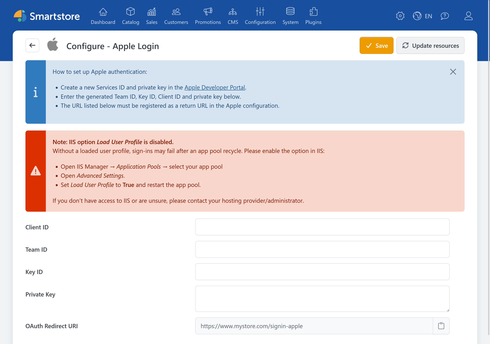

# Apple Auth

> Sign in with your Apple ID

The **Apple Auth** plugin allows customers to sign in to the store with their Apple ID.

## Required information

You need the following information for the configuration:

- Client ID or Apple Services ID,
- Team ID,
- Key ID,
- private key.

For information about creating and configuring the required identifiers and keys, see the official Apple documentation:

- [Configuring your environment for Sign in with Apple](https://developer.apple.com/documentation/signinwithapple/configuring-your-environment-for-sign-in-with-apple)
- [Configure Sign in with Apple for the web](https://developer.apple.com/help/account/capabilities/configure-sign-in-with-apple-for-the-web)

## Configuring Apple Auth in Smartstore

1. Go to **Customers > External authentication methods**.
2. Click **Configure** for **Apple Login**.
3. Select the appropriate store scope if required.
4. Enter the Client ID, Team ID, and Key ID.
5. Insert the private key.
6. Copy the displayed redirect URL and register it with Apple.
7. Click **Save**.
8. Return to the provider list and activate **Apple Login**.

The redirect URL has the following format:

`https://shop.example.com/signin-apple`

## Private key format

Smartstore expects a private key in PKCS#8 format. You can insert it in either of the following forms:

- complete PEM format with `BEGIN PRIVATE KEY` and `END PRIVATE KEY`,
- the Base64 content of the key only.

Literal `\n` line breaks stored in the string are also processed.

Smartstore uses the key to generate an Apple client secret that is valid for 30 days. If the private key cannot be processed, Smartstore logs an error and does not display the Apple login button.


Treat the private key like a password. Do not publish it or send it by unencrypted email.


## IIS notice

On Windows, the configuration page may indicate that no user profile is loaded for the IIS application pool.

In this case:

1. Open IIS Manager.
2. Select the application pool used by the store.
3. Open **Advanced Settings**.
4. Set **Load User Profile** to `True`.
5. Restart the application pool.

Without a loaded user profile, Apple logins may fail after the application pool has been restarted or recycled.

## Testing the login

Open the store login page in a private browser window and click **Sign in with Apple**. Verify that you are redirected back to the store and signed in after authentication.

If you encounter a problem, see the [general troubleshooting information](../external-auth.md#troubleshooting).
