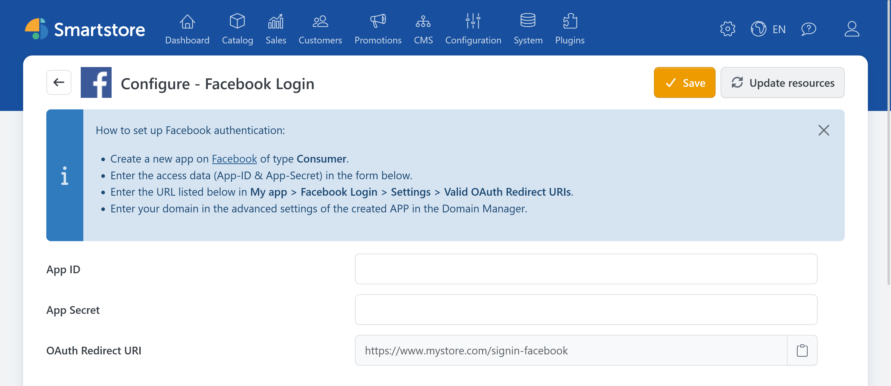

# Facebook Auth

> Sign in with your Facebook account

The **Facebook Auth** plugin allows customers to sign in to the store with their Facebook account.

## Required information

You need the following information for the configuration:

- App ID,
- App Secret.

Configure the application used for authentication through [Meta for Developers](https://developers.facebook.com/apps/). Follow the current provider documentation for Facebook Login and valid OAuth redirect URIs.

## Configuring Facebook Auth in Smartstore

1. Go to **Customers > External authentication methods**.
2. Click **Configure** for **Facebook Login**.
3. Select the appropriate store scope if required.
4. Enter the App ID and App Secret.
5. Copy the displayed redirect URL and register it with Meta.
6. Click **Save**.
7. Return to the provider list and activate **Facebook Login**.

The redirect URL has the following format:

`https://shop.example.com/signin-facebook`

## Testing the login

Open the store login page in a private browser window and click **Sign in with Facebook**. Verify that you are redirected back to the store and signed in after authentication.

If you encounter a problem, see the [general troubleshooting information](../external-auth.md#troubleshooting).
