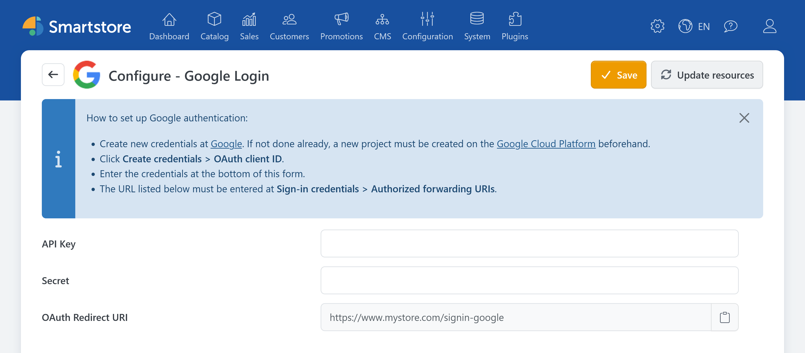

# Google Auth

> Sign in with your Google account

The **Google Auth** plugin allows customers to sign in to the store with their Google account.

## Required information

You need the following information for the configuration:

- Client ID,
- client secret.

For information about creating and configuring an OAuth client for a web application, see the official documentation [Using OAuth 2.0 for Web Server Applications](https://developers.google.com/identity/protocols/oauth2/web-server).

## Configuring Google Auth in Smartstore

1. Go to **Customers > External authentication methods**.
2. Click **Configure** for **Google Login**.
3. Select the appropriate store scope if required.
4. Enter the Client ID (API Key) and client secret (Secret).
5. Copy the displayed redirect URL and register it with Google.
6. Click **Save**.
7. Return to the provider list and activate **Google Login**.

The redirect URL has the following format:

`https://shop.example.com/signin-google`


The redirect URI registered with Google must match the URL displayed by Smartstore exactly.


## Testing the login

Open the store login page in a private browser window and click **Sign in with Google**. Verify that you are redirected back to the store and signed in after authentication.

If you encounter a problem, see the [general troubleshooting information](../external-auth.md#troubleshooting).
