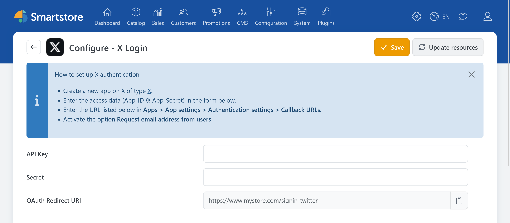

# X Auth

> Sign in with your X account

The **X Auth** plugin allows customers to sign in to the store with their X account. For compatibility reasons, the redirect URL still uses the name `twitter`.

## Required information

You need the following information for the configuration:

- API Key or Consumer Key,
- Consumer Secret or API Key Secret.

For information about configuring the application, user authentication, and callback URLs, see the official X documentation:

- [Implementing Sign in with X](https://docs.x.com/x-for-websites/log-in-with-x/guides/implementing-sign-in-with-x)
- [OAuth 1.0a](https://docs.x.com/fundamentals/authentication/oauth-1-0a/overview)

The application must be able to provide Smartstore with the email address required for registration. Consult the X documentation for the currently required settings and permissions.

## Configuring X Auth in Smartstore

1. Go to **Customers > External authentication methods**.
2. Click **Configure** for **X Login**.
3. Select the appropriate store scope if required.
4. Enter the API Key and Consumer Secret.
5. Copy the displayed redirect URL and register it with X.
6. Click **Save**.
7. Return to the provider list and activate **X Login**.

The redirect URL has the following format:

`https://shop.example.com/signin-twitter`

## Testing the login

Open the store login page in a private browser window and click **Sign in with X**. Verify that you are redirected back to the store and signed in after authentication.

If Smartstore does not create a customer account, check in particular whether X supplies a usable email address.

If you encounter a problem, see the [general troubleshooting information](../external-auth.md#troubleshooting).
