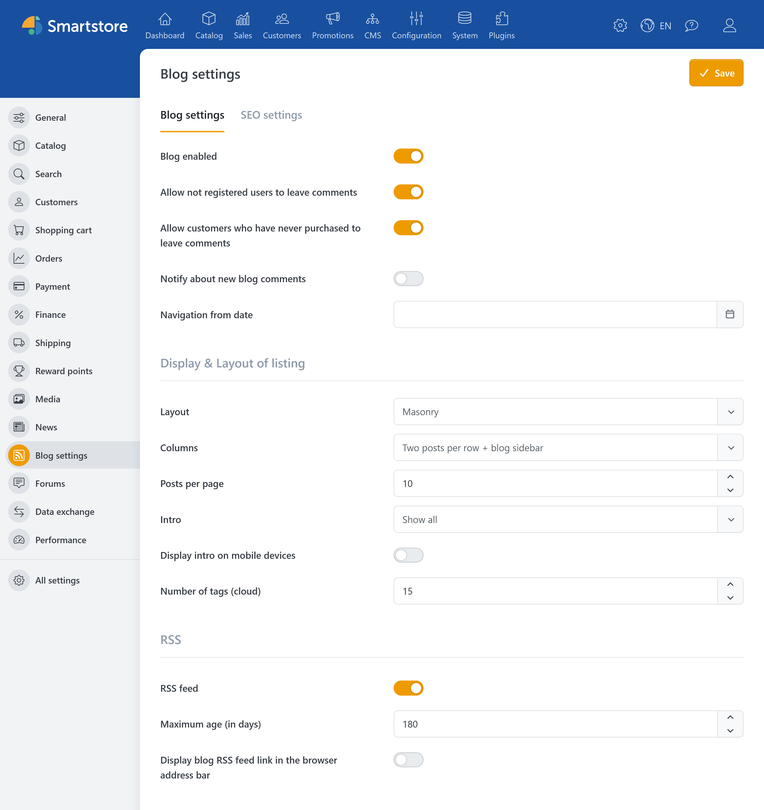
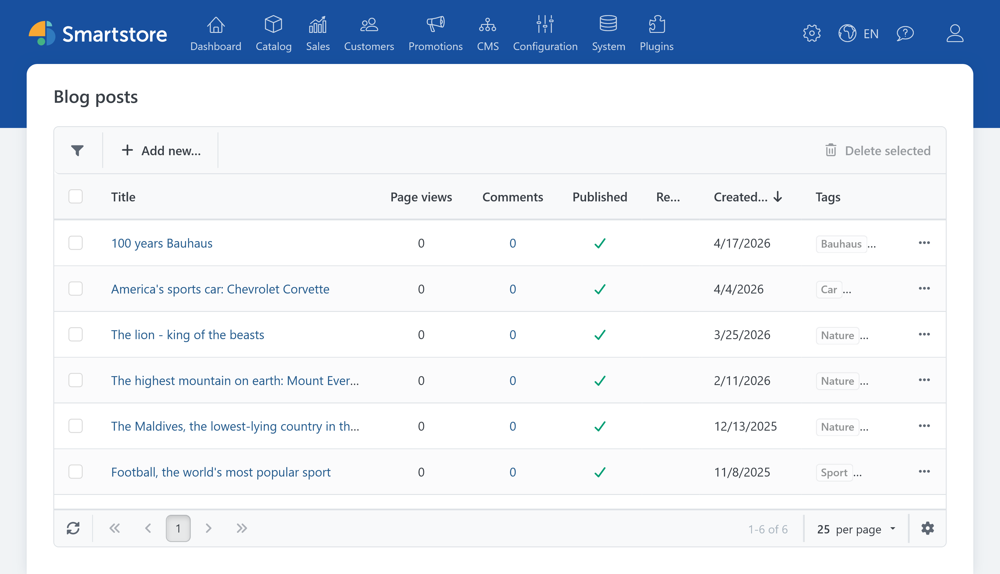
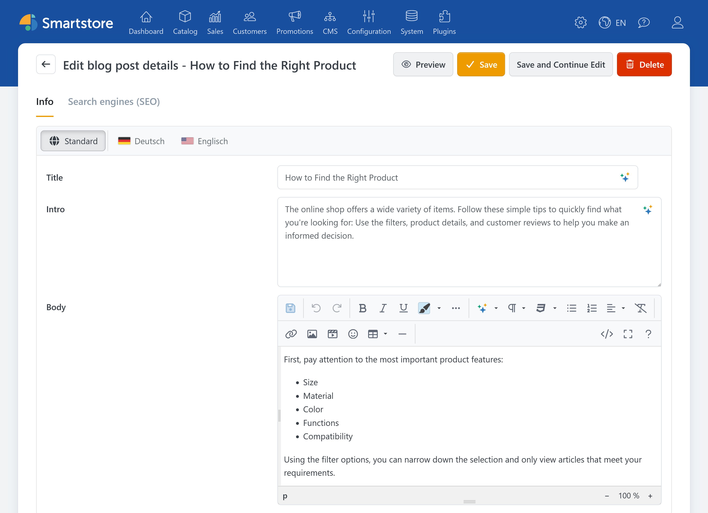
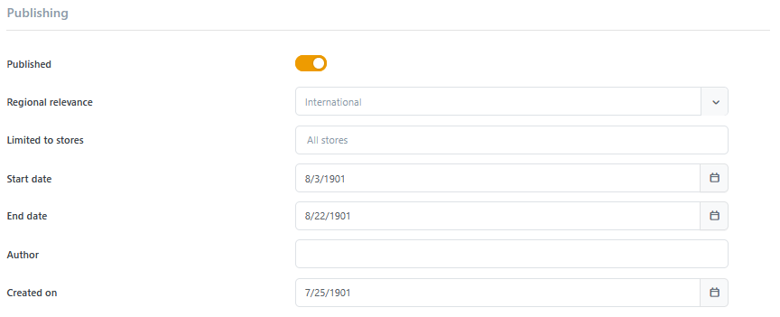
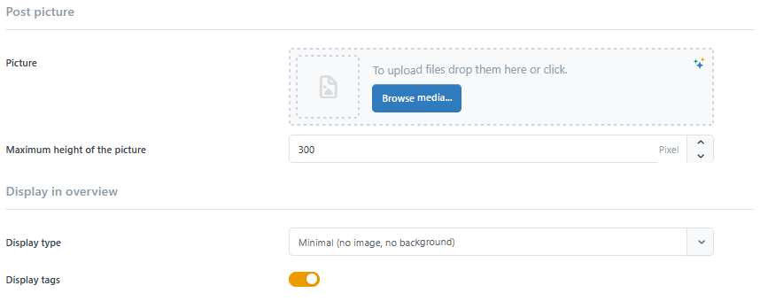
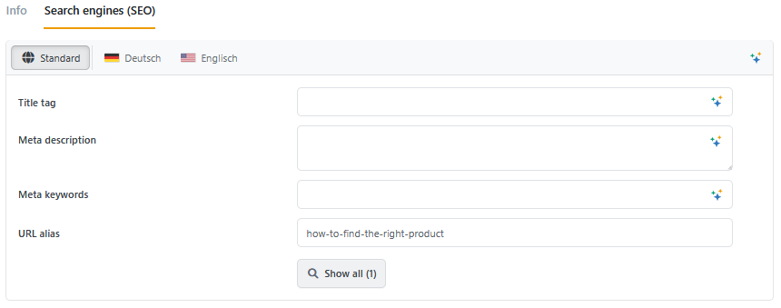
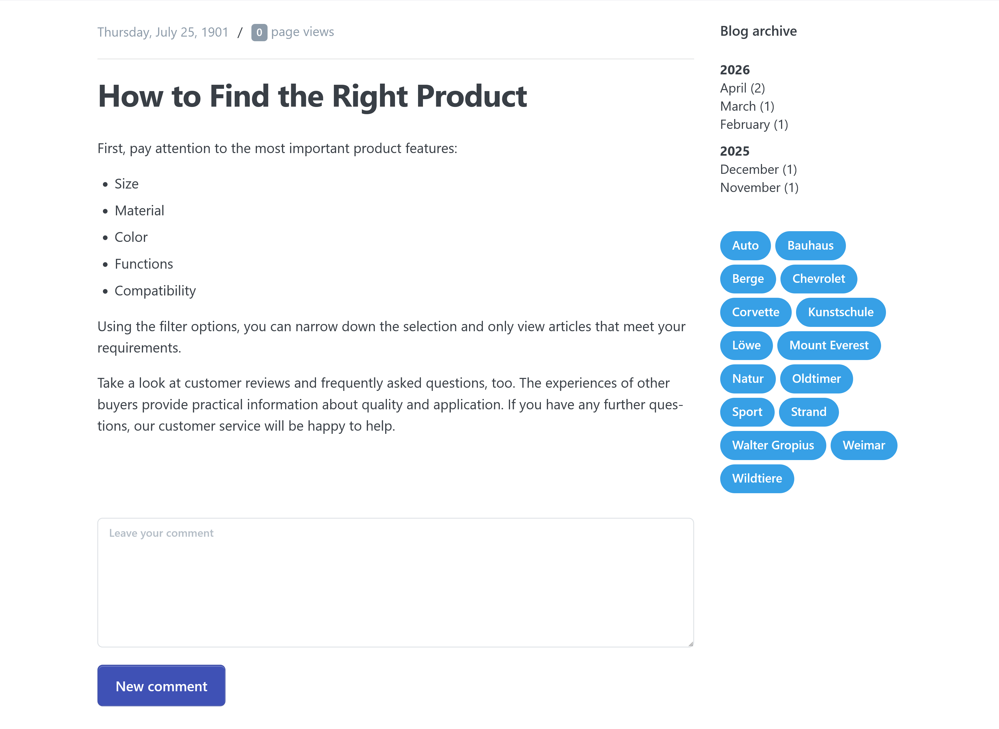
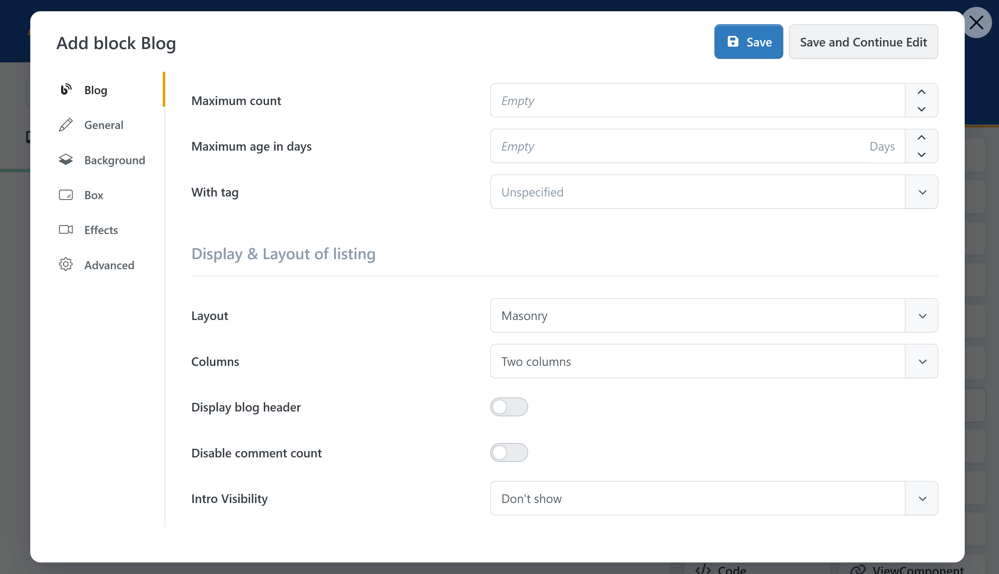

# Blog

> Blog, publish, discuss.

With **Smartstore Blog**, you can publish news, guides, product information, and other editorial content directly in your store. Posts can be scheduled, assigned to specific stores or languages, and optimized for search engines.

Visitors can browse the blog by month or tag and leave comments if this has been permitted. You can also use the Page Builder to present selected posts on the home page or other store pages.


The blog areas and actions available in the administration area are controlled by the access permissions of the signed-in administrator. For more information, see [Controlling Access Permissions](../configuration/controlling-access-permissions.md).


## Configuring the blog

In the administration area, go to **Configuration > Settings > Blog settings**.

In a multi-store installation, first select the store to which the settings should apply at the top of the page. Settings can be overridden for each store. For more information, see [Defining the Scope of Settings](../configuration/general-settings-preferences/defining-the-scope-of-settings.md).

### General settings

| Setting | Description |
| --- | --- |
| **Blog enabled** | Enables or disables the blog in the public store. When the blog is enabled, a link to it is added to the store's main menu. |
| **Allow not registered users to leave comments** | Allows visitors without a customer account to comment on blog posts. |
| **Allow customers who have never purchased to leave comments** | Determines whether signed-in customers without a previous order can comment. When disabled, only customers who have already placed an order in the current store can comment. |
| **Notify about new blog comments** | Notifies the store owner when a new comment has been submitted. |
| **Navigation from date** | Determines the date from which posts are included in the monthly navigation. Older posts are neither deleted nor unpublished. |

### Displaying the blog overview

The display settings determine how posts are arranged on the public blog overview.

| Setting | Description |
| --- | --- |
| **Layout** | Determines whether posts are displayed in a regular grid or a masonry layout with post cards of different heights. |
| **Columns** | Determines whether two posts per row with a blog sidebar or three posts per row without a blog sidebar are displayed. The sidebar contains the month and tag navigation. |
| **Posts per page** | Determines how many posts are displayed on each page. The value must be greater than `0`. |
| **Image aspect ratio** | Determines the aspect ratio of preview images, for example `1:1`, `4:3`, `16:9`, `16:10`, or `21:9`. This option is only available for the grid layout. |
| **Card Layout** | Displays posts as bordered cards in the grid layout. This option is only available for the grid layout. In the masonry layout, posts are always displayed as cards. |
| **Intro** | Determines whether the introduction is hidden, limited to two or three lines, or displayed in full. |
| **Display intro on mobile devices** | Displays the introduction on small screens as well. |
| **Number of tags (cloud)** | Determines how many of the most frequently used tags appear in the tag navigation. A value of `0` hides the tag navigation. |
| **Display author** | Displays public author information with the post, provided that a public author has been selected and the author feature is available in the system. |

### Providing an RSS feed

An RSS feed allows visitors and feed readers to retrieve new blog posts automatically.

| Setting | Description |
| --- | --- |
| **RSS feed** | Enables the blog's RSS feed. |
| **Maximum age (in days)** | Determines the maximum age of posts included in the RSS feed. The value is specified in days and must be greater than `0`. |
| **Display blog RSS feed link in browser address bar** | Adds a reference to the feed to the HTML page header. This allows browsers and feed readers to detect it automatically. |

### SEO data for the blog overview

Use the **SEO** tab to enter the general search engine information for the blog overview.

| Setting | Description |
| --- | --- |
| **Meta title** | Specifies the title that search engines can use for the blog overview. |
| **Meta description** | Summarizes the blog content for search engines and potential visitors. |
| **Meta keywords** | Contains optional keywords that describe the blog's topics. |

In a multilingual store, you can maintain these values separately for each language. For basic guidance, see [SEO](../../discover/common-concepts/seo.md).

Save the configuration when you are finished.

## Creating a blog post

Go to **CMS > Blog > Blog posts** and click **Add new**.

### Entering the title, intro, and body

| Field | Description |
| --- | --- |
| **Title** | The title of the post. This field is required and can contain up to 450 characters. |
| **Intro** | A short introduction that can be used as preview text in the blog overview. |
| **Body** | The full blog post. This field is required and supports formatted content such as headings, lists, links, tables, and images. |

If Smartstore AI has been configured, additional functions for generating, translating, and revising content may be available for these fields. For more information, see [AI](ai.md).

### Maintaining multilingual content

In a multilingual store, the title, intro, body, and SEO information can be entered separately for each language.

Use the language selector in the relevant input area. The content under **Standard** is used as a fallback if no separate value has been entered for a language.

For more information, see [Working with Multiple Languages](../../discover/common-concepts/working-with-multiple-languages.md).

### Defining tags and comments

| Setting | Description |
| --- | --- |
| **Tags** | Assigns existing or newly entered keywords to the post. Tags group related posts and can be used in the public tag navigation. |
| **Allow comments** | Enables the comment form for this post. The global blog settings also determine which visitors are allowed to comment. |

Use consistent tags whenever possible. For example, the terms "shipping," "shipping costs," and "delivery" would create three separate topic groups.

### Controlling publication

| Setting | Description |
| --- | --- |
| **Published** | Determines whether the post can be displayed publicly. |
| **Regional relevance** | Limits the post to a specific language. Without a selection, the post applies internationally. This field is only displayed when multiple languages are available. |
| **Limited to stores** | Determines the stores in which the post is visible. Without a restriction, it applies to all stores. |
| **Start date** | Determines the date and time from which the post is publicly displayed. |
| **End date** | Determines the date and time after which the post is no longer publicly displayed. |
| **Created on** | Determines the date displayed with the post. It also affects sorting and assignment to the monthly navigation. |


**Created on** is not the publication date. To schedule publication, use **Start date** and **End date** together with the **Published** option.


Administrators with the relevant permissions can open unpublished posts or posts that have not yet reached their publication date for review.

### Defining the author

When a post is created, the name of the signed-in administrator is entered as the author. This internal value is not automatically displayed as a public author profile with the post.

Depending on the system configuration, a customer can also be selected as the public author. In this case, information such as the avatar, profession title, and detailed author description can be displayed with the post. **Display author** must also be enabled in the blog settings.

### Selecting the post picture and designing the preview

In the **Post picture** section, select the picture for the post detail page.

| Setting | Description |
| --- | --- |
| **Picture** | Specifies the picture used on the post detail page. Depending on the selected display type, it can also appear in the blog overview. |
| **Maximum height of the picture** | Limits the display height of the picture on larger screens. If the field is left empty, the height is determined automatically. |

Pictures are selected through the Media Manager. For information about uploading, organizing, and reusing pictures, see [Media Manager](mediamanager.md).

Use pictures of sufficient quality and provide meaningful ALT text. At the same time, avoid unnecessarily large files because they can increase blog page loading times.

Under **Display in overview**, select how the post is displayed in lists and blog blocks.

| Setting | Description |
| --- | --- |
| **Display type** | Determines the basic preview type of the post. The available types are described in the following table. |
| **Preview picture** | Specifies a separate picture for display types that do not use the post picture. |
| **Image aspect ratio** | Defines a separate aspect ratio for images displayed above the text. Without a selection, Smartstore uses the original aspect ratio or the global blog setting. |
| **Display tags** | Determines whether the assigned tags are displayed in the post preview. |

| Preview type | Display |
| --- | --- |
| **Minimal (no image, no background)** | Displays the post without a picture or background. |
| **Picture over text** | Displays the post picture above the text. |
| **Preview picture over text** | Displays a separate preview picture above the text. |
| **Picture behind text** | Uses the post picture as the background. |
| **Preview picture behind text** | Uses a separate preview picture as the background. |
| **Background color** | Uses a selected theme color as the background. |

A post picture is required for display types that use it. Display types that use a separate preview picture require a preview picture to be selected.

### Maintaining the post's SEO data

Open the **SEO** tab.

| Setting | Description |
| --- | --- |
| **Meta title** | Determines the title used for search engines. If no separate meta title is provided, the post title is used on the detail page. |
| **Meta description** | Summarizes the post for search engines and potential visitors. |
| **Meta keywords** | Contains optional keywords that describe the post's topics. |
| **URL alias** | Determines the URL segment of the post. If the field is left empty, Smartstore generates it from the title. |

Use short and durable URLs. Change the address of a published and linked post only when necessary. For more recommendations, see [SEO](../../discover/common-concepts/seo.md).

### Saving and checking the preview

Click **Save** to return to the blog post overview. Click **Save and continue editing** to remain on the editing page.

The **Preview** button becomes available after the post has been saved for the first time.

Before publishing, check the following:

* Is **Published** enabled?
* Are the start and end dates correct?
* Has the correct store been selected?
* Have all required language versions been maintained?
* Is the picture required for the selected display type available?
* Is the preview picture cropped appropriately?
* Have the URL, meta title, and meta description been completed?
* Do all included links work?
* Is the mobile display easy to read?

## Integrating blog posts into the store

### Standard blog area

When the blog is enabled, Smartstore automatically provides a blog overview and separate detail pages for the posts. Visitors can open the blog through an entry in the main menu.

The blog overview supports:

* pagination
* filtering by month
* filtering by tag
* different list layouts
* links to the detail pages
* display of the comment count
* RSS, if enabled

### Displaying blog posts with the Page Builder

The Page Builder **Blog** block lets you display a selection of recent posts in a story.

Open a story in the Page Builder, drag the **Blog** block into the grid, and open its settings.

| Setting | Description |
| --- | --- |
| **Maximum count** | Limits the number of displayed posts. |
| **Maximum age in days** | Only includes posts that are not older than the specified number of days. |
| **With tag** | Limits the selection to posts with a specific tag. |
| **Layout** | Determines whether posts are displayed in a grid or masonry layout. |
| **Columns** | Determines whether two or three posts are displayed per row. |
| **Display blog header** | Shows or hides the blog block heading. When displayed, the heading includes a button linking to the full blog. |
| **Disable comment count** | Determines whether the number of comments is hidden in the post previews. |
| **Card Layout** | Displays the posts as bordered cards. |
| **Intro** | Determines how much of the introduction is displayed. |
| **Display author** | Displays the public author if the author feature is available and a public author has been assigned to the post. |

For a general introduction, see [Page Builder](pagebuilder.md). For information about using the different block types and their main settings, see [Using Blocks](pagebuilder/blocks.md).

### Positioning blog posts on specific pages

The Page Builder story can be assigned to one or more target pages and widget zones. This lets you present blog posts on the home page, landing pages, category pages, or other areas supported by widget zones.

For the story to be visible, select a target page and a widget zone, then publish the story. For more information, see [Widget Zones](../content-management/widget-zones.md).

### Linking individual blog posts

Individual posts can be selected as targets in Smartstore's central link dialog. This is available for buttons, menu items, linked images, Page Builder content, and text links in the content editor.

In the link dialog, select **Blog post** as the target type and then select the required post. Smartstore can detect when a linked post is unpublished or deleted later.

## Managing posts

You can filter the blog post overview by:

* title
* intro
* body
* tags
* creation period
* store
* language
* publication status

Some values, such as the publication status, can be changed directly in the table. Use the row actions to open or delete posts. You can also delete several selected posts together.

The overview also displays the number of page views and comments for each post. Views by administrators are not counted.

## Managing comments

Go to **CMS > Blog > Blog comments**. Alternatively, click the number of comments for a post in the blog post overview.

The comment list contains:

* the associated blog post
* customer
* comment text
* IP address
* creation date

New comments are saved immediately. The current administration interface does not provide a separate approval or editing function.

You can delete individual comments or several selected comments in the administration area.

## Troubleshooting

### The blog is not displayed in the store

Check the following:

* Is the Blog plugin enabled?
* Is **Enabled** selected in the blog settings?
* Are you editing the settings for a different store?
* Does the store use a customized menu or theme?

### A post is not displayed

Check the following:

* Is **Published** enabled?
* Is the current date within the start and end dates?
* Is the post assigned to the correct store?
* Does the regional relevance match the current language?
* Has the post been saved?

### The Page Builder Blog block is empty

Check the following:

* Are there any published posts?
* Does the specified maximum age exclude all posts?
* Is a tag selected that is not assigned to any published post?
* Are the story, target page, and widget zone published and assigned correctly?

### Visitors cannot submit comments

Check the following:

* Are comments allowed for the relevant post?
* Are guests allowed to comment?
* Are customers without an order allowed to comment?
* Is the visitor signed in if this is required?

## Related documentation

* [AI](ai.md)
* [Media Manager](mediamanager.md)
* [Page Builder](pagebuilder.md)
* [Using Blocks](pagebuilder/blocks.md)
* [Widget Zones](../content-management/widget-zones.md)
* [SEO](../../discover/common-concepts/seo.md)
* [Working with Multiple Languages](../../discover/common-concepts/working-with-multiple-languages.md)
* [Working with Multiple Stores](../../discover/common-concepts/working-with-multiple-stores.md)
* [Controlling Access Permissions](../configuration/controlling-access-permissions.md)
