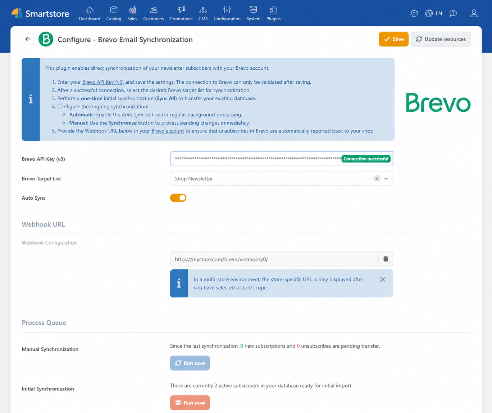
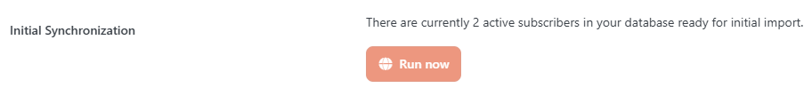
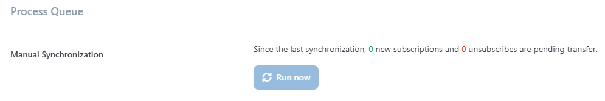

# Brevo

The **Brevo Email Synchronization** plugin connects Smartstore's newsletter management with the Brevo email marketing service, formerly Sendinblue. Newsletter subscriptions and unsubscribes from Smartstore are synchronized with a selected Brevo contact list. Existing subscribers can be transferred once, while subsequent changes can be processed automatically or manually.


Campaigns can be managed either directly in Brevo or with Smartstore's integrated newsletter feature. For more information, see [Create and send an email campaign in Brevo](https://help.brevo.com/hc/en-us/articles/4413566705298-Create-and-send-an-email-campaign) and [Managing Newsletter Campaigns](../marketing-promotions/managing-newsletter-campaigns.md).


To use the plugin, you need:

- an active Brevo account
- a Brevo API key version 3
- at least one contact list in Brevo.

## Configuration

Under **Plugins > Manage Plugins**, open the configuration for the **Brevo Email Synchronization** plugin. Here you connect Smartstore to your Brevo account, select the target contact list, and configure synchronization.

| Setting | Description |
|---|---|
| **Brevo API Key (v3)** | API key used to [connect Smartstore to Brevo](#connecting-to-brevo). After successful validation, Smartstore displays **Connection successful** in the input field. |
| **Brevo Target List** | Contact list to which new newsletter subscribers are added. Unsubscribes remove the contact from this list. |
| **Auto Sync** | Activates the background task for [automatic synchronization](#automatic-synchronization). The task runs once per hour. |
| **Webhook URL** | Address generated by Smartstore for the [Brevo webhook](#setting-up-the-webhook). The URL can be copied but cannot be edited manually. |
| **Manual Synchronization** | Shows pending subscriptions and unsubscribes and allows you to [process them immediately](#manual-synchronization). |
| **Initial Synchronization** | Adds all currently active newsletter subscribers for the selected store to the queue for the [initial transfer](#initially-synchronizing-existing-subscribers). |

The plugin synchronizes subscriptions and unsubscribes based on the email address. When a customer subscribes, the contact is created or updated in Brevo and added to the selected list. An unsubscribe in Smartstore removes the contact from this list but does not delete it from the Brevo account. Unsubscribes in Brevo can be reported back to Smartstore through the webhook.


The plugin transfers email addresses only. Names, addresses, orders, other customer data, and contact attributes are not synchronized with Brevo.


### Connecting to Brevo

1. Open [API Keys](https://app.brevo.com/settings/keys/api) in Brevo.
2. Create or copy an API key version 3.
3. Enter the key under **Brevo API Key (v3)**.
4. Click **Save**.
5. Check that the green **Connection successful** status appears in the **Brevo API Key (v3)** field.
6. Under **Brevo Target List**, select the required contact list.
7. Save the configuration again.

Brevo lists can only be retrieved after an API key has been saved and the connection has been established successfully.


The plugin retrieves up to 50 contact lists from the Brevo account. If an existing list is not available for selection, check the API key and the number of lists in Brevo.



Treat the API key as confidential. Do not publish it, and only share it with people who require access to the Brevo integration.


### Synchronizing subscribers

New newsletter subscriptions and unsubscribes are first recorded in a local queue. After configuring the connection and target list, you can transfer existing subscribers and process subsequent changes automatically or manually.

#### Initially synchronizing existing subscribers

Use the initial synchronization to transfer newsletter subscribers already stored in Smartstore.

1. In a multi-store installation, first select the required store.
2. In the **Initial Synchronization** section, check the number of active subscribers.
3. Click **Run now** in this section.
4. Then process the queue through **Manual Synchronization**, or enable **Auto Sync**.


Initial synchronization first adds the active subscribers to the queue. They are not transferred to Brevo until the queue is processed manually or by the background task.


You can run the initial synchronization again when required. Contacts that already exist in Brevo are updated and assigned to the selected list.

#### Automatic synchronization

Enable **Auto Sync** so that Smartstore regularly processes the queue in the background. The corresponding **Brevo subscriber sync** task runs once per hour.

You can check the task status, last execution, and possible errors under **System > Scheduled Tasks**. For more information, see [Managing Scheduled Tasks](../system-maintenance/managing-scheduled-tasks.md).


Synchronization does not take place in real time. New subscriptions and unsubscribes remain in the queue until the next task execution.


#### Manual synchronization

The **Manual Synchronization** section shows how many subscriptions and unsubscribes have been waiting for transfer since the last synchronization.

Click **Run now** to process the pending changes immediately. Manual synchronization is only available after a Brevo target list has been selected.

After successful processing, Smartstore displays the number of updated contacts.

## Setting up the webhook

The webhook reports unsubscribes from Brevo back to Smartstore. Without this webhook, unsubscribes performed directly in Brevo are not automatically reflected in Smartstore's newsletter management.

Copy the address displayed under **Webhook URL** in Smartstore and use it in Brevo as the target address for an outbound webhook. Enable the **unsubscribe** event for this webhook. Detailed setup instructions are available in the Brevo documentation under [Create an outbound webhook](https://help.brevo.com/hc/en-us/articles/27824932835474-Create-outbound-webhooks-to-send-real-time-data-from-Brevo-to-an-external-app).

Smartstore only processes Brevo events of type `unsubscribe` through this endpoint. The plugin ignores other Brevo events. When Brevo reports an unsubscribe, Smartstore immediately removes the corresponding newsletter subscription. No additional unsubscribe confirmation is sent.


Make sure you copy the complete webhook URL. In a multi-store installation, the address contains the ID of the store whose newsletter subscriber should be removed.


## Multi-store configuration

In a multi-store installation, settings can be configured globally or for a specific store. Before configuring the plugin, use the store selector to choose the required store. Initial synchronization only includes active newsletter subscribers from that store.

The displayed webhook URL contains the ID of the selected store. If unsubscribes from Brevo should be reported back for multiple stores, configure the displayed URL for each store in Brevo.

For more information, see [Defining the Scope of Settings](../configuration/general-settings-preferences/defining-the-scope-of-settings.md) and [Working with Multiple Stores](../../discover/common-concepts/working-with-multiple-stores.md).

## Checking newsletter subscribers in Smartstore

The subscriptions and unsubscribes synchronized by Brevo relate to Smartstore newsletter subscribers.

Open **Admin > Marketing > Newsletter Subscribers** to check the subscribers stored locally. There you can determine whether a subscription is active or whether an unsubscribe reported through the Brevo webhook has been removed.

For more information about managing, importing, or exporting newsletter subscribers, see [Managing Newsletter Campaigns](../marketing-promotions/managing-newsletter-campaigns.md#manage-subscribers).

## Privacy

During synchronization, Smartstore transfers newsletter subscriber email addresses to Brevo. Include Brevo in your store's privacy information and inform affected people about the nature and purpose of this data transfer.

The plugin does not transfer names, addresses, orders, or other customer data. Further contact processing as well as sending and analyzing Brevo campaigns takes place in the Brevo account.

## Further information

- [Managing Newsletter Campaigns](../marketing-promotions/managing-newsletter-campaigns.md)
- [Managing Scheduled Tasks](../system-maintenance/managing-scheduled-tasks.md)
- [Defining the Scope of Settings](../configuration/general-settings-preferences/defining-the-scope-of-settings.md)
- [Working with Multiple Stores](../../discover/common-concepts/working-with-multiple-stores.md)
- [Brevo API Keys](https://app.brevo.com/settings/keys/api)
- [Create and send an email campaign in Brevo](https://help.brevo.com/hc/en-us/articles/4413566705298-Create-and-send-an-email-campaign)
- [Create an outbound webhook in Brevo](https://help.brevo.com/hc/en-us/articles/27824932835474-Create-outbound-webhooks-to-send-real-time-data-from-Brevo-to-an-external-app)

## Interested in This Plugin?

We would be happy to advise you personally about features, possible applications, and licensing options. Together, we will determine whether the plugin meets your requirements and guide you toward the right purchase decision.

<a href="https://smartstore.com/en/personal-consultation/" class="button primary">Request a personal consultation</a>
