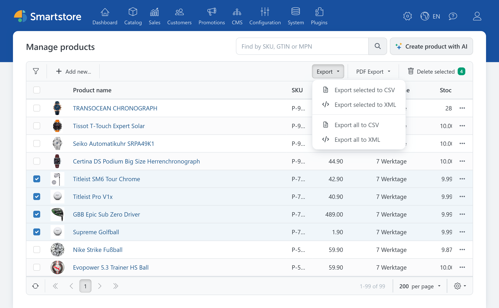
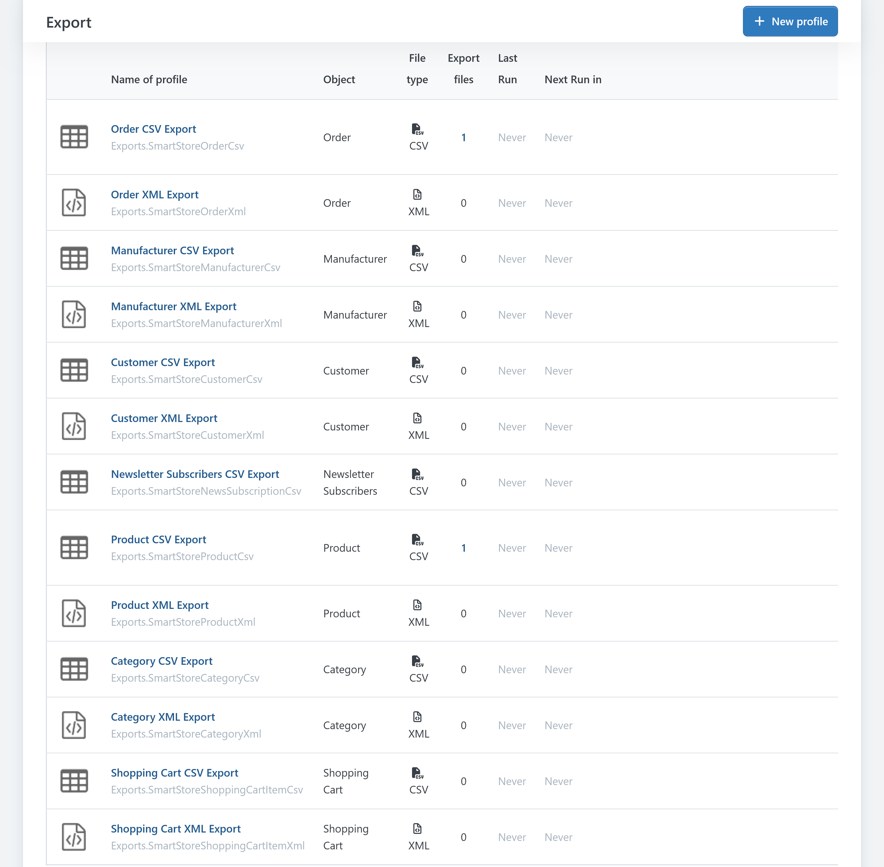
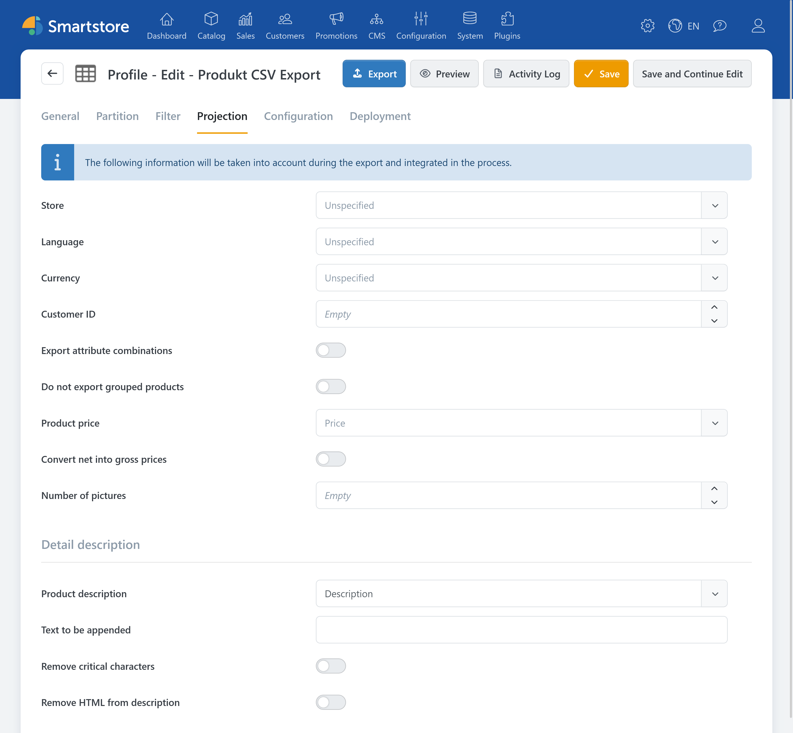
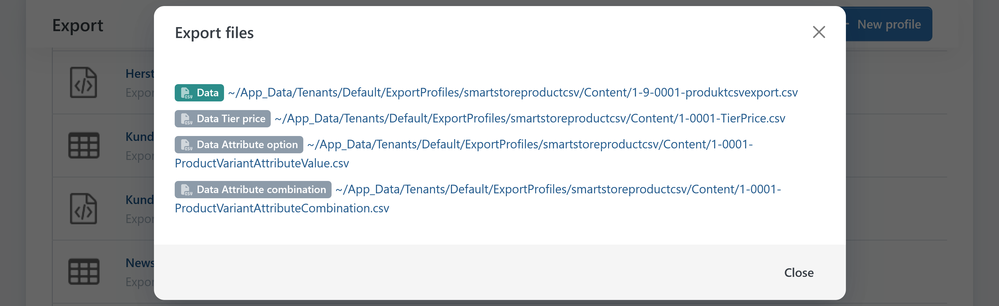

# Common Export Providers

> Export store data with ease

The **Common Export Providers** plugin adds general CSV and XML exports for key store data to Smartstore. Export commands appear directly in the relevant administration lists. The plugin also creates system profiles that control the scope, processing, and delivery of export files.


In demo mode, **Common Export Providers** is limited to a maximum of 20 main records per export.


The plugin provides a total of 13 export providers and corresponding system profiles.

| Data type | CSV | XML | Selected records | All records |
|---|:---:|:---:|:---:|:---:|
| Products | ✓ | ✓ | ✓ | ✓ |
| Categories | ✓ | ✓ | ✓ | ✓ |
| Manufacturers | ✓ | ✓ | ✓ | ✓ |
| Customers | ✓ | ✓ | ✓ | ✓ |
| Orders | ✓ | ✓ | ✓ | ✓ |
| Newsletter subscribers | ✓ | – | – | ✓ |
| Shopping carts | ✓ | ✓ | – | ✓ |
| Wishlists | ✓ | ✓ | – | ✓ |

## Run a quick export

The plugin adds an **Export** command to the following administration pages:

- Products
- Categories
- Manufacturers
- Customers
- Orders
- Newsletter subscribers
- Current shopping carts
- Current wishlists.

For products, categories, manufacturers, customers, and orders, the following commands are generally available:

- **Export selected to CSV**
- **Export selected to XML**
- **Export all to CSV**
- **Export all to XML**.

The export command for selected records becomes available only after you select at least one row in the list.

You can export all newsletter subscribers to CSV. For current shopping carts and wishlists, full CSV and XML exports are available.


Search criteria and table filters set in an administration list are not automatically passed to the export profile when you run a quick export.

**Export all** therefore exports all data that matches the filters in the corresponding system profile, not just the rows currently displayed in the table.


If you need only a subset, select the required records or adjust the filters in the export profile.

## Export process

1. Open the relevant administration list.
2. Select individual records if needed.
3. Open the **Export** menu.
4. Choose the file format and export scope.
5. Confirm the prompt.
6. Smartstore starts the export as a background task.
7. Open **Configuration > Export** to view the progress, output files, and log.

A quick export does not start an immediate browser download. After the export starts, Smartstore indicates that the data export task is running. The completed files are then available from the corresponding export profile.

If the required system profile is missing, the plugin recreates it. Start the export again afterwards.

## Manage export profiles

During installation, the plugin creates an enabled system profile for each export provider. You can find these profiles under **Configuration > Export**.

Depending on the data type, you can use the following general settings, among others:

- Enable or disable a profile
- Set its name and file name pattern
- Skip records or limit the number of records
- Split data across multiple export files
- Create separate files for each store
- Filter data using criteria specific to the data type
- Project data for the export
- Create ZIP archives
- Schedule automatic exports
- Send notifications
- Deliver files through the file system, a public folder, email, HTTP, or FTP.

For a full description of these functions, see [Managing Export Profiles](../data-exchange/managing-export-profiles.md).

System profiles can be edited but cannot be deleted through the regular profile management interface.

### Configure product exports

The product providers support additional functions of the general export framework. Depending on the selected format, you can:

- Exclude grouped products
- Output attribute combinations as separate products
- Project or combine product descriptions
- Export associated product data to additional CSV files.

In a product CSV profile, enable **Export associated data** on the **General** tab to create additional files for:

- Tier prices
- Attribute values
- Attribute combinations.

The file names end with the technical names `TierPrice`, `ProductVariantAttributeValue`, and `ProductVariantAttributeCombination`, respectively.


Do not change these technical parts of the file names if you intend to use the files for a later product import. The product importer identifies the type of associated data from the file name.


You cannot export associated data at the same time as projecting attribute combinations as separate products.

For more information about supported product data and subsequent imports, see [Importing and Exporting Products](../catalog/managing-products/importing-exporting-products.md).

## Contents of the export files

The files contain technical data fields and are not limited to the visible columns of the corresponding administration list. Many field names are in English.

| Export | Data fields (selection) | Additional contents and format details |
|---|---|---|
| **Products** | ID and product type Name, short description, and full description SEO data SKU, GTIN, and manufacturer part number Prices and special prices Inventory and stock information Shipping, weight, and dimensions Delivery time and unit of measure Product images Category and manufacturer assignments Tags Related and cross-selling products Bundle data Store assignments Localized content | CSV exports can create additional files for tier prices, attribute values, and attribute combinations. The scope and presentation also depend on the profile's projection settings. |
| **Categories and manufacturers** | Name and description SEO data and URL alias Image URL Template Published status Display order Store assignments Localized content | The XML output can also contain the respective product assignments. |
| **Customers** | Customer number, username, and email address Active status and customer roles Company and contact details Billing and shipping addresses Newsletter status Tax information Last login and last activity Store assignments Reward points Customer attributes | XML output represents customer roles, addresses, and reward points hierarchically, among other data. The CSV export can also contain technical authentication fields such as password hash, password format, and password salt. |
| **Orders** | Order number and status Customer and store assignment Totals, taxes, discounts, and shipping costs Currency Payment and shipping methods Billing and shipping addresses Transaction identifiers Reward points Timestamps | XML output can also contain customer data, order items, product information for those items, shipments and shipment items, store information, and stored payment or direct debit data. |
| **Shopping carts and wishlists** | Cart or wishlist item Quantity and price Selected product attributes Associated customer Associated product | Whether shopping cart or wishlist data is exported depends on the administration page from which you start the export. |
| **Newsletter subscribers** | Email address Active status Store ID | Available only as a CSV export. |

## Editing in Excel

If you want to edit a CSV file in Excel, do not open it by double-clicking it. Instead, import it through **Data > From Text/CSV** and, if necessary, remove the automatic type conversion from the applied transformation steps. Otherwise, Excel may interpret decimal or thousands separators incorrectly.

For more information, see [Managing Export Profiles](../data-exchange/managing-export-profiles.md).

## Permissions

The export commands are shown only to administrators who have the **Execute export** permission.

The general permissions of Smartstore's export system also apply to managing export profiles, accessing output files, and reading logs.

Grant export permissions only to trusted administration roles. For information about assigning permissions, see [Controlling Access Permissions](../configuration/controlling-access-permissions.md).

## Privacy and secure delivery

Export files can contain sensitive or personal information, including:

- Customer and contact details
- Billing and shipping addresses
- IP addresses
- Order and payment information
- Password hashes and salts
- Stored card or direct debit data.

For this reason, follow your usual data protection policies.

## Further information

- [Managing Export Profiles](../data-exchange/managing-export-profiles.md)
- [Managing Scheduled Tasks](../system-maintenance/managing-scheduled-tasks.md)
- [Importing and Exporting Products](../catalog/managing-products/importing-exporting-products.md)
- [Exporting Product Feeds](../catalog/managing-products/exporting-product-feeds.md)
- [Managing Customers](../customers/managing-customers.md)
- [Managing Orders](../sales/managing-orders.md)
- [Controlling Access Permissions](../configuration/controlling-access-permissions.md)
