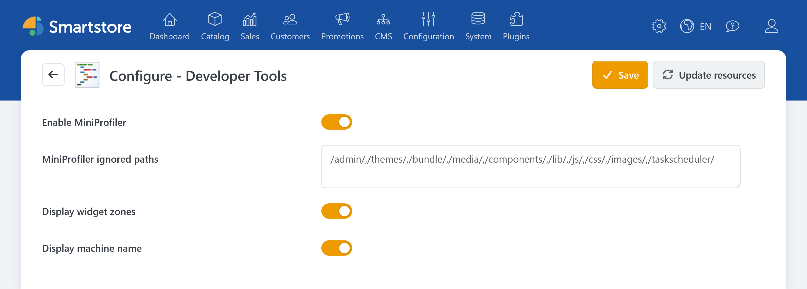
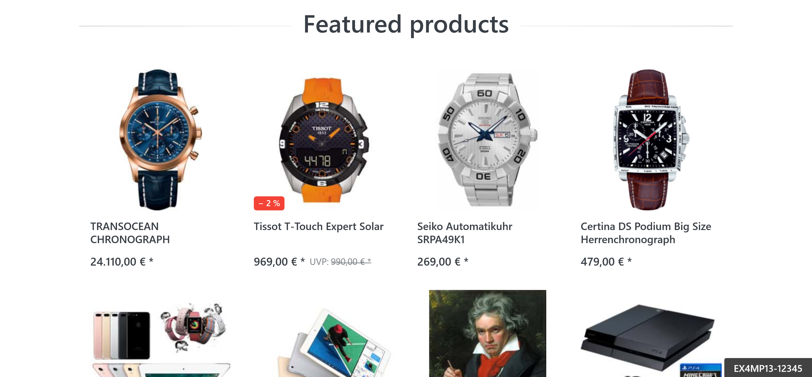

# Developer Tools

> Interactive store diagnostics

Developer Tools help administrators analyze and configure a Smartstore store. You can use them to examine the processing of page requests, make available widget zones visible, and identify the application instance currently responding in distributed environments.

These features are intended for diagnostics and configuration work. Turn off any features you no longer need after use.

## Configuring Developer Tools

In the backend, go to **Plugins > Developer Tools**.

The following settings are available:

| Setting | Function |
| --- | --- |
| **Enable MiniProfiler** | Measures the processing time of page requests. |
| **MiniProfiler ignored paths** | Excludes specific URL paths from measurement. |
| **Display widget zones** | Displays the widget zones available on the current store page. |
| **Display machine name** | Displays the identifier of the application instance currently responding. |

If you operate multiple stores, use the store selector above the configuration to specify whether the settings apply globally or to a particular store. For more information, see [Multi-Store Configuration](../configuration/general-settings-preferences/defining-the-scope-of-settings.md).

## Using MiniProfiler

MiniProfiler helps you identify slow store pages. After a page is requested, it displays the measured processing time. For example, you can compare different pages or check whether a change affects loading time.

### Enabling MiniProfiler

The MiniProfiler widget appears in the upper-left corner of the store page. When accessing the store normally, it is visible only to signed-in administrators.

Click a measurement to view more details about the page request. The detailed view is intended primarily for advanced users and developers.


Smartphones are excluded from profiling. MiniProfiler can be used on tablets.



MiniProfiler adds processing overhead. In a production store, enable it only for the duration of your investigation.


### Excluding paths from profiling

Advanced users can use **MiniProfiler ignored paths** to specify URL paths that should not be examined. Separate paths with commas. The predefined exclusions for the backend and static files should normally be retained.

For more information about configuration and technical analysis, see [MiniProfiler in the developer documentation](https://dev.smartstore.com/framework/platform/diagnostics#miniprofiler).

## Displaying widget zones

Widget zones are predefined positions where widgets, Page Builder stories, or custom content can be displayed in the store. Developer Tools allow you to check which widget zones are available on a particular store page and where they are located.

For basic information about using these positions, see [Widget zones](../content-management/widget-zones.md).

### Enabling the widget zone display

When accessing the store normally, widget zones are displayed only if you are signed in with an administrator account. They remain hidden from customers.


Displaying widget zones prevents the affected page requests from being served from the [Output Cache](output-cache.md). Turn off this feature when you have finished your work.


### Displaying widget zones in the store

Open the widget zone menu using the layers icon on the right side of the browser window.


The widget zone menu is displayed only when the browser window is sufficiently wide. If necessary, check whether the browser window is maximized.


The menu contains a list of the widget zones available on the current page, grouped by page area.

You can use the menu as follows:

| Action | Function |
| --- | --- |
| **Select widget zone** | Scrolls to the corresponding position on the page and briefly highlights it. |
| **Copy icon** | Copies the exact name of the widget zone to the clipboard. |
| **On/off switch** | Specifies whether widget zone markers are displayed continuously. |
| **Eye icon** | Temporarily shows or hides markers that have already been rendered. |
| **Close** | Closes the widget zone menu. |

You can also temporarily show or hide the markers using **Alt + K**.

The setting for continuous display is saved in the browser and remains active until it is changed again.


The menu always displays the widget zones of the currently open page. Switch between the home page, a product page, a category page, and the shopping cart, for example, to check the positions available on each page. The available widget zones depend on the page, the active theme, and the enabled features.


Zones with the same name are listed only once in the menu, even if they occur multiple times on a page.

For more information about positioning and sorting widgets, see [Arranging Widgets](../content-management/arranging-widgets.md). You can also use [Previewing Themes & Stores](../../discover/common-concepts/previewing-themes-stores.md) to check different themes or stores.

## Displaying the machine name

**Display machine name** shows the identifier of the application instance currently responding in the lower-right corner of the store frontend.

This feature is especially useful for stores running on multiple servers, containers, or application instances. By requesting a page repeatedly, you can identify which instance processes each request.

When accessing the store normally, this information is restricted to signed-in administrators. Requests made locally on the server are a technical exception.


The identifier reveals information about the technical environment. Turn off the display after completing your diagnostics.


## Related articles

- [MiniProfiler in the developer documentation](https://dev.smartstore.com/framework/platform/diagnostics#miniprofiler)
- [Widget zones](../content-management/widget-zones.md)
- [Arranging Widgets](../content-management/arranging-widgets.md)
- [Output Cache](output-cache.md)
- [Multi-Store Configuration](../configuration/general-settings-preferences/defining-the-scope-of-settings.md)
- [Previewing Themes & Stores](../../discover/common-concepts/previewing-themes-stores.md)
