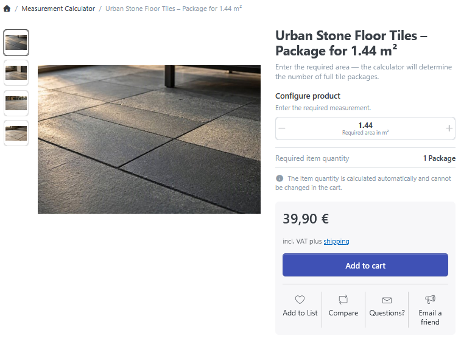
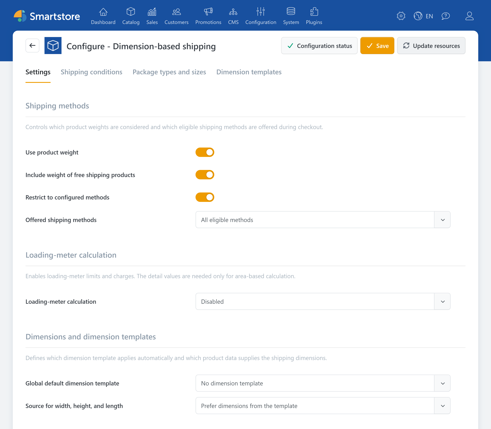
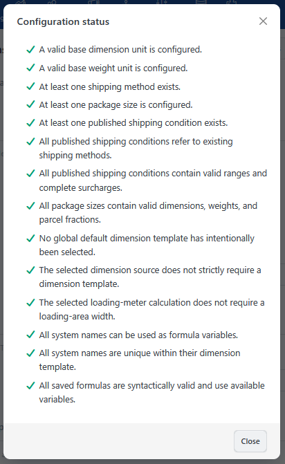

# Dimension-based shipping

The **Dimension-based shipping** plugin calculates shipping costs based on product dimensions and, optionally, shipping weight. Using this information, the plugin determines which configured parcels, pallets, or other cuboid package sizes are required. This determines the available shipping methods and their prices.

The plugin provides two areas that can be used independently: The dimension and quantity calculator lets customers configure products with custom dimensions and calculates the price or item quantity from their input. Independently of this, you can calculate shipping costs based on product dimensions. Using only the calculator does not require any package sizes or shipping conditions.

The plugin supports, among other things:

- package sizes with fixed maximum dimensions and weights,
- shipping conditions based on weight, volume, or quantity,
- girth and oversized-goods rules,
- surcharges for packaging, energy, tolls, or additional weight units,
- loading-meter calculations,
- additional product dimensions or dimensions entered by customers,
- automatic dimension templates through global, category, and product defaults,
- packing formulas for non-cuboid products.

## Requirements

Before configuring the plugin, you need:

- complete width, height, and length values for products that require shipping,
- maintained shipping weights if weight is to affect the calculation,
- the prices and dimension limits specified by your shipping provider.


All lengths use the **base dimension unit**, and all weights use the **base weight unit**. Check both units before configuring the plugin.

For example, a value of `120` means 120 cm only if centimeters are configured as the base dimension unit. For more information, see [Managing weights, quantity units, and dimensions](../configuration/managing-weights-quantity-units-dimensions.md).


## Calculation process

For each shipping method, the calculation follows this simplified sequence:

1. The width, height, and length of the products are determined.
2. If enabled, shipping weight is also considered.
3. Quantities are split into individual cuboids or combined using a packing formula.
4. The plugin finds published shipping conditions for the shipping method, store, destination country, postal code, and cart quantity.
5. The packing algorithm tries to arrange the products in suitable package sizes. Cuboids may be rotated.
6. Tiers and surcharges are evaluated for each package.
7. Finally, the configured selection rule is applied to all eligible shipping methods.

If no matching shipping condition or package size can be found, no price is offered for that shipping method.

## Recommended configuration sequence

1. Create the required [shipping methods](../configuration/setting-up-shipping-methods.md).
2. Check the [base dimension unit and base weight unit](../configuration/managing-weights-quantity-units-dimensions.md).
3. Configure the [settings](dimension-pricing/settings.md).
4. Create [package types and sizes](dimension-pricing/package-types-and-sizes.md).
5. Create and publish the [shipping conditions](dimension-pricing/shipping-conditions.md).
6. If required, create [dimension templates](dimension-pricing/dimension-templates.md) and configure their global, category-specific, or product-specific use.

## Configuration and permissions

Open **Configuration** &rarr; **Regional settings** &rarr; **Shipping rate computation methods**. Open the submenu for **Dimension-based shipping** and select **Configure**. The configuration page contains four tabs:

- [Settings](dimension-pricing/settings.md)
- [Shipping conditions](dimension-pricing/shipping-conditions.md)
- [Package types and sizes](dimension-pricing/package-types-and-sizes.md)
- [Dimension templates](dimension-pricing/dimension-templates.md)

The [dimension and quantity calculator](dimension-pricing/dimension-and-quantity-calculator.md) is configured within a dimension template. See [Practical examples](dimension-pricing/practical-examples.md) for specific applications.

Use **Configuration status** in the toolbar to check whether essential requirements and saved formulas are configured correctly.


Separate [permissions](../configuration/controlling-access-permissions.md) are available to read, create, edit, and delete **Dimension-based shipping** data. Administrators receive these permissions by default. Grant other administrative roles only the permissions they actually need.


## Cart and checkout behavior

Free-shipping products do not create their own package, although their weight can still affect selection and pricing depending on the [settings](dimension-pricing/settings.md).

Every offered shipping method must be able to transport the entire relevant cart. The plugin does not automatically split a cart across different shipping methods.

## Example

The following simplified example guides you through a basic parcel-shipping configuration. It shows how the shipping method, package type, package size, and shipping condition are connected and which checks are recommended after setup. For detailed applications of the dimension and quantity calculator, see [Practical examples](dimension-pricing/practical-examples.md).

1. Create the shipping method `Standard parcel`.
2. Create the package type `Parcel` with display order `10`.
3. Add the package size `Parcel M` with your provider's maximum dimensions and weight. Set **Fraction of a full unit** to `1`.
4. Create a published shipping condition for the required store, destination country, and postal-code pattern `*`.
5. Select the shipping method `Standard parcel` and package size `Parcel M`.
6. Enter the base price and add weight ranges or surcharges if required.
7. Test a product at the dimension and weight limits.
8. Then test a quantity that requires two packages and verify the price calculation.

## Known limitations

Area-based loading-meter calculation uses the rectangular footprint of the packed result. It therefore does not represent carrier-specific rules such as stackability, pallet exchange, or axle load. Account for such requirements in your configuration and compare the calculated values with your shipping provider's specifications. For more information about the minimum value and rounding, see [Loading-meter calculation](dimension-pricing/settings.md#loading-meter-calculation).
