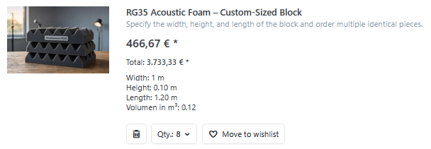

# Dimension and quantity calculator

The dimension and quantity calculator is an optional configurator on the product detail page. It replaces the standard quantity input and is suitable for cut-to-size products, panels, fabrics, floor coverings, and other products whose required quantity or price depends on dimensions.


The calculator can:

- convert a total measurement entered by the customer into an item quantity,
- determine the required item quantity from several individual dimensions,
- calculate a dimension-based price,
- offer a freely selectable item quantity for dimension-based prices.

You configure the calculator in a [dimension template](dimension-templates.md). One template can be assigned to multiple products so that they use the same calculation logic. See [Practical examples](practical-examples.md) for applications of all operating modes.

## Requirements

Before configuring the calculator, the dimension template should contain every dimension needed for the calculation. For each dimension, configure the system name, minimum value, maximum value, default value, and visible label under [**Dimensions**](dimension-templates.md#add-dimensions).

The calculator later uses these values for its input fields and calculations.

## Dimension and quantity calculator settings

The settings are divided into **Display** and **Calculation**. Under **Display**, enable and label the calculator. Under **Calculation**, determine which inputs are available and how they produce the dimension value, item quantity, or price.


### Display

| Setting | Description |
| --- | --- |
| **Show dimension and quantity calculator** | Enables the calculator for all products that use this dimension template. It appears above the price on the product detail page and replaces the standard quantity input. |
| **Dimension value label** | Labels the calculated value, for example **Area in m²**, **Length in m**, or **Volume in m³**. |

The calculator takes the item quantity label from the product's [**quantity unit**](../../configuration/managing-weights-quantity-units-dimensions.md). It automatically uses the singular or plural form, for example **1 package** or **2 packages**.

### Calculation

These settings determine what the customer enters and how the calculator derives the dimension value, item quantity, or price.

| Setting | Description |
| --- | --- |
| **Operating mode** | Determines whether the customer enters a total measurement or individual dimensions and whether the calculator derives the item quantity or price. |
| **Calculation formula** | Combines dimensions into a dimension value. For example, `Width * Length` calculates an area from width and length. |
| **Divisor** | Converts the formula result to another unit when required. |
| **Decimal places** | Determines how precisely the dimension value is displayed and used. |

#### Select the operating mode

Choose the operating mode by answering two questions:

- Does the customer enter a total requirement or individual dimensions?
- Should the calculator derive the item quantity or the price?

| Operating mode | Customer input | Result | Quantity in cart | Example |
| --- | --- | --- | --- | --- |
| Enter aggregate dimension – calculate item quantity | one total value | required item quantity | cannot be changed | [Floor tiles](practical-examples.md#floor-tiles-calculate-packages-from-a-total-area) |
| Enter individual dimensions – calculate item quantity | individual dimensions | dimension value and required item quantity | cannot be changed | [Non-woven wallpaper](practical-examples.md#non-woven-wallpaper-calculate-rolls-from-wall-dimensions) |
| Enter individual dimensions – calculate price | individual dimensions | dimension-based price | no quantity selection | [Glass panel](practical-examples.md#glass-panel-calculate-the-price-of-a-two-dimensional-cut-to-size-product) |
| Enter individual dimensions – calculate price and select quantity | individual dimensions and item quantity | dimension-based unit and total price | freely selectable | [Acoustic foam](practical-examples.md#acoustic-foam-configure-three-dimensional-blocks) |

##### Enter aggregate dimension – calculate item quantity

The customer enters the total required measurement, such as an area. The individual product dimensions are not displayed and cannot be changed.

Using the fixed product dimensions, the formula calculates how much one item covers. The calculator divides the total requirement by this value and rounds the result up to a whole item quantity.

See [Floor tiles](practical-examples.md#floor-tiles-calculate-packages-from-a-total-area) for a complete configuration.

##### Enter individual dimensions – calculate item quantity

The customer enters the dimensions of the requirement. The formula combines these inputs into a dimension value from which the calculator determines the required item quantity. If the calculated quantity is not sufficient as a whole number, it is rounded up to the next complete item.

The price is based on the regular product price and the calculated item quantity. See [Non-woven wallpaper](practical-examples.md#non-woven-wallpaper-calculate-rolls-from-wall-dimensions) for a complete configuration.

##### Enter individual dimensions – calculate price

The customer enters the dimensions of one configuration. The calculator compares the resulting dimension value with the product's base measurement and adjusts the regular product price proportionally.

The configured version is added to the cart as one item; no additional quantity selection is offered. For one- and two-dimensional examples, see [Textile cable](practical-examples.md#textile-cable-calculate-the-price-from-a-length) and [Glass panel](practical-examples.md#glass-panel-calculate-the-price-of-a-two-dimensional-cut-to-size-product).

##### Enter individual dimensions – calculate price and select quantity

As in the previous operating mode, the calculator determines the price of one configured version. The customer additionally selects how many identical items with these dimensions to order.

For two- and three-dimensional examples, see [Tabletop](practical-examples.md#tabletop-order-several-identical-cut-to-size-products) and [Acoustic foam](practical-examples.md#acoustic-foam-configure-three-dimensional-blocks).

#### Calculation formula

The calculation formula combines the required dimensions into a dimension value. The purpose of this value depends on the operating mode:

- When a total measurement is entered, the formula describes how much one item covers.
- When individual dimensions are entered, the formula calculates the dimension value of the required configuration.
- In quantity-based operating modes, this value determines the required item quantity.
- In price-based operating modes, its ratio to the product's base measurement determines the price.

The formula uses the system names of dimensions from the dimension template. Available system names are displayed below the formula field. Select a system name to insert it at the current cursor position.

Numbers, decimal numbers, parentheses, and the four basic arithmetic operators `+`, `-`, `*`, `/` are supported.

Examples:

```text
Width * Length
Width / 2
(A + Width) * Height
```

The formula is validated when you save. Invalid expressions and variables that do not exist in the dimension template are reported directly on the formula field.

#### Divisor

The formula result is divided by the divisor. Use it to convert the result from the store's base dimension unit to the unit that the calculator should display and use.

If millimeters are the base dimension unit, for example, use the following conversions:

| Required dimension value | Example formula | Divisor |
| --- | --- | ---: |
| Meters | `Width` | `1,000` |
| Square meters | `Width * Length` | `1,000,000` |
| Cubic meters | `Width * Height * Length` | `1,000,000,000` |

The correct divisor depends on the [base dimension unit](../../configuration/managing-weights-quantity-units-dimensions.md), the formula, and the required output unit. Use `1` if no conversion is required.

#### Decimal places

Determines how many decimal places are used to display the calculated dimension value. The price calculation continues to use the more precise, unrounded formula result.

Configure the decimal places and step sizes of input fields separately under [**Dimensions**](dimension-templates.md#add-dimensions).

### Display in the cart and order

The entered dimensions and calculated dimension value accompany the product item throughout the ordering process. They appear in the off-canvas cart, cart, checkout, customer order details, administration order view, print view, and the order emails sent to the customer and merchant.

- An item quantity determined by the calculator cannot be changed in the cart.
- An item quantity selected by the customer remains editable in the cart.


