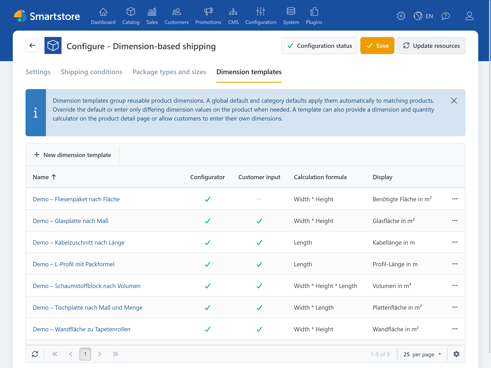
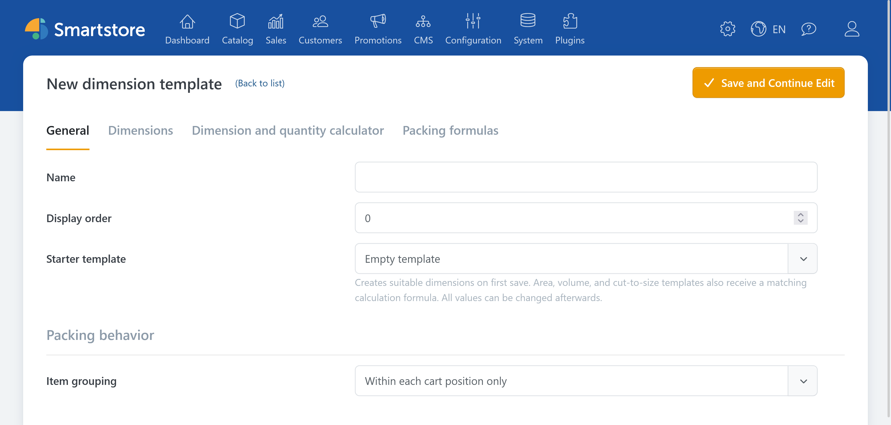
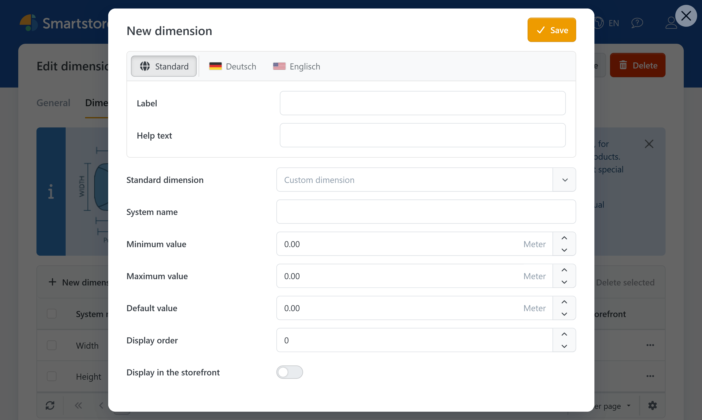
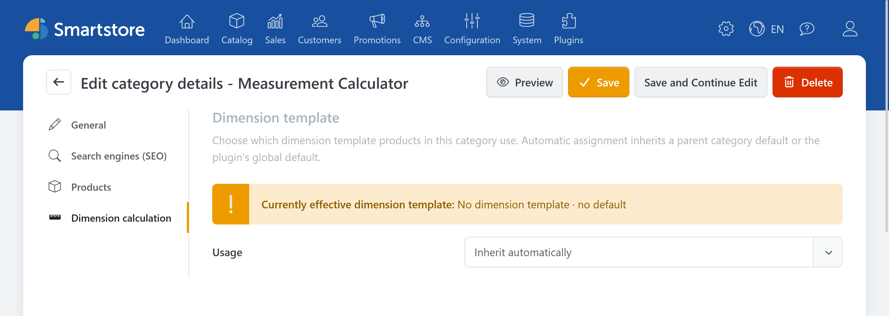
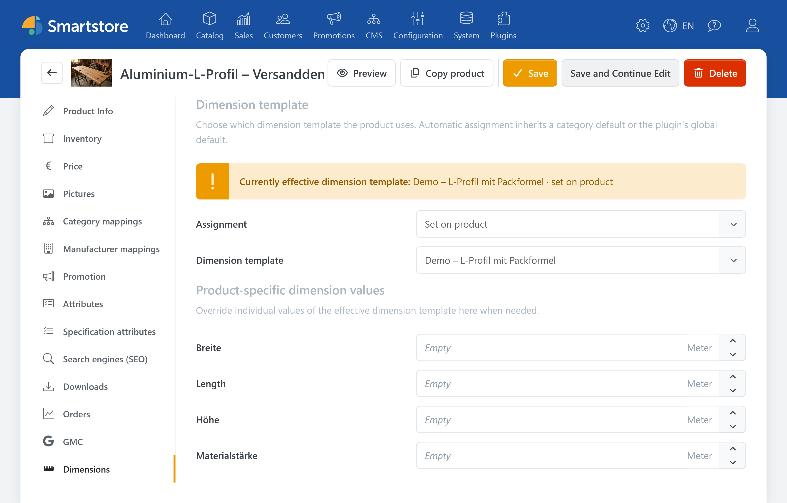
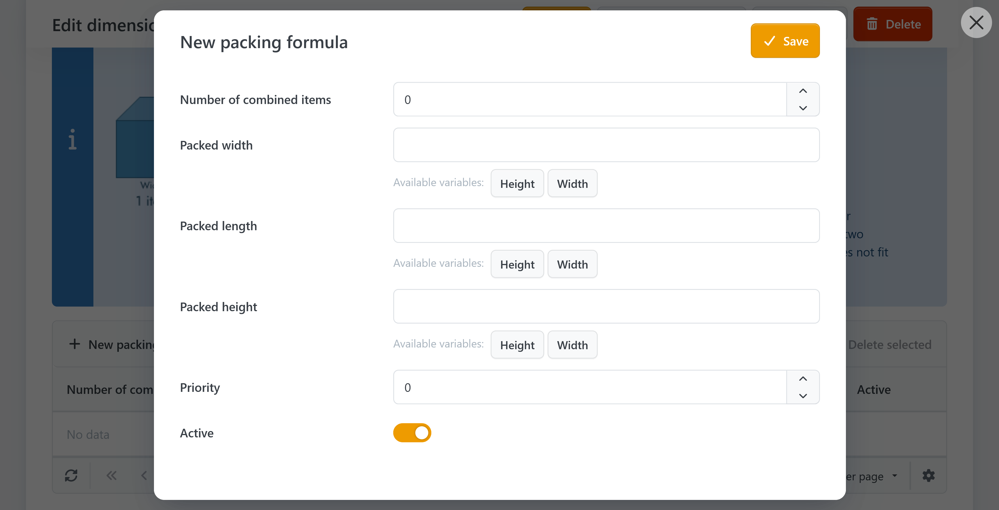

# Dimension templates

Dimension templates are reusable records of additional product dimensions. They can also provide the [dimension and quantity calculator](dimension-and-quantity-calculator.md) on the product detail page and contain packing formulas for combining identical products efficiently.



Open the [plugin configuration](../dimension-pricing.md#configuration-and-permissions) and switch to the **Dimension templates** tab.


You do not need a dimension template if you use only the standard product fields for width, height, and length and require neither the dimension and quantity calculator nor a packing formula.


## Create a dimension template

1. Click **New dimension template**.
2. Enter an administrative **Name**.
3. Select a **Starter template**.
4. Set the **Display order**.
5. Save the template. The edit page remains open so that you can immediately review the created dimensions and settings.

| Starter template | Created content |
| --- | --- |
| Empty template | Creates no dimensions or calculation formula. |
| Width, height, and length | Creates the three standard dimensions `Width`, `Height`, and `Length`. |
| Area (width × height) | Creates `Width` and `Height` and the formula `Width * Height`. |
| Volume (width × height × length) | Creates `Width`, `Height`, and `Length` and the corresponding volume formula. |
| Cut to size (width × length) | Creates `Width` and `Length` and the formula `Width * Length`. |



## Add dimensions

Dimensions form the basis of calculation formulas and can also be displayed on the product detail page or entered by customers. For each dimension, you define the system name, permitted value range, default value, and other settings.



| Option | Description |
| --- | --- |
| Label | Visible name of the dimension. |
| Help text | Explanation for administrators or customers. |
| Standard dimension | Select **Width**, **Height**, or **Length** to use the corresponding system name automatically. Select **Custom dimension** for any other dimension. |
| System name | Technical name used in calculation and packing formulas. For a custom dimension, define the system name yourself. |
| Minimum value | Smallest value that an administrator or customer may enter. |
| Maximum value | Largest value that an administrator or customer may enter. |
| Default value | Value used for a product unless a product-specific value is entered. |
| Display order | Lower values appear first. |
| Display in the storefront | Shows the dimension applied to the product in the **Dimensions** section of the product detail page. |


If the selected [source for width, height, and length](settings.md#source-for-width-height-and-length) uses dimensions from the template, it requires dimensions with the system names `Width`, `Height`, and `Length`.


## Assign dimension templates

Dimension templates can be assigned globally, through categories, or directly to individual products. The effective template for each product is determined in this order:

1. Product assignment
2. Assignment of the most specific category
3. Global default dimension template
4. No dimension template

You can therefore start with a global template, configure exceptions for categories, and handle only individual products separately.

### Set the global default

The global default applies to all products for which no different template is specified by a category or directly on the product. Select **No dimension template** to disable the global default.

1. Open the plugin [settings](settings.md#global-default-dimension-template).
2. Select the required template under **Global default dimension template**.
3. Save the settings.

### Set a category default

Use categories to assign one dimension template to multiple products. The assignment can inherit the parent category or global default, disable the template, or replace it with another template.

1. In the administration area, open **Catalog** &rarr; [**Categories**](../../../manage/catalog/organizing-product-categories.md).
2. Open the required category and switch to the **Dimension calculation** tab.
3. Select the required mode under **Usage**.
4. For **Select a different dimension template**, choose the template.
5. If required, set the **Priority**, and save the category.

| Mode | Description |
| --- | --- |
| Automatic (inherit default) | Inherits the default of the parent category or, if none is set there, the global default. |
| No dimension template | Uses no dimension template for this category and its child categories. A more specific category or product assignment can override this. |
| Select a different dimension template | Uses the selected template for this category and its child categories. A more specific assignment takes precedence. |



The page shows which default would be inherited without a separate selection and where it comes from.

If a product belongs to multiple categories, the assignment from the deepest and therefore most specific category is used first. If multiple assignments are on the same level, the lower **Priority** takes precedence. If these values are also identical, the display order of the product's category assignments decides.

### Set a product assignment

For an individual product, you can inherit, disable, or specifically replace the assignment from a category or the global default. You can also override the default values of the applied dimension template for that product.

1. In the administration area, open **Catalog** &rarr; **Products**.
2. Open the required product and switch to the **Dimensions** tab.
3. Select the required mode under **Assignment**.
4. For **Set on product**, select the template.
5. Enter only dimensions that differ from the template values, and save the product.

| Mode | Description |
| --- | --- |
| Inherit automatically | Uses the default from the most specific category or the global default. |
| No dimension template | Disables the dimension template for this product. |
| Set on product | Uses the selected template for this product. |



Under **Currently effective dimension template**, you can see the template in use and its source. A product assignment always takes precedence over category and global defaults.


If multiple categories with equal precedence provide different defaults, a message appears on the product. Review the category priorities and the display order of the category assignments, or select an unambiguous template directly on the product.


### Use product-specific dimension values

The dimension fields on the product override the default values of the effective dimension template. Leave a field empty to use the template's default value.

If you later change a default value in the dimension template, the new value automatically applies to every product without a product-specific override. Delete an entered product value to use the current template value again.

If you select **No dimension template** on the product, its saved product-specific dimension values are removed.

## Duplicate or delete a dimension template

Open an existing dimension template and click **Duplicate** to create a copy including its dimensions, packing formulas, and translations. The copy opens for editing and can be changed independently.

When deleting a template, the confirmation shows how many products and categories it is assigned to directly. It also states whether the template is selected as the global default. Deleting the template removes these assignments as well as its dimensions and packing formulas.

## Packing formulas

Packing formulas are suitable for identical, non-cuboid products that can be combined into a smaller cuboid packing element.



Open a dimension template and switch to **Packing formulas**. For each formula, define:

- the number of items calculated together,
- the width of the packing element,
- the height of the packing element,
- the length of the packing element,
- the priority; lower values are evaluated first.

Example: Two L-shaped parts can be nested. Height and length remain unchanged, while the combined width is `Width + A`.

```text
Number of combined items: 2
Packing element width: Width + A
Packing element height: Height
Packing element length: Length
Priority: 0
```

If formulas exist for groups of 10 and 2 items and the group of 10 has higher priority, 25 items are handled as two groups of ten, two groups of two, and one individual item.

The available variables are shown as buttons below each formula field. Click a variable to insert it at the current cursor position.

Formulas are validated when you save. Unknown variables or invalid expressions are reported directly on the corresponding field. Still test quantities immediately below, exactly at, and immediately above each group size.

If a system name is already used in a formula, update the affected formulas before renaming or deleting the dimension.

## When product dimensions are not used

- Check the [source for width, height, and length](settings.md#source-for-width-height-and-length).
- Use the system names `Width`, `Height`, and `Length` for custom standard dimensions.
- Check which dimension template is effective for the product and where the assignment comes from.
- Consider dimensions of [variants or attribute combinations](../../../manage/catalog/managing-products/understanding-product-variants.md), as these can affect the product's base values.
