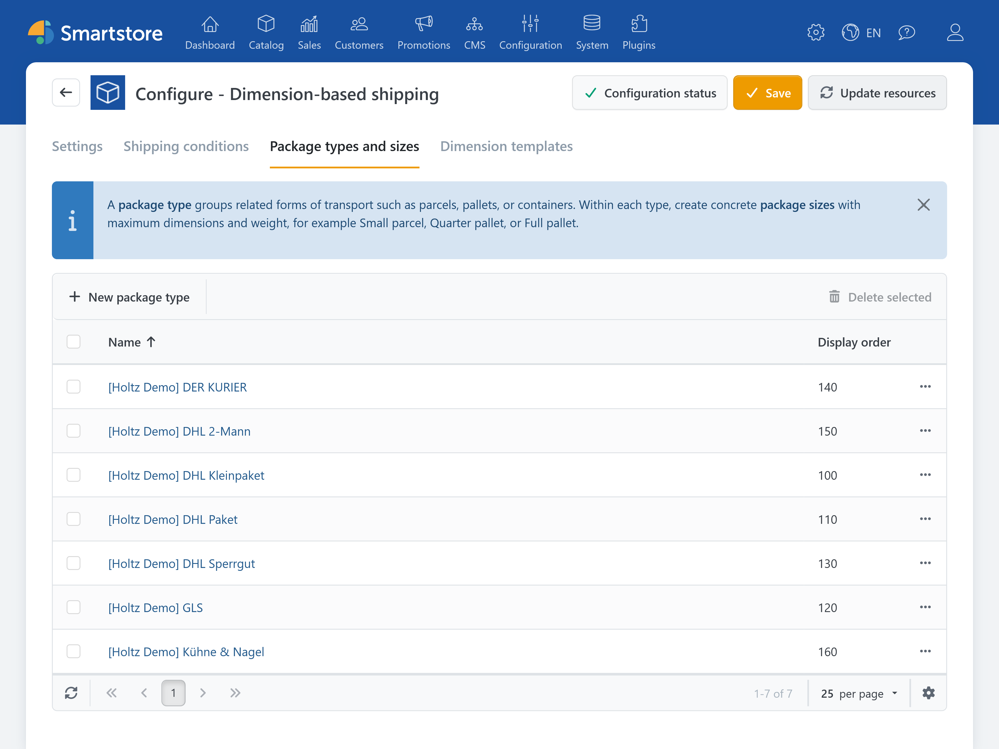
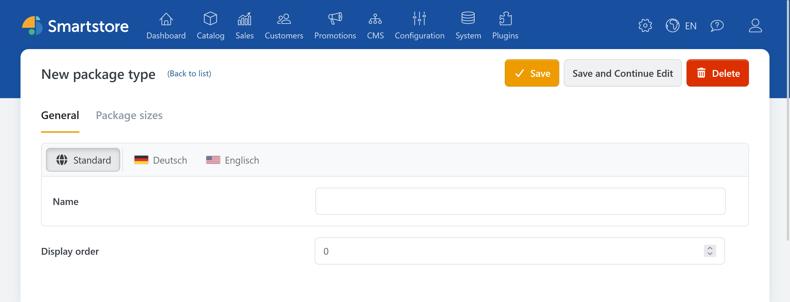
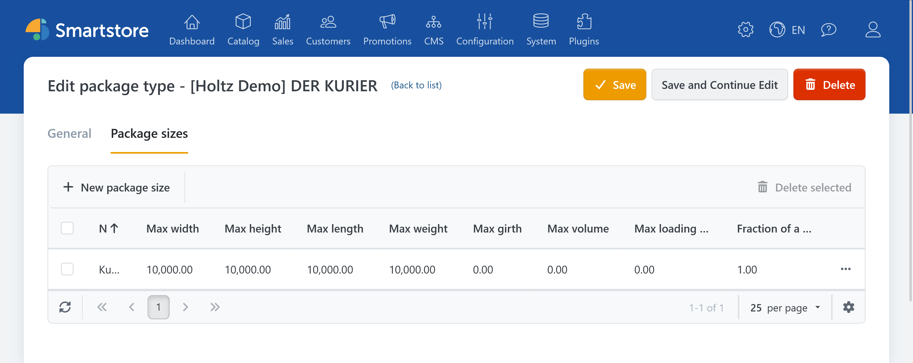
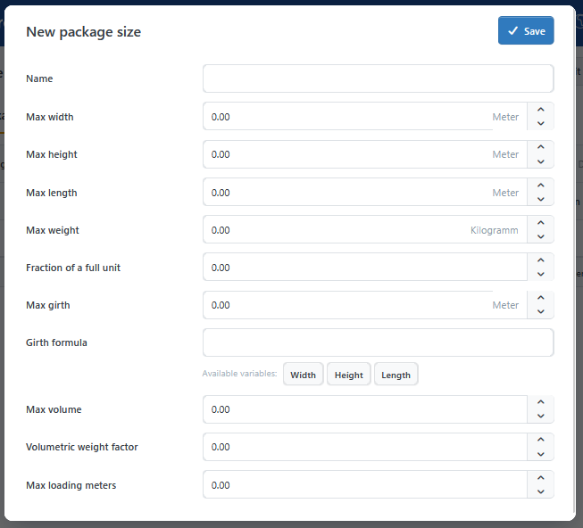

# Package types and sizes

A **package type** groups related forms of transport, such as parcels, pallets, or containers. A **package size** describes a specific cuboid format and its limits, such as *Parcel S* or *Quarter pallet*.



## Create a package type

The **Package types and sizes** tab in the [plugin configuration](../dimension-pricing.md#configuration-and-permissions) provides an overview of all entries.



1. Click **New package type**.
2. Enter a unique name, such as `Parcel shipping` or `Pallet shipping`.
3. Set the **Display order**. Lower values have higher priority during selection.
4. Save the package type.

## Create a package size



Open a saved package type, switch to **Package sizes**, and click **New package size**.



| Option | Description |
| --- | --- |
| Name | Unique administrative name, such as `Parcel S` or `Half pallet`. |
| Max. width,<br>Max. height,<br>Max. length | Maximum dimensions of the package size. The packing algorithm tries to arrange products within these limits. |
| Max. weight | Maximum package weight. It is considered during packing when weight calculation is enabled. |
| Fraction of a full unit | Relates partial sizes to a full unit. `1` represents a full unit. Smaller values are preferred when priority is otherwise equal. |
| Max. girth | Optional maximum. `0` disables the limit. |
| Girth formula | Optional formula using `Width`, `Height`, and `Length` that calculates the girth of the packed result. |
| Max. volume | Optional maximum for the sum of product volumes in the package. `0` disables the limit. |
| Volumetric weight factor | Multiplies the packed volume by a factor. The greater of actual weight and volumetric weight becomes the chargeable weight. `0` disables the conversion. |
| Max. loading meters | Optional maximum per package. Its meaning depends on the selected [loading-meter mode](settings.md#loading-meter-calculation). `0` disables the limit. |

Example girth formula:

```text
Length + 2 * Width + 2 * Height
```


The variables `Width`, `Height`, and `Length`, the arithmetic operators `+`, `-`, `*`, `/`, and parentheses are available for the girth formula.


The formula is applied to the actual occupied dimensions of the packed result. If a maximum girth is set but the formula cannot be evaluated, the package size is not eligible.

Use the buttons below the formula field to insert `Width`, `Height`, and `Length`. The girth formula is validated when you save; errors are reported directly on the field.

## Use in shipping conditions

A [shipping condition](shipping-conditions.md) connects a package size to a shipping method, destination, and price. Therefore, create the required package types and sizes first.

Configure the dimension, weight, and quantity units in [Managing weights, quantity units, and dimensions](../../configuration/managing-weights-quantity-units-dimensions.md).

## When no package size fits

Check:

- the maximum dimensions and weight of the package sizes,
- the product-dimension source in the [settings](settings.md),
- girth, volume, and loading-meter limits,
- packing formulas for non-cuboid products,
- carts containing multiple products or higher quantities.
