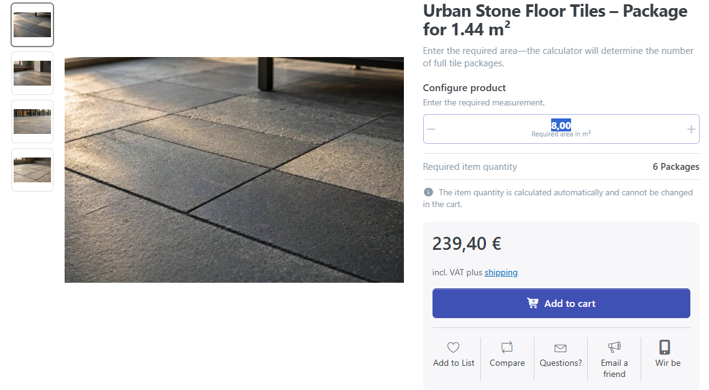
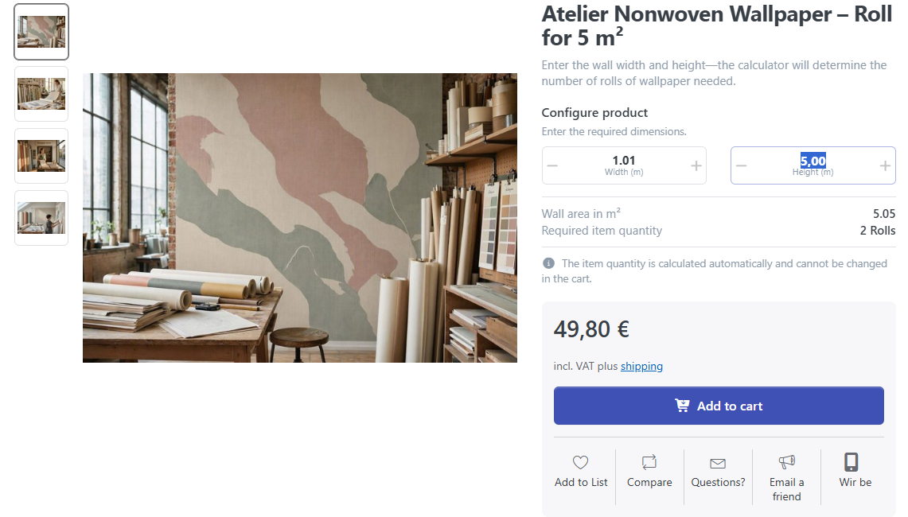
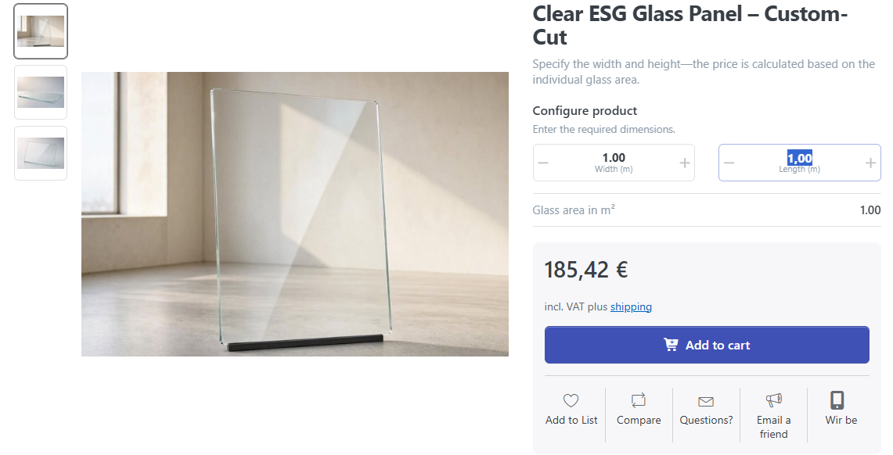
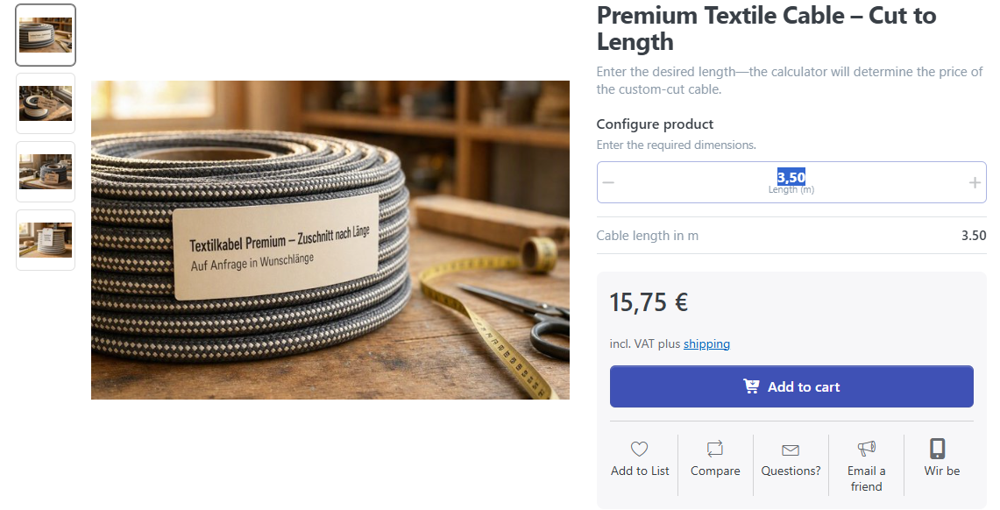
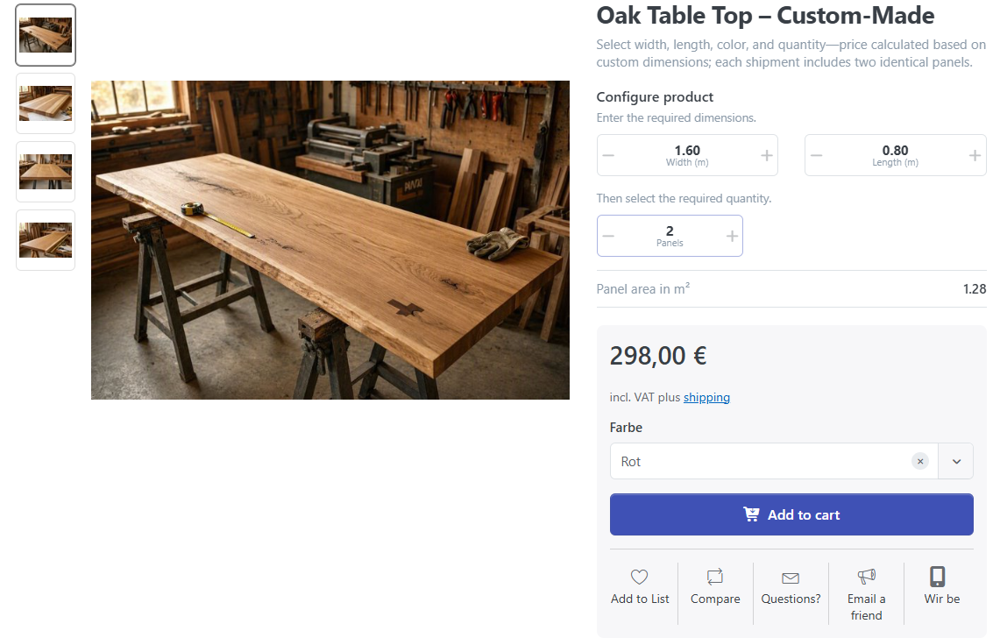
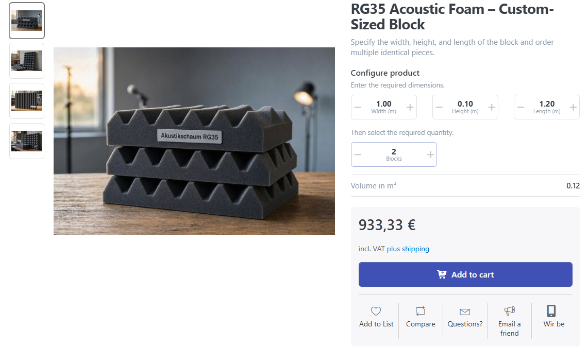

# Practical examples

The following examples demonstrate common uses of the dimension and quantity calculator. Together they cover all four [operating modes](dimension-and-quantity-calculator.md#select-the-operating-mode) and one-, two-, and three-dimensional products.

The example prices and dimensions are for illustration. Adapt minimum values, maximum values, step sizes, and labels to your actual product range.

| Example | Customer input | Result |
| --- | --- | --- |
| [Floor tiles](#floor-tiles-calculate-packages-from-a-total-area) | total required area | number of complete packages |
| [Non-woven wallpaper](#non-woven-wallpaper-calculate-rolls-from-wall-dimensions) | width and height of the wall area | number of complete rolls |
| [Glass panel](#glass-panel-calculate-the-price-of-a-two-dimensional-cut-to-size-product) | width and length of the cut-to-size panel | price of the glass panel |
| [Textile cable](#textile-cable-calculate-the-price-from-a-length) | required length | price of the cable cut |
| [Tabletop](#tabletop-order-several-identical-cut-to-size-products) | width, length, and quantity | total price of identical tabletops |
| [Acoustic foam](#acoustic-foam-configure-three-dimensional-blocks) | width, height, length, and quantity | total price of identical foam blocks |

## Floor tiles: calculate packages from a total area

The product **Urban Stone floor tiles – package for 1.44 m²** is sold only in complete packages. The customer knows the required floor area but does not have to calculate how many packages are needed.

### Configuration

| Setting | Example value |
| --- | --- |
| Operating mode | **Enter aggregate dimension – calculate item quantity** |
| Dimensions of one package | Width `1.20 m`, length `1.20 m` |
| Calculation formula | `Width * Length` |
| Divisor | `1` |
| Dimension value label | **Required area in m²** |
| Product quantity unit | **Package / Packages** |
| Regular product price | `€39.90` per package |

The formula first calculates the area of one package from its fixed product dimensions:

```text
1.20 m * 1.20 m = 1.44 m² per package
```

### Example calculation

The customer enters a total requirement of `8 m²`.

```text
8 m² / 1.44 m² = 5.56 packages
Rounded up: 6 packages
6 * €39.90 = €239.40
```

The calculator adds six complete packages to the cart. The calculated item quantity cannot be changed manually there.



## Non-woven wallpaper: calculate rolls from wall dimensions

The **Atelier non-woven wallpaper – roll for 5 m²** is sold by the roll. The customer enters the width and height of the area to be wallpapered. The calculator determines the required area and the number of complete rolls.

### Configuration

| Setting | Example value |
| --- | --- |
| Operating mode | **Enter individual dimensions – calculate item quantity** |
| Coverage of one roll | `5 m²` |
| Calculation formula | `Width * Height` |
| Divisor | `1` |
| Dimension value label | **Area in m²** |
| Product quantity unit | **Roll / Rolls** |
| Regular product price | `€24.90` per roll |

### Example calculation

The customer enters a width of `1.01 m` and a height of `5 m`.

```text
1.01 m * 5 m = 5.05 m²
5.05 m² / 5 m² = 1.01 rolls
Rounded up: 2 rolls
2 * €24.90 = €49.80
```

The calculator displays the calculated area and the two required rolls. Because only complete rolls are sold, even a small additional requirement is rounded up to the next roll.



## Glass panel: calculate the price of a two-dimensional cut-to-size product

The **Clear toughened glass panel – cut to size** is sold as one custom-cut panel. The customer specifies width and length; the price changes proportionally to the calculated area.

### Configuration

| Setting | Example value |
| --- | --- |
| Operating mode | **Enter individual dimensions – calculate price** |
| Product base dimensions | Width `0.60 m`, length `0.80 m` |
| Base area | `0.48 m²` |
| Calculation formula | `Width * Length` |
| Divisor | `1` |
| Dimension value label | **Glass area in m²** |
| Regular product price | `€89.00` for the base area |

### Example calculation

The customer configures a glass panel with a width of `1 m` and a length of `1 m`.

```text
Configured area: 1 m * 1 m = 1 m²
Area ratio: 1 m² / 0.48 m² = 2.0833
Price: €89.00 * 2.0833 = €185.42
```

The cart contains one glass panel with the entered dimensions and calculated price. This operating mode does not offer an additional quantity selection.



## Textile cable: calculate the price from a length

The **Premium textile cable – cut to length** demonstrates that the calculator can also use only one dimension. The customer enters the required cable length and receives the price for the complete cut.

### Configuration

| Setting | Example value |
| --- | --- |
| Operating mode | **Enter individual dimensions – calculate price** |
| Product base length | `1 m` |
| Calculation formula | `Length` |
| Divisor | `1` |
| Dimension value label | **Cable length in m** |
| Regular product price | `€4.50` per meter |

### Example calculation

The customer enters a length of `3.50 m`.

```text
3.50 m / 1 m = 3.5
3.5 * €4.50 = €15.75
```

The cart contains one `3.50 m` cable cut priced at `€15.75`. Unlike ordinary products sold by the meter, the configured length is stored as the dimension of this single cut.



## Tabletop: order several identical cut-to-size products

For the **Oak tabletop – made to measure**, the customer specifies the width and length of one tabletop. They can also select how many identical tabletops with exactly these dimensions to order.

### Configuration

| Setting | Example value |
| --- | --- |
| Operating mode | **Enter individual dimensions – calculate price and select quantity** |
| Product base dimensions | Width `1.60 m`, length `0.80 m` |
| Base area | `1.28 m²` |
| Calculation formula | `Width * Length` |
| Divisor | `1` |
| Dimension value label | **Panel area in m²** |
| Product quantity unit | **Panel / Panels** |
| Regular product price | `€149.00` for the base area |

### Example calculation

The customer keeps the base dimensions of `1.60 m × 0.80 m` and selects two tabletops.

```text
Area per tabletop: 1.60 m * 0.80 m = 1.28 m²
Price per tabletop: €149.00
Total price: 2 * €149.00 = €298.00
```

The cart contains two identical tabletops. To order tabletops with different dimensions, the customer opens the product again for each different configuration.



## Acoustic foam: configure three-dimensional blocks

The **RG35 acoustic foam – custom-sized block** demonstrates a three-dimensional configuration. Width, height, and length determine the volume and therefore the price of one block. The customer can also order several identical blocks.

### Configuration

| Setting | Example value |
| --- | --- |
| Operating mode | **Enter individual dimensions – calculate price and select quantity** |
| Product base dimensions | Width `0.60 m`, height `0.10 m`, length `1.20 m` |
| Base volume | `0.072 m³` |
| Calculation formula | `Width * Height * Length` |
| Divisor | `1` |
| Dimension value label | **Volume in m³** |
| Product quantity unit | **Block / Blocks** |
| Regular product price | `€280.00` for the base volume |

### Example calculation

The customer configures a block with a width of `1 m`, height of `0.10 m`, and length of `1.20 m`, then selects two blocks.

```text
Configured volume: 1 m * 0.10 m * 1.20 m = 0.12 m³
Volume ratio: 0.12 m³ / 0.072 m³ = 1.6667
Price per block: €280.00 * 1.6667 = €466.67
Total from the unrounded unit price: €933.33
```

The displayed unit price is rounded commercially. The calculator continues to use the more precise, unrounded value for the total price. The cart shows the width, height, length, and volume of the configured block. The selected item quantity remains editable there; every block in this cart item retains the same dimensions.


