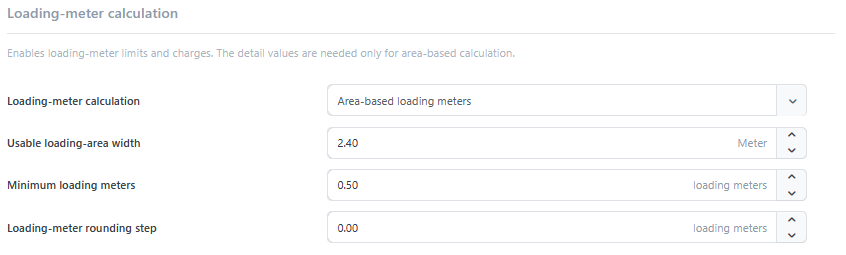

# Settings

The **Settings** tab in the [plugin configuration](../dimension-pricing.md#configuration-and-permissions) contains the central settings of the **Dimension-based shipping** plugin. They determine which dimension template is applied by default, which product data supplies the shipping dimensions, and whether product weights affect the calculation.

You can also configure:

- which eligible shipping methods are offered during checkout,
- how free-shipping products are handled in the weight calculation,
- which rule the plugin uses to select between multiple eligible shipping methods,
- how loading meters are calculated, rounded, and assigned minimum values.

## Shipping methods

This section determines whether product weights affect the calculation and which eligible shipping methods are offered during checkout.

| Option | Description |
| --- | --- |
| Use product weight | Considers product weight during packing and in weight and dimensional-weight tiers. |
| Include weight of free shipping products | Free-shipping products do not create their own package, but their total weight is added to the first package that requires shipping. |
| Restrict to configured methods | Hides a shipping method if no matching published shipping condition is found. If disabled, an [unconfigured method can be offered with a price of `0`](settings.md#when-a-shipping-method-is-offered-with-a-price-of-0). |
| Offered shipping methods | Determines whether all eligible shipping methods, only the cheapest one, or only the method with the highest priority is offered. |


**Include weight of free shipping products** is shown only when **Use product weight** is enabled.


### Selecting the offered shipping methods

This setting is applied after all eligible shipping methods have been calculated.

| Option | Description |
| --- | --- |
| All eligible shipping methods | Returns every matching shipping method. |
| Cheapest eligible shipping method | Returns only the method with the lowest calculated price. If prices are equal, display order decides. |
| Eligible shipping method with the highest priority | Returns only the eligible method with the lowest display order. If display orders are equal, price decides. |

All methods calculated by this plugin take part in the selection. For example, if **Pickup** must not compete with delivery methods, do not configure it as an equivalent method of this plugin.

If you operate multiple stores, use the store selector above the configuration to specify whether the settings apply globally or to a particular store. For more information, see [Multi-store configuration](../../configuration/general-settings-preferences/defining-the-scope-of-settings.md).

## Loading-meter calculation

Three options are available under **Loading-meter calculation**:

| Option | Description |
| --- | --- |
| Disabled | Loading-meter limits and surcharges are ignored. |
| Fixed charge per packed unit | Checks the occupied length against [**Max. loading meters**](package-types-and-sizes.md#create-a-package-size). The [loading-meter charge](shipping-conditions.md#surcharges) configured in the shipping condition is added once per packed unit. |
| Area-based | Calculates `occupied length × occupied width ÷ usable loading-area width`. The minimum and rounding settings are then applied. The loading-meter charge is treated as a price per calculated loading meter. |

For area-based calculation, also configure:

- **Usable loading-area width**: Width of the available loading area in the [base dimension unit](../../configuration/managing-weights-quantity-units-dimensions.md).
- **Minimum loading meters**: Optional minimum value per package.
- **Loading-meter rounding step**: Increment to which each package is rounded up. `0` disables rounding.

Example: A package occupies 1.20 m in length and 0.80 m in width. With a usable loading-area width of 2.40 m, the result is `1.20 × 0.80 ÷ 2.40 = 0.40` loading meters. If the minimum is `0.50`, the plugin charges `0.50` loading meters.


The area-based calculation uses the rectangular footprint of the packed result. Carrier-specific rules such as stackability, pallet exchange, or axle load are not derived automatically.


## Dimensions and dimension templates

This section determines which dimension template applies automatically and which product data supplies the shipping dimensions.

### Global default dimension template

The **Global default dimension template** applies automatically to products without a different product or category assignment. This avoids selecting the same template separately for every product.

Select **No dimension template** if no global default should apply. A dimension template can still be assigned through a category or directly to a product.

For details about global, inherited, and product-specific assignments, see [Assigning dimension templates](dimension-templates.md#assign-dimension-templates).

If no dimension template exists yet, select **Create dimension template** to create one directly.

### Source for width, height, and length

**Source for width, height, and length** determines where the three dimensions used for shipping come from.

| Option | Description |
| --- | --- |
| Use standard product dimensions only | Uses only the product's standard dimension fields. |
| Use dimensions from the template only | Uses only dimensions with the system names `Width`, `Height`, and `Length`. |
| Prefer standard product dimensions | Uses the standard product value first for each dimension. If it is `0`, the value from the dimension template is used. |
| Prefer dimensions from the template | Uses the dimension-template value first for each dimension. If it is `0`, the standard product value is used. |

For more information about custom dimensions, see [Dimension templates](dimension-templates.md).

## When a shipping method is offered with a price of 0

If **Restrict to configured methods** is disabled, an unconfigured shipping method can be offered with a price of `0`. Enable the setting or create a matching published [shipping condition](shipping-conditions.md).
