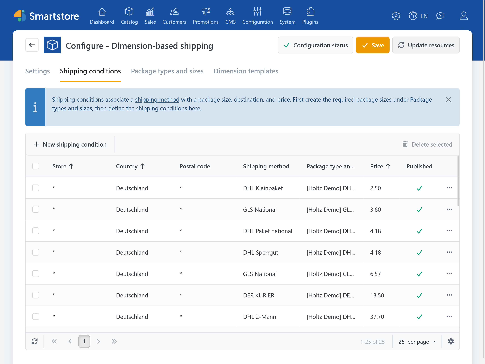
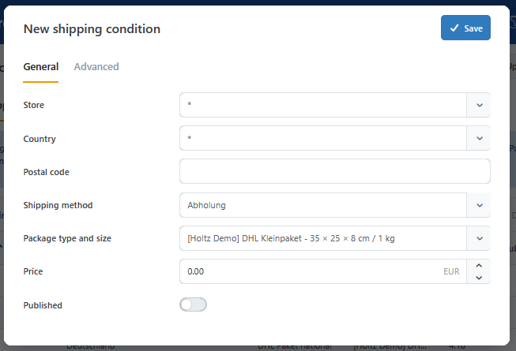
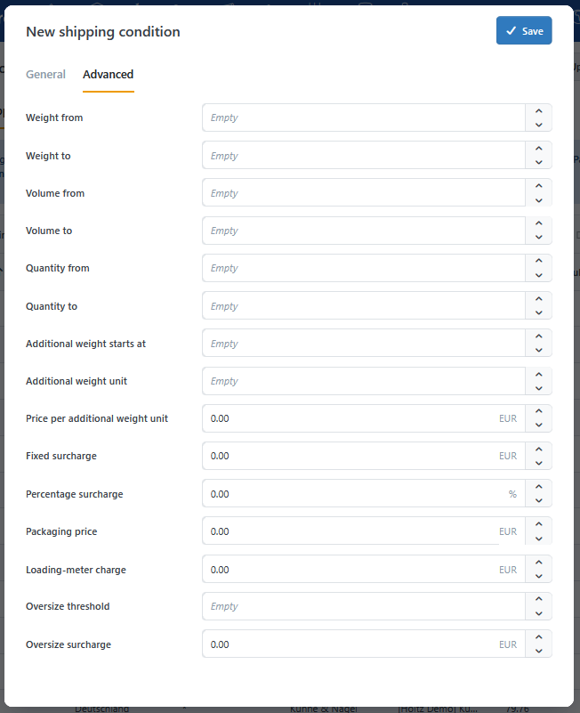

# Shipping conditions

A **shipping condition** connects a [shipping method](../../configuration/setting-up-shipping-methods.md) and a [package size](package-types-and-sizes.md) to a destination, tier limits, price, and surcharges.

Open the [plugin configuration](../dimension-pricing.md#configuration-and-permissions), switch to the **Shipping conditions** tab, and click **Add new shipping condition**.

## General conditions

The **General** tab contains the scope, package size, base price, and publication status. The general values are displayed directly in the overview.

### Scope and base price

The scope determines the stores, [destination countries](../../configuration/managing-countries-regions.md), postal codes, and shipping methods to which a shipping condition can apply. You also select the associated package type and size and enter the base price for each package created. Only published shipping conditions are considered during calculation.

| Option | Description |
| --- | --- |
| Store | Applies to the selected store or, with `*`, to all stores. |
| Country | Applies to the country of the shipping address or, with `*`, to all countries. |
| Postal code | Applies to the postal code of the shipping address. |
| Shipping method | Shipping method to which the condition applies; `*` applies to all methods. |
| Package type and size | Package size into which the cart is packed. |
| Price | Base price per created package in the store's primary currency. |
| Published | Only published conditions are considered during calculation. |

For postal-code input, use `*` for any number of characters and `?` for exactly one arbitrary character. Numeric ranges can be specified with a hyphen, and multiple patterns can be separated by commas, for example `10*, 12???, 50000-59999`. An empty field or `*` applies to all postal codes.

## Advanced conditions

The **Advanced** tab contains tier limits and surcharges. In the overview, you can display the advanced values as needed using the column selector (gear icon).

### Tier limits

Tier limits restrict a shipping condition to specific ranges for chargeable weight, volume, or item quantity. Weight and volume limits apply to an individual package, while quantity limits apply to the total quantity of products requiring shipping in the cart.

| Option | Description |
| --- | --- |
| Chargeable weight from / to | Optional range for the chargeable weight of an individual package. |
| Volume from / to | Optional volume range for an individual package. |
| Quantity from / to | Optional range for the total quantity of products requiring shipping in the cart. |

All lower and upper limits are **inclusive**. A shipping condition with `Chargeable weight to = 10` also applies at exactly 10 units of the [base weight unit](../../configuration/managing-weights-quantity-units-dimensions.md).

### Additional weight charge

Use the following fields to combine a base price with additional weight increments:

- **Additional weight from**: Weight already included in the base price.
- **Additional weight unit**: Size of one additional increment, for example `1` kg.
- **Price per additional weight unit**: Price for each started increment.

The following example shows how an additional weight charge affects the shipping price. As soon as the chargeable weight of a package exceeds the specified threshold, the configured charge is calculated for each additional weight increment or part thereof and added to the base price. The example values illustrate the individual calculation steps and the resulting shipping price.

> The base price includes 10 kg. Each additional 2 kg increment or part thereof costs €3. At 15 kg, three additional increments are charged: `base price + 3 × €3`.

### Surcharges

Surcharges add further cost components to the base price. You can configure fixed or percentage surcharges, packaging costs, loading-meter costs, and oversize surcharges.

| Option | Description |
| --- | --- |
| Fixed surcharge | Fixed amount per package, for example for tolls or climate costs. |
| Percentage surcharge | Percentage applied to the subtotal of the base price and additional weight charges. |
| Packaging price | Fixed packaging price per package. |
| Loading-meter charge | The [loading-meter calculation](settings.md#loading-meter-calculation) **Fixed charge per packed unit** calculates a one-time charge per package; **Area-based** calculates the price per loading meter. |
| Oversize threshold | Value from which the oversize surcharge applies. If a girth formula exists, its result is used; otherwise, the longest occupied edge is used. |
| Oversize surcharge | Fixed amount per package from and including the oversize threshold. |

The price of an individual package is calculated in this order:

1. Base price
2. Price for each started additional weight unit
3. Percentage surcharge on this subtotal
4. Fixed surcharge
5. Packaging price
6. Loading-meter surcharge
7. Oversize surcharge, if applicable

If the cart requires multiple packages, each package is calculated separately and the results are added together.

## Overlapping shipping conditions

During preselection, specific matches are preferred over general matches:

- a specific shipping method before `*`,
- a specific store before `*`,
- a specific country before `*`,
- a specific postal-code pattern before empty or `*`.

If multiple conditions are equally specific and match the same tier limits, the condition with the lowest calculated price is used. A separate order for shipping conditions is not required.

The display order of the package type is unaffected. It still determines which eligible package type is preferred.

## When a shipping method is missing

Check the following in order:

1. Does the shipping method exist and is it active?
2. Is at least one matching shipping condition published?
3. Does it match the store, country, and postal code of the shipping address?
4. Is the postal-code pattern correct?
5. Can at least one configured package size contain the cart?
6. Are weight, volume, and quantity within the configured ranges?

## When a tier or surcharge does not apply

Weight and volume ranges apply to the individual package. Quantity ranges, in contrast, apply to the total quantity of products requiring shipping in the cart.

Also check:

- the publication status of the shipping condition,
- the specificity and calculated price of overlapping conditions,
- the selected loading-meter calculation method,
- the configuration of additional weight increments.
