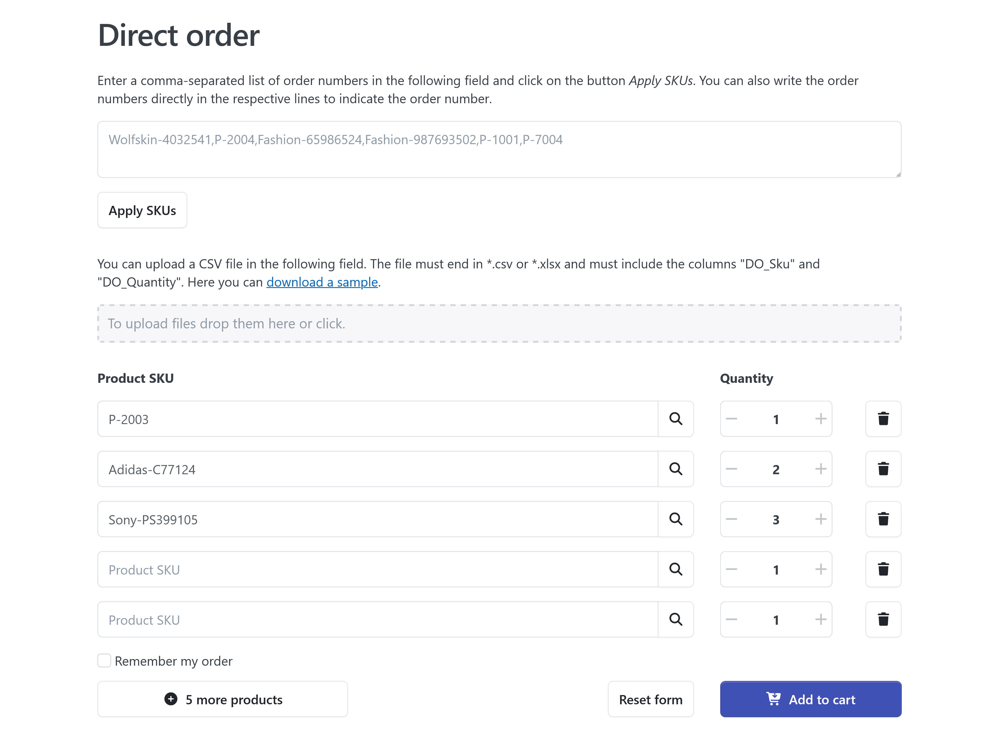
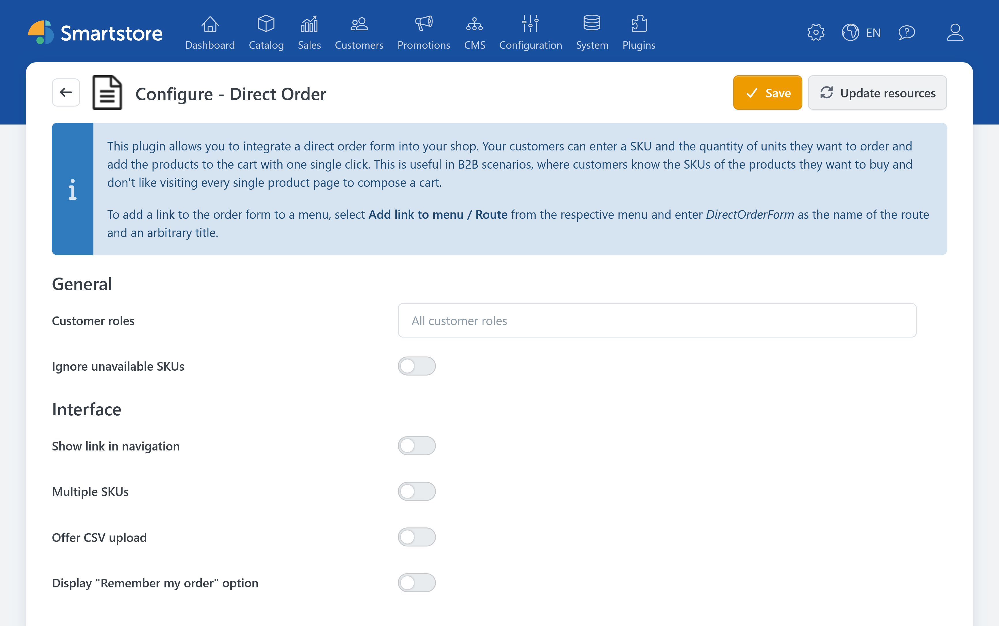

# DirectOrder

> From the SKU directly to the shopping cart.

DirectOrder enables fast, SKU-based product entry. The plugin is particularly useful for business customers who already know the SKUs and quantities they need and therefore do not want to select each product individually from its product detail page.

Customers enter multiple SKUs and the corresponding quantities in a compact order form. DirectOrder validates the entries and transfers the products it finds to the regular shopping cart. Customers then continue through the shopping cart and checkout as usual.

## Typical Use Cases

DirectOrder is particularly suitable for:

* B2B customers who regularly order the same products
* orders based on price lists, catalogs, or inventory management data
* quickly entering larger order quantities
* adding multiple products to the shopping cart at once
* recurring order combinations
* importing prepared order lists from CSV or Excel files

The SKU used in the order form must be stored for the corresponding product. For more information about maintaining and searching for SKUs, see [Creating and Editing Products](../catalog/managing-products/creating-and-editing-products.md).

### Controlling Access by Customer Role

You can specify which customer roles may access the DirectOrder form. This allows you to make quick ordering available only to dealers, wholesale customers, or other selected B2B customer roles.

A customer can belong to multiple customer roles. For information about creating and assigning roles, see [Managing Customer Roles](../customers/managing-customer-roles.md).

### Entering Multiple Products at Once

In the order form, customers enter a product's SKU and the required quantity. This allows them to compile multiple products in a single step and then transfer them to the shopping cart.

The SKU corresponds to the item number stored in the product data. It should be unique and up to date within the product catalog.

### Uploading Order Lists

When file uploads are enabled, customers can upload a prepared order list. The supported file formats are `.csv` and `.xlsx`.

The file must contain at least the following columns:

| Column | Data type | Description |
| --- | --- | --- |
| `DO_Sku` | Text | The product's item number or SKU |
| `DO_Quantity` | Number | The required quantity |

Example:

| DO_Sku | DO_Quantity |
| --- | ---: |
| ART-10001 | 5 |
| ART-10027 | 2 |
| ART-10480 | 10 |

Instructions and a sample file are available for download directly from the order form.


The DirectOrder upload is used exclusively to compile a shopping cart. It is separate from the administrative product import. For information about importing product and catalog data, see [Importing & Exporting Products](../catalog/managing-products/importing-exporting-products.md).


### Saving Recurring Orders

The **Remember my order** function allows signed-in customers to save frequently used order combinations and retrieve them later. This means that regularly required products do not need to be entered again for every order.

Before completing an order, customers should check the products, quantities, prices, and availability in the generated shopping cart as usual.

## Configuration

Open the plugin configuration in the administration area under **Plugins > Manage Plugins**. Find DirectOrder and select **Configure**. For general information about plugin management, see [Managing Plugins](managing-plugins.md).

In the DirectOrder configuration, you can specify:

* which customer roles may access the order form
* whether customers may upload order lists as files
* how DirectOrder handles unknown SKUs

### Selecting Customer Roles

Select the customer roles that may use the order form. Then use a test account from an authorized role and one from an unauthorized role to verify that the form is displayed or hidden as intended.

If access should also be controlled through general permissions, see [Controlling Access Permissions](../configuration/controlling-access-permissions.md).

### Configuring a Navigation Link

DirectOrder can provide a link to the order form in the store navigation. If the link should appear elsewhere or in a custom menu, you can create it using the menu builder.

Use the following route: `DirectOrderForm`. The notice box in the plugin configuration contains further information about using the route.

For information about creating menu items and using the **Route** menu type, see [Edit Menu Items](../content-management/edit-menu-items.md).

### Handling Unknown SKUs

If an entered SKU cannot be found, DirectOrder can redirect the customer to the product search by default. This gives the customer an opportunity to find the requested product using alternative search terms.

Alternatively, unknown SKUs can be ignored. This option can be useful for extensive upload files when valid entries should still be transferred.

Before enabling this option, verify that skipped entries are sufficiently clear to the customer. Otherwise, an incomplete order could go unnoticed.

## Using DirectOrder in the Store

1. Open the DirectOrder form.
2. Enter the SKU and required quantity for each item, or upload a prepared order list in `.csv` or `.xlsx` format.
3. Check the recognized products and quantities.
4. Transfer the items to the shopping cart.
5. Review the shopping cart and continue through the regular checkout.
6. If required, save the combination using **Remember my order**.

## FAQ

### How Can I Place the Link to the Order Form Myself?

Create a menu item of the **Route** type in the menu builder and use the `DirectOrderForm` route. The notice box in the DirectOrder configuration contains the corresponding instructions.

For more information, see [Edit Menu Items](../content-management/edit-menu-items.md).

### What Happens to Unknown SKUs?

Depending on the plugin configuration, DirectOrder either redirects the customer to the product search or ignores the unknown SKU. Therefore, review the transferred items after manual entry or a file upload.

## Related Documentation

* [Managing Plugins](managing-plugins.md)
* [Managing Customer Roles](../customers/managing-customer-roles.md)
* [Controlling Access Permissions](../configuration/controlling-access-permissions.md)
* [Edit Menu Items](../content-management/edit-menu-items.md)
* [Creating and Editing Products](../catalog/managing-products/creating-and-editing-products.md)
* [Importing & Exporting Products](../catalog/managing-products/importing-exporting-products.md)
