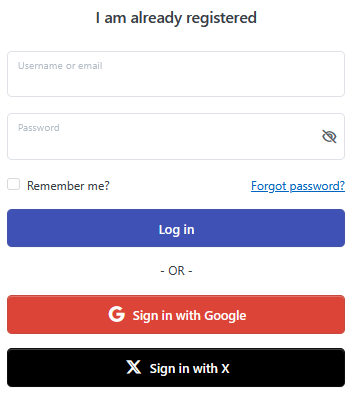
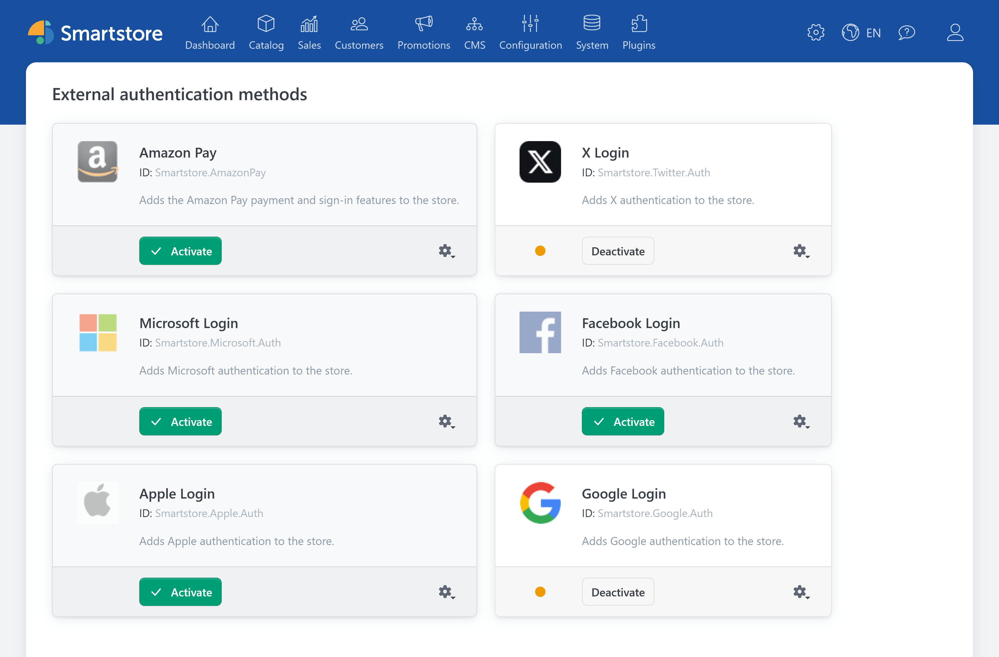
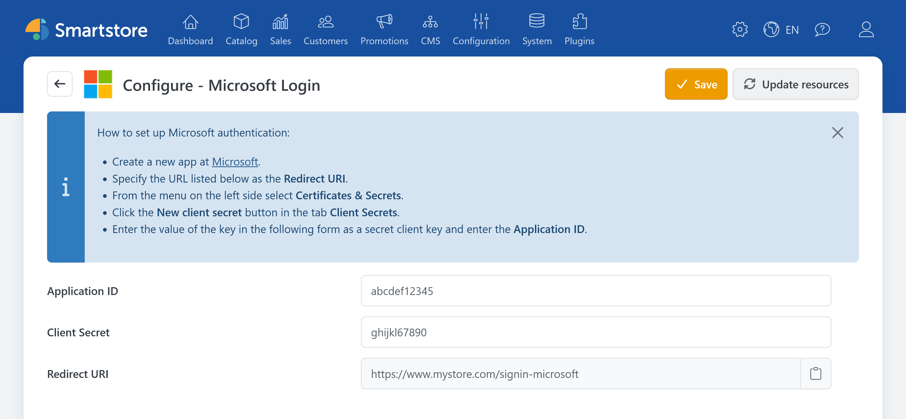
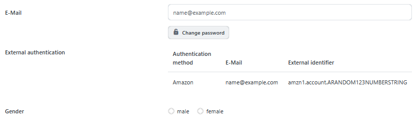

# Setting up external authentication

External authentication plugins allow customers to sign in to your store with an existing Apple, Google, Facebook, Microsoft, or X account. Once configured, an additional button such as **Sign in with Google** appears on the login page.

Manage the available providers under **Customers > External authentication methods**.

## Supported providers

| Provider | Required credentials | Redirect URL |
| --- | --- | --- |
| [Apple](auth/apple-auth.md) | Client ID, Team ID, Key ID, and private key | `https://shop.example.com/signin-apple` |
| [Google](auth/google-auth.md) | Client ID and client secret | `https://shop.example.com/signin-google` |
| [Facebook](auth/facebook-auth.md) | App ID and App Secret | `https://shop.example.com/signin-facebook` |
| [Microsoft](auth/microsoft-auth.md) | Application ID and client secret | `https://shop.example.com/signin-microsoft` |
| [X](auth/twitter-auth.md) | API Key and Consumer Secret | `https://shop.example.com/signin-twitter` |


The domain `shop.example.com` is only an example. Always use the redirect URL displayed by Smartstore on the configuration page of the respective plugin.


## General setup process

The basic setup process is the same for every provider:

1. Go to **Customers > External authentication methods**.
2. Click **Configure** for the provider you want to use.
3. Copy the redirect URL displayed by Smartstore.
4. Configure an application for external sign-in with the provider and register the redirect URL there.
5. Copy the credentials generated by the provider to Smartstore.
6. Click **Save**.
7. Return to the list of authentication methods and activate the provider.
8. Test the login in the frontend.


Configuration and activation are separate steps. A fully configured plugin appears on the login page only after it has been activated.


## Using the redirect URL

The redirect URL, also called the callback URL or redirect URI, determines where the provider redirects the customer after authentication. Smartstore calculates it from the base URL of the current store.

Copy the displayed URL to the provider configuration without changing it. The following components must match:

- protocol, such as `https`,
- domain,
- port, if applicable,
- complete path,
- capitalization if the provider treats it as significant,
- and any trailing slash.

If the store domain changes, you must also register the new redirect URL with the provider.

## Settings for multiple stores

The configuration pages support multiple stores, allowing you to use separate credentials for different stores.

Before saving, select the store to which the credentials apply. Then verify that the redirect URL registered with the provider belongs to that store's domain.

For more information, see [Multi-Store Configuration](../configuration/general-settings-preferences/defining-the-scope-of-settings.md).

## Access permissions

Smartstore distinguishes between the following access permissions:

- viewing authentication methods,
- configuring authentication methods,
- activating or deactivating authentication methods.

For example, employees can be allowed to view the configuration without being allowed to activate a provider. Assign these permissions under **Customers > Customer roles** on the **Access control list** tab of the respective customer role.

For more information, see [Controlling Access Permissions](../configuration/controlling-access-permissions.md).

## Customer login behavior

When a customer selects a provider, Smartstore redirects them to the external login. After successful authentication, the customer returns to the store through the redirect URL registered with the provider.

### Previously linked customer account

Smartstore looks for an existing link based on:

- the authentication provider,
- and the unique external user ID.

If Smartstore finds a matching link, it signs in the associated customer. The customer is then redirected to the originally requested store page or the home page.

### First external login

If no link exists yet, the regular registration process begins:

1. Smartstore uses the name and email address provided by the authentication provider.
2. Smartstore creates a customer account.
3. The external user ID is linked to the new customer account.
4. The designated customer roles and registration actions are applied.
5. The registration method configured under **Configuration > Settings > Customer Settings** determines the remaining process.

| Registration method | Behavior |
| --- | --- |
| Standard account creation | The account is activated. The customer receives the configured welcome message and is signed in. |
| Email validation | Smartstore sends the validation message. The account must then be activated using the link in that message. |
| Admin approval | The account remains inactive until an administrator approves it. |
| Disabled | No new customer account is created through the external provider. |

For more information, see [Customer Settings](../configuration/general-settings-preferences/customer-settings.md).


An identical email address does not automatically link an external login to an existing customer account. Smartstore identifies existing external logins by their external user ID. Before making permanent changes, inform affected customers about alternative ways to sign in.


## Viewing linked logins

An existing external login is displayed both in the customer's account and in customer management. Smartstore shows the authentication method, the email address provided by the provider, and the external identifier.

For more information about the customer details view, see [Managing Customers](../customers/managing-customers.md).

## Deactivating a provider

When you deactivate a provider:

- its button disappears from the login page,
- customers can no longer use that external login,
- existing links to customer accounts remain stored.

Existing links can therefore be used again after the provider is reactivated.


Before permanently deactivating a provider, make sure that affected customers have another way to sign in.


## Troubleshooting

### The login button does not appear

Check whether:

- the authentication method has been activated,
- all required credentials have been saved,
- the settings apply to the correct store scope,
- and the credentials could be processed successfully.

For Apple, an invalid private key can prevent the login button from appearing.

### An error occurs after authentication

Compare the redirect URL displayed by Smartstore with the URL registered with the provider. Both values must match exactly.

### Login no longer works after changing the domain

Open the plugin configuration and copy the newly calculated redirect URL. Replace or add the previous URL in the provider configuration.

### No new customer account is created

Check the registration method under **Configuration > Settings > Customer Settings**. The provider must also supply the account data required for registration, particularly a usable email address.

### An existing customer cannot sign in through the provider

An email address that already exists in the store does not constitute an external account link. Smartstore identifies an existing link by the external user ID.

### Finding additional technical information

Smartstore records technical provider errors in the event log. The customer sees only a general error message in the frontend.

For more information, see [Analyzing the Event Log](../system-maintenance/analyzing-the-event-log.md).
