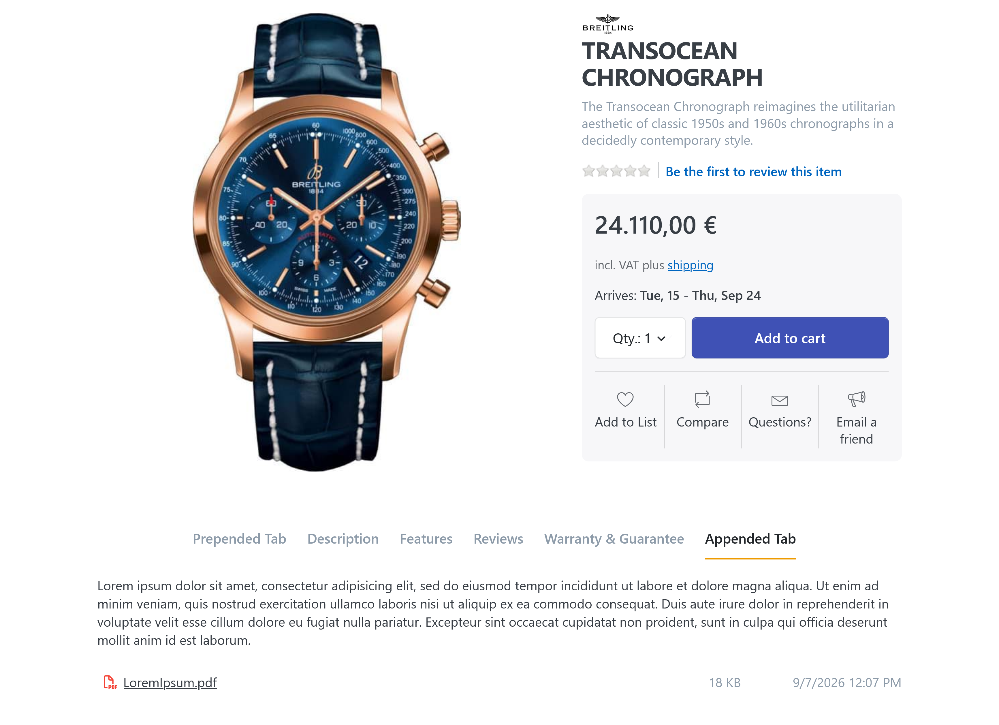
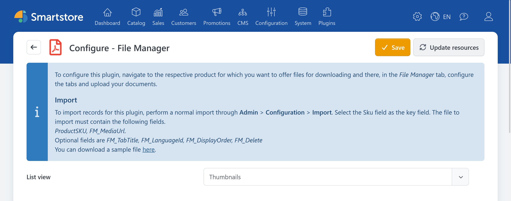
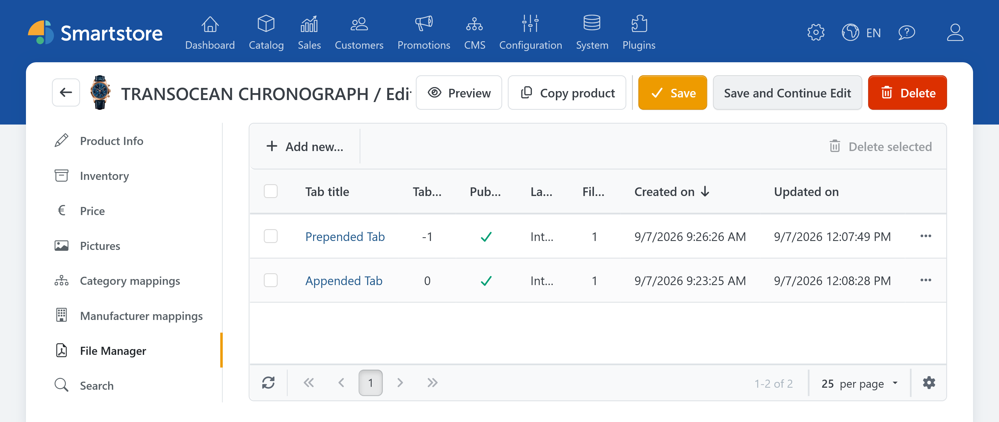
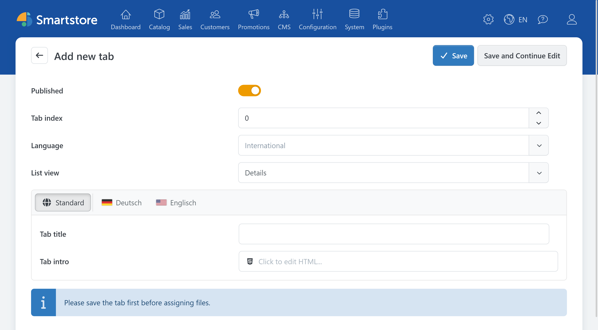
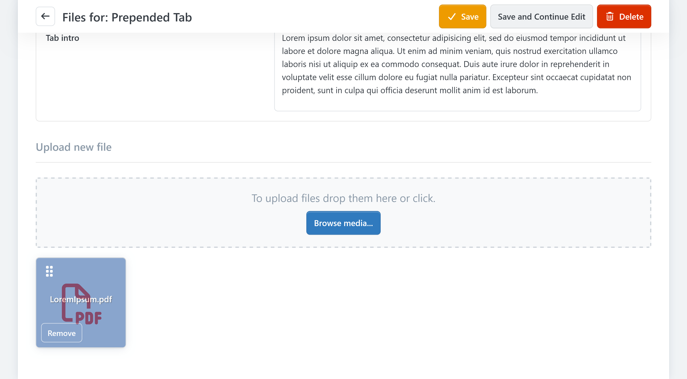
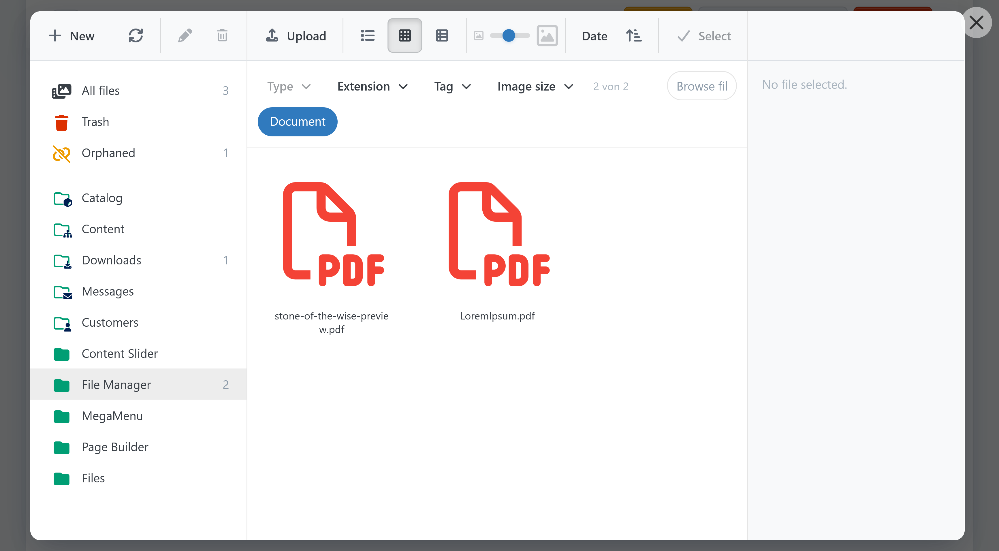
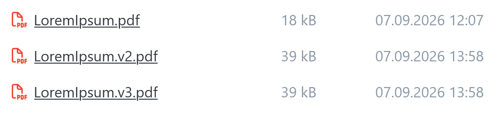
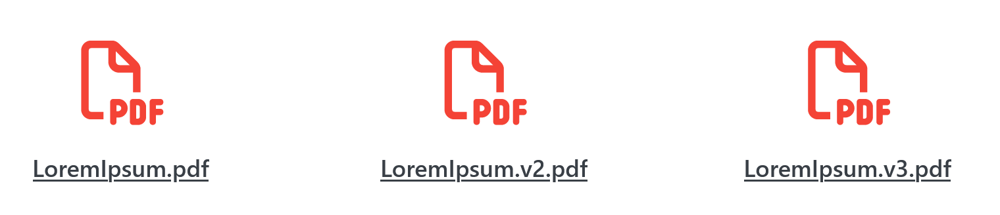
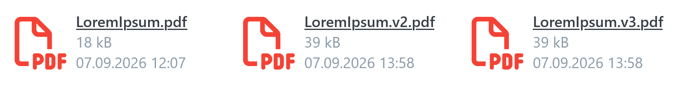

# File Manager

> Custom tabs on the product detail page

With **File Manager**, you can assign documents such as user manuals, data sheets, certificates, or brochures to products. The documents appear in additional tabs on the product detail page in your store.

Typical use cases include:

- user and installation manuals
- technical data sheets
- safety information
- certificates and test reports
- product brochures
- price lists
- driver and software downloads


File Manager provides supplementary documents on the product detail page. To deliver a file as a purchased digital product instead, use the product's download functions. For more information, see [Handling Digital Products (ESD)](../catalog/managing-products/handling-digital-products-esd.md).


## Configuring File Manager

In the administration area, go to **Plugins > Manage Plugins**. Find **File Manager** and select **Configure**.

On the configuration page, select the default [document list display](#checking-the-display-in-the-store). The following options are available:

| Display | Description |
| --- | --- |
| **Details** | Compact list showing the file name, file size, and modification date |
| **Thumbnails** | Preview-oriented display that hides the file size and modification date |
| **Tiles** | Tile display with a file icon and additional file information |

This setting serves as the default. You can select a different display for each document tab later.


The configuration page also contains a sample file for importing document assignments. The import is described in [Importing Documents](#importing-documents).


## Opening File Manager for a Product

Documents are assigned directly to the product.

1. Go to **Catalog > Products**.
2. Select the required product.
3. Open the **File Manager** tab in the product editor.

The overview displays the document tabs already created for the product. The displayed information includes:

- title
- tab index
- publication status
- language
- number of assigned files
- creation date
- last modification date

Depending on your access permissions, you can create new tabs, edit existing tabs, or delete multiple selected tabs. For more information, see [Permissions](#permissions).

## Creating a Document Tab

In the File Manager tab, click **Add new...**.

Then configure the properties of the tab.

### Published

Enable **Published** to display the tab on the product detail page.

You can initially save a tab without publishing it, prepare its text and documents, and publish it after reviewing the result.

### Tab Index

The tab index determines the position and order of File Manager tabs. A negative tab index positions the tab before the regular product tabs. Tabs with an index of `0` or higher are inserted after the regular product tabs. Tabs with a lower index are placed before tabs with a higher index.

For example, use increments such as `10`, `20`, and `30`. This allows you to insert more tabs between existing tabs later.

### Language

A document tab can be international or assigned to a specific language.

- **International:** The tab can be displayed in all store languages.
- **Specific language:** The tab appears only when the visitor uses that language.

In the frontend, Smartstore includes both international tabs and tabs for the currently selected language.

### Title

The title appears as the tab label on the product detail page.

Use short, descriptive names, such as:

- Documents
- User Manuals
- Technical Data Sheets
- Certificates
- Downloads

### Introduction

You can use the optional introduction to provide additional information above the document list. An HTML editor is available for this purpose.

The introduction is suitable for:

- instructions for using the documents
- version or validity information
- safety information
- links to additional information pages
- contact details for questions

For information about using the editor, see [Editing HTML Content](../../discover/common-concepts/editing-html-content.md).

### List view

Select how the documents in this tab are displayed:

- Details
- Thumbnails
- Tiles

The setting applies only to the current tab. For example, you can display technical documents in the Details view and brochures in the Thumbnails view.

## Using Languages and Translations

The tab's language selection and the translation of its text serve different purposes:

1. The **tab language** determines the store language in which the entire tab is displayed.
2. The **localized editor** lets you translate the title and introduction.

### Using the Same Documents in All Languages

If you want to use the same files in all store languages:

1. Create an international tab.
2. Translate the title and introduction using the localized editor.
3. Assign the shared documents to this tab.

### Using Different Documents for Each Language

For example, to provide separate German and English manuals:

1. Create a separate tab for each language.
2. Select the corresponding language for each tab.
3. Assign only documents in that language to the tab.


An international tab and a language-specific tab can be displayed at the same time. Check that their titles or documents do not overlap unintentionally.


For more information about configuring languages and using the localized editor, see [Working with Multiple Languages](../../discover/common-concepts/working-with-multiple-languages.md).

## Assigning Documents

Save a new document tab first. You can assign files to it only after it has been saved.

You can then:

- upload new documents,
- select existing documents from the Media Manager,
- assign multiple documents at the same time,
- change the order of documents,
- remove individual document assignments.

The media selection is limited to the **Document** media type. For more information, see [Media Settings](../configuration/general-settings-preferences/media-settings.md).

The same media file cannot be assigned to a tab more than once.

### Selecting Existing Documents

Open the media selector and select the required files. Then confirm your selection by clicking **Select**.

For detailed information about selecting and managing files, see:

- [Media Manager](mediamanager.md)
- [Managing Files and Folders](mediamanager/files-and-folders.md)

### Sorting Documents

Arrange the assigned documents in the required order. This order is also used on the product detail page.

Use descriptive file names so that customers can identify the content, language, and version of a document. For example:

- `User-Manual-Model-A-DE.pdf`
- `User-Manual-Model-A-EN.pdf`
- `Data-Sheet-Model-A-2026-08.pdf`
- `EU-Declaration-of-Conformity-Model-A.pdf`

### Removing an Assignment

When you remove a document from a tab, only its assignment to that tab is deleted. The media file itself may remain available in the Media Manager and may be used elsewhere.

Before deleting the media file itself, check its usages in the Media Manager. For information about the recycle bin and orphaned files, see [Cleaning Up the Media Library](mediamanager/cleanup.md).


Do not delete a media file directly in the Media Manager without checking it first. It may be assigned to other products, pages, or store content.


## Checking the Display in the Store

Save the tab and open the product detail page in your store.

A File Manager tab is displayed only when the required conditions are met:

- The tab is published.
- The tab language matches the current store language, or the tab is international.
- The visitor has the required [display permission](#permissions).
- The tab contains at least one document or an introduction.

Completely empty tabs are not displayed.

| Display | Preview |
| --- | --- |
| **Details** |  |
| **Thumbnails** |  |
| **Tiles** |  |

Depending on the selected list view, the following information is shown:

- file icon
- file name
- file size
- last modification date

Clicking a document opens it in a new browser tab. Whether the browser displays the file directly or offers it as a download depends on the file type and the visitor's browser settings.


The modification date may be hidden on smaller screens to provide more space for the file name.


## Using Multiple Document Tabs

You can assign multiple File Manager tabs to a product. This is useful when you want to organize a large number of documents by subject or language.

| Tab | Language | Tab index | Content |
| --- | --- | ---: | --- |
| User Manuals | International | 10 | General manuals |
| Data Sheets | International | 20 | Technical specifications |
| Certificates | International | 30 | Test reports and certificates |
| Downloads | German | 40 | Additional German-language files |
| Downloads | English | 40 | Additional English-language files |

Avoid creating more tabs than necessary. A shared tab is usually clearer when you only have a few files.

## Importing Documents

File Manager assignments can be processed through the regular product import. This is particularly useful when you need to provide documents for many products.

For information about importing data, see:

- [Importing & Exporting Products](../catalog/managing-products/importing-exporting-products.md)
- [Managing Import Profiles](../data-exchange/managing-import-profiles.md)

### Import Fields

| Field | Required | Description |
| --- | ---: | --- |
| `ProductSKU` | Yes | SKU of the product to which the document is assigned |
| `FM_MediaUrl` | Yes | URL or import path of the document |
| `FM_TabTitle` | No | Title of the target tab |
| `FM_LanguageId` | No | ID of the tab language |
| `FM_DisplayOrder` | No | Position of the document within the tab |

If no matching tab exists, the import can automatically create a published tab. If no tab title is specified, **Documents** is used as the title.

Pay particular attention to imports with:

- a missing `FM_TabTitle`,
- identical file names in multiple tabs,
- different language IDs,
- existing document assignments,
- documents with file extensions that are not permitted.

The permitted document file extensions and maximum upload size are controlled through [Media Settings](../configuration/general-settings-preferences/media-settings.md).

## Permissions

File Manager provides separate permissions for different actions:

- viewing File Manager data
- creating tabs
- editing tabs
- deleting tabs
- displaying document tabs in the frontend

For example, you can grant employees read-only access without allowing them to create or delete tabs.

Frontend permissions can also determine which customer roles can see the document tabs. If a published tab is missing only for certain users, check the permissions under **Customers** > **Customer roles** in the **Access control list** tab of the custumer role.

For more information, see [Controlling Access Permissions](../configuration/controlling-access-permissions.md).

## Deleting Tabs and Documents

The following actions have different effects:

| Action | Effect |
| --- | --- |
| **Remove document assignment** | The document is no longer displayed in this tab. |
| **Delete tab** | The tab and its document assignments are removed. |
| **Permanently delete product** | The File Manager records associated with the product are cleaned up. |
| **Delete media file** | The actual file is deleted through the Media Manager. Other usages may be affected. |

To hide a tab temporarily, disable **Published** instead of deleting it.

## Troubleshooting

### A Document Cannot Be Uploaded

Check the following:

- Is the file extension assigned to the **Document** media type under **Configuration > Settings > Media**?
- Does the file exceed the maximum upload file size specified there?
- Does the administrator have the required [media permissions](#permissions)?

For more information, see [Media Settings](../configuration/general-settings-preferences/media-settings.md) and [Troubleshooting the Media Manager](mediamanager/troubleshooting.md).

## Related Documentation

- [Importing & Exporting Products](../catalog/managing-products/importing-exporting-products.md)
- [Managing Import Profiles](../data-exchange/managing-import-profiles.md)
- [Media Manager](mediamanager.md)
- [Managing Files and Folders](mediamanager/files-and-folders.md)
- [Cleaning Up the Media Library](mediamanager/cleanup.md)
- [Media Settings](../configuration/general-settings-preferences/media-settings.md)
- [Working with Multiple Languages](../../discover/common-concepts/working-with-multiple-languages.md)
- [Editing HTML Content](../../discover/common-concepts/editing-html-content.md)
- [Controlling Access Permissions](../configuration/controlling-access-permissions.md)
