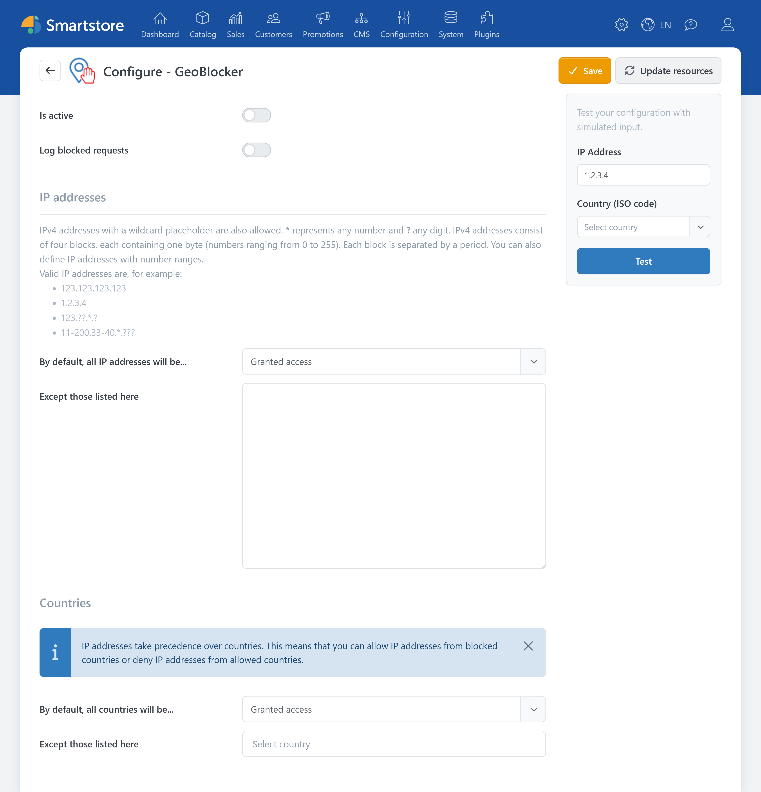
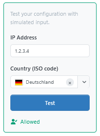
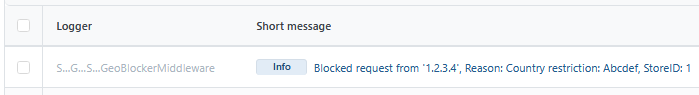

# GeoBlocker

> Blocking with precision

With **GeoBlocker**, you can restrict access to your store based on IP addresses and countries of origin. For example, you can block individual addresses, allow only specified IP ranges, or block access from selected countries.

When a request is denied, Smartstore responds with the HTTP status code **403 Forbidden**. The plugin does not provide a custom blocked-access page.

## Use cases

GeoBlocker is suitable for tasks such as:

- blocking known individual IP addresses,
- blocking specific IPv4 address ranges,
- reducing unwanted automated access from known IP addresses or regions of origin,
- supplementing protective measures against bots, scrapers, and abusive requests,
- restricting access from selected countries,
- allowing visitors from selected countries only,
- making a store accessible only from specified networks.


Country restrictions rely on the geographic mapping of IP addresses. This mapping is not always unambiguous or complete. GeoBlocker is therefore an additional protective measure and does not replace a firewall, web application firewall, or secure configuration of the administration area.


## Opening GeoBlocker

In the administration area, go to **Plugins > GeoBlocker**.



In a multi-store installation, the settings can be overridden for individual stores. First select the required store at the top of the page.

For more information, see [Defining the Scope of Settings](../configuration/general-settings-preferences/defining-the-scope-of-settings.md) and [Working with Multiple Stores](../../discover/common-concepts/working-with-multiple-stores.md).

## General settings

| Setting | Description |
|---|---|
| **Is active** | Enables or disables access validation. |
| **Log blocked requests** | Writes blocked requests to the event log as information entries. |


The number of log entries is technically limited. If a large number of requests are blocked, not every individual request will necessarily appear in the event log.


## Controlling access by IP address

In the **IP addresses** section, specify how IPv4 addresses are handled.

### Selecting the access mode

The **By default, all IP addresses will be...** setting provides two options:

| Option | Behavior |
|---|---|
| **Granted access** | All IP addresses are generally allowed access.<br>The entered addresses and patterns are blocked (blocklist). |
| **Denied access** | All IP addresses are generally blocked.<br>Only addresses matching an entered pattern pass the IP validation (allowlist). |


With an allowlist, an incorrect rule can also block your own access to the administration area. Enter your public IP address and test the configuration before activating GeoBlocker.


### Entering IP rules

In the **Except those listed here** field, enter one rule per line. Complete IPv4 addresses, wildcard characters (`*`, `?`), and numeric ranges are supported.

Examples:

```text
2.17.65.255
2.56.160.0
123.??.*.?
11-200.40.*.???
```

The wildcard characters have the following meanings:

| Syntax | Meaning |
|---|---|
| `*` | Any sequence of digits within the pattern |
| `?` | Exactly one arbitrary digit |
| `11-200` | A numeric range including the specified limits |

IPv4 addresses consist of four numeric blocks separated by periods. Each fully specified block must contain a value between `0` and `255`.

Invalid lines prevent the settings from being saved. The error message identifies the number and content of the affected line. If the list is empty, Smartstore does not create an IP rule. Selecting **Denied access** alone therefore does not block any visitors.


Only IPv4 addresses and the described IPv4 patterns are supported as IP rules. IPv6 addresses cannot be configured in this section.


## Controlling access by country

In the **Countries** section, specify how a visitor's detected country of origin is handled.

The country is determined from the visitor's IP address. GeoBlocker uses the IP geolocation database available in the system.

### Selecting the access mode

The **By default, all countries will be...** setting also provides two options:

| Option | Behavior |
|---|---|
| **Granted access** | Visitors from all countries are generally allowed access. The selected countries are blocked. |
| **Denied access** | All detected countries are generally blocked. Only the selected countries pass the country validation. |

Under **Except those listed here**, select the countries that should be treated differently from the default rule. If the country list is empty, Smartstore does not create a country rule. The selected access mode alone therefore does not block any visitors.

For more information about the countries available in Smartstore, see [Managing Countries and Regions](../configuration/managing-countries-regions.md).

### Unrecognized countries

If Smartstore cannot determine a country for an IP address, the country rule does not block the request. This also applies when all countries are denied access by default.

Keep in mind that a country allowlist does not provide complete access control for unknown IP addresses or addresses that cannot be mapped unambiguously.

## Testing the configuration

The **Test** panel is located on the right side of the configuration page. It lets you simulate the evaluation of the saved rules.

Enter the following information:

- **IP Address**
- optionally, a **Country (ISO code)**
- for multi-store installations, the **Store** to be tested

If you do not select a country, Smartstore attempts to determine it from the entered IP address.

Then click **Test**. The result is displayed as **Allowed** or **Blocked**. If access is blocked, the reason determined by the rule is also shown.




Save any changed settings before running the test. The test uses the rules that have already been saved and does not take unsaved form entries into account.


The test simulates only the IP and country rules. It does not check the following runtime conditions:

- whether **Is active** is enabled,
- whether the request is local.

The test can therefore display **Blocked** even though an actual request would not be blocked because of one of these conditions.

## Activating GeoBlocker safely

When setting up GeoBlocker for the first time, proceed step by step:

1. Initially leave **Is active** disabled.
2. In a multi-store installation, select the correct store.
3. Select the required IP and country access modes.
4. Enter the required IP addresses, patterns, and countries.
5. Click **Save**.
6. Test several allowed and blocked combinations.
7. Pay particular attention to testing your own public IP address.
8. Enable **Log blocked requests**.
9. Enable **Is active** and save the settings again.
10. Verify access from a second network or device.


There is no automatic exception for administrators, registered customers, or the administration area. An unsuitable allowlist can therefore also lock out an administrator.


Also keep in mind that dynamically assigned public IP addresses can change. An allowlist that works today could prevent access at a later date.

## Reviewing blocked requests

If **Log blocked requests** is enabled, you can find the entries in the event log.

An entry contains in particular:

- the IP address of the blocked request,
- the reason for blocking,
- the affected store.



For information about searching the log and opening its details, see [Analyzing the Event Log](../system-maintenance/analyzing-the-event-log.md).

## Related documentation

- [Installing Plugins](installing-plugins.md)
- [Managing and Licensing Plugins](managing-plugins.md)
- [Defining the Scope of Settings](../configuration/general-settings-preferences/defining-the-scope-of-settings.md)
- [Working with Multiple Stores](../../discover/common-concepts/working-with-multiple-stores.md)
- [General Settings](../configuration/general-settings-preferences/general-settings.md)
- [Managing Countries and Regions](../configuration/managing-countries-regions.md)
- [Analyzing the Event Log](../system-maintenance/analyzing-the-event-log.md)
