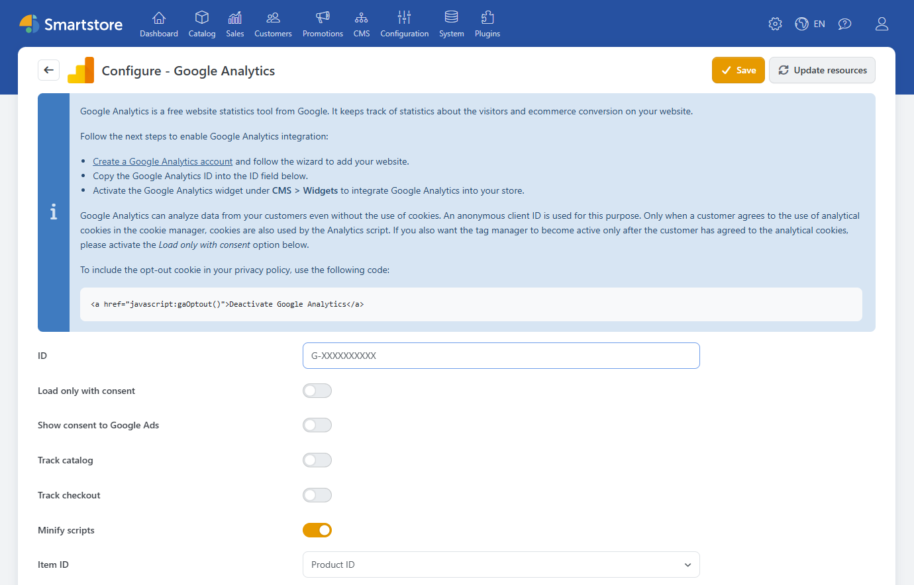

# Google Analytics

The **Google Analytics** plugin integrates Google Analytics with Smartstore. It provides insights into how visitors use your store and interact with products, the shopping cart, and checkout. In addition to general page views, the plugin supports ecommerce events such as product views, checkout initiation, and completed orders.


The data displayed in Google Analytics and its retention period also depend on the configuration of your Google Analytics account. The plugin establishes the connection and transmits the store events enabled in Smartstore.


To use the plugin, you need:

- a Google Analytics account
- a configured Google Analytics property with a web data stream
- the corresponding measurement ID.

## Configuration

Under **Plugins > Manage Plugins**, open the configuration for the **Google Analytics** plugin. Here you enter the measurement ID, select the tracking areas you require, and coordinate the integration with your consent management settings.



| Setting | Description |
|---|---|
| **ID** | Measurement ID of the web data stream in your Google Analytics property, for example `G-XXXXXXXXXX`. |
| **Load only with consent** | Loads the Analytics script only after the visitor has consented to analytical cookies. For more information, see [Cookies and consent](#cookies-and-consent). |
| **Show consent to Google Ads** | Adds consent choices for advertising-related data and personalized advertising to the Cookie Manager. Enable this option only if you use Google Ads. |
| **Track catalog** | Tracks selected views and interactions in the product catalog. |
| **Track checkout** | Tracks shopping cart, checkout, and purchase activity. |
| **Minify scripts** | Reduces the size of the generated tracking scripts. This option should normally remain enabled. |
| **Item ID** | Determines which identifier is sent to Google Analytics for products. For more information, see [Selecting the item ID](#selecting-the-item-id). |

The tracking codes shown below these settings are prepopulated with appropriate default values and do not need to be edited for a standard setup. If Smartstore displays a notification about outdated scripts, use **Restore scripts** to apply the current defaults. This overwrites any custom changes in the script fields.

### Connecting Google Analytics

1. Create a property for your store in Google Analytics.
2. Configure a web data stream for the website.
3. Copy the corresponding measurement ID.
4. Enter the measurement ID in the **ID** field in Smartstore.
5. Enable [**Track catalog**](#catalog-and-checkout-tracking) and [**Track checkout**](#catalog-and-checkout-tracking) as required.
6. Configure the required cookie and consent settings.
7. Click **Save**.


The plugin does not add tracking while no measurement ID is configured or the `UA-0000000-0` placeholder is still in use.


### Activating the Google Analytics widget

The corresponding widget must be active so that the plugin can add the tracking scripts to the storefront.

1. Open **CMS > Widgets**.
2. Locate the **Google Analytics** widget.
3. Activate the widget.

For more information about activating and managing widgets, see [Arranging Widgets](../content-management/arranging-widgets.md).

### Catalog and checkout tracking

With **Track catalog**, you can analyze product detail pages, product lists, and search queries, among other activities. Supported interactions such as selecting a product or adding it to the shopping cart are also tracked.

With **Track checkout**, the plugin transmits supported events from the shopping cart and order process. These include viewing the shopping cart, beginning checkout, selecting shipping and payment information, and successfully completing an order.


Enable only the areas you actually want to analyze in Google Analytics. Then verify the setup with suitable test actions in your store and the diagnostic tools provided by Google Analytics.


### Selecting the item ID

The **Item ID** setting determines how products are identified in Google Analytics.

| Selection | Usage |
|---|---|
| **SKU** | Uses the SKU of the product or selected variant. |
| **Product ID** | Uses the internal Smartstore product ID. |
| **Product ID with variant ID** | Combines the product ID with the ID of the selected variant. |

If you use Google Ads or a Google Merchant Center feed, the selected item ID should match the product identifier used there.


Do not change the item ID without a specific reason. After a change, products may appear under a new identifier in Google Analytics, separating statistics that belong together.


## Cookies and consent

The plugin integrates with the Smartstore Cookie Manager. Use **Load only with consent** to specify that the Analytics script is loaded only after the visitor has consented to analytical cookies.

If you also use Google Ads, enable **Show consent to Google Ads** to add consent choices for advertising-related data and personalized advertising to the Cookie Manager.

For more information about consent management, see [Cookie Manager](../configuration/cookie-manager.md).

### Providing an opt-out link

The plugin provides an opt-out function that visitors can use to disable Google Analytics tracking. For example, you can include the following link in your privacy policy:

```html
<a href="javascript:gaOptout()">Deactivate Google Analytics</a>
```

After the visitor selects the link, the browser stores the opt-out for the configured measurement ID.


Include Google Analytics and, where applicable, Google Ads in your store's privacy policy. Also review data retention, consent settings, and other privacy options directly in your Google account.


## Multi-store configuration

In a multi-store installation, you can configure settings for individual stores. Before configuring the plugin, select the required store and enter the corresponding measurement ID and tracking settings.

For more information, see [Multi-Store Configuration](../configuration/general-settings-preferences/defining-the-scope-of-settings.md).

## Further information

- [Arranging Widgets](../content-management/arranging-widgets.md)
- [Cookie Manager](../configuration/cookie-manager.md)
- [Multi-Store Configuration](../configuration/general-settings-preferences/defining-the-scope-of-settings.md)
