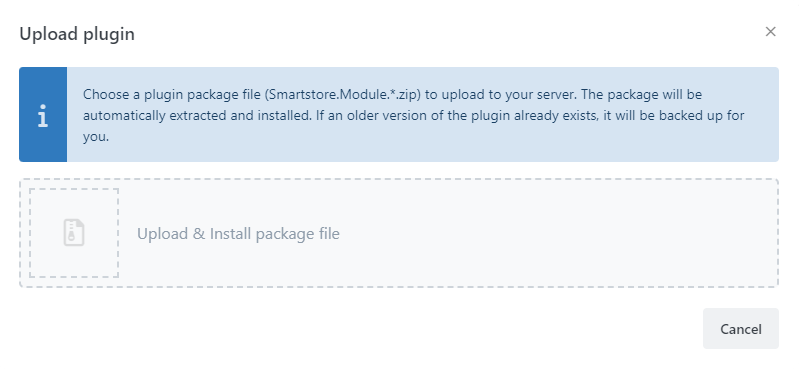
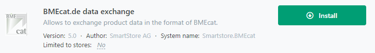

# Installing Plugins

Smartstore is delivered with plugins already installed. You can find more plugins in the [Smartstore Marketplace](http://community.smartstore.com/index.php?/files/) from Smartstore itself and from third-party providers. Smartstore plugin files have the Zip file format and the extension `.zip`.

## How to upload and install a plugin

Choose the menu item **Plugins > Manage plugins** and click the **Upload Plugin** button. Choose the Zip file that contains the plugin.

The plugin has now been uploaded and can be installed and configured in the plugin management area.

