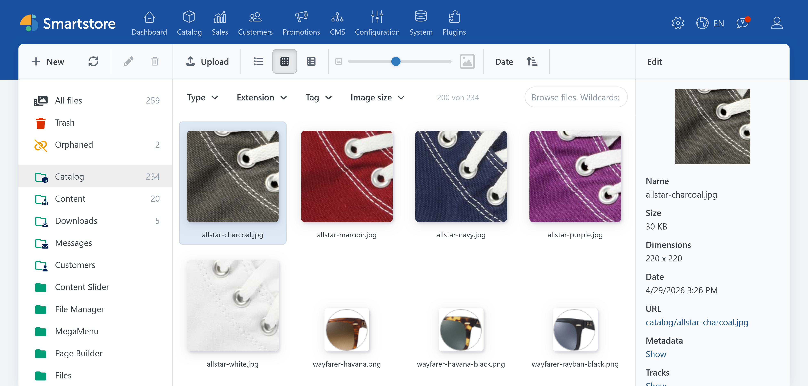
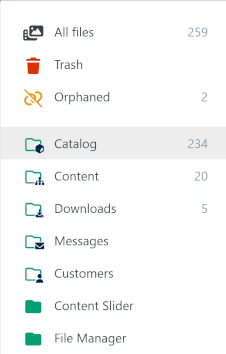
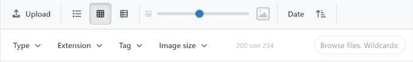
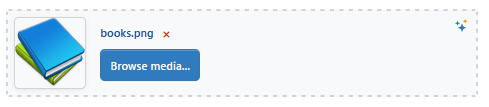

# Media Manager

> Keep your store files organized and easy to find in one place.

The Media Manager is the central file management tool in the Smartstore backend. Here you can upload, organize, and find images, videos, audio files, documents, and other files, and select them for use in the store.


The available features depend on your user permissions and on the modules that are installed and licensed.




## Opening the Media Manager

In the backend, go to **CMS** &rarr; **Media**.

Access is controlled by two separate permissions:

- **View media:** The user can browse the media library and download files.
- **Edit media:** The user can upload, modify, move, and delete files, among other actions.

## Getting to know the user interface

The Media Manager consists of three areas:

1. **Folder pane:** Displays albums, folders, and special file views.
2. **File pane:** Displays the files in the selected folder or search results.
3. **Details pane:** Displays a preview and information about the selected file.

You can adjust the width of the folder and details panes using the dividers. The Media Manager stores the selected widths as well as the view, sorting, and thumbnail size in the browser being used.

## Understanding albums, folders, and special views

Albums are the top-level storage areas provided by the system. You can create your own folders within an album. System albums cannot be renamed, moved, or deleted.



The following special views are available above the regular albums and folders:

| View | Content |
| --- | --- |
| **All files** | The entire active media library |
| **Trash** | Files that have not yet been permanently deleted |
| **Transient** | Files that can be deleted during the next cleanup operation |
| **Orphaned** | Files without a known reference from a data entity |
| **Unassigned** | Files that are not assigned to a folder |

You cannot upload new files or create folders in special views.

For detailed information, see [Managing files and folders](mediamanager/files-and-folders.md) and [Cleaning up the media library](mediamanager/cleanup.md).

## Uploading files

1. Select the desired destination folder.
2. Click **Upload**.
3. Select one or more files.
4. Wait until all uploads have finished.

Alternatively, drag files from your file system into the file pane and drop them onto the upload area that appears.

Uploads are subject to the general media settings:

- maximum permitted file size,
- maximum image dimensions to which larger images are resized,
- permitted file extensions and media types.

For more information, see [Media Settings](../configuration/general-settings-preferences/media-settings.md).

### Handling files with the same name

If a file with the same name already exists in the destination folder, select an action:

- **Replace:** Replaces the existing file.
- **Rename:** Automatically gives the new file a unique name.
- **Skip:** Does not add the new file.

If multiple conflicts occur, you can apply your decision to all remaining files.

## Viewing and finding files



### Changing the view

Three views are available for the file pane:

- **Details:** A compact list with file information
- **Thumbnails:** A large preview overview
- **Tiles:** A combination of previews and file information

Use the size slider to adjust the thumbnail size in the thumbnail and tile views.

### Sorting files

You can sort by date, name, modification date, file size, image dimensions, media type, or file extension. Use the button next to the sort selection to change the sort direction.

### Searching by file name

Enter a search term in the search field. The search supports wildcards:

- `*` represents any number of characters.
- `?` represents exactly one character.

Example:

```text
product-*.jpg
```

### Filtering files

You can combine multiple filters:

- media type,
- file extension,
- tag,
- image dimensions.

Active filters appear below the filter bar. Large result sets are loaded incrementally as you scroll.

## Selecting files

- Click a file to select it.
- Hold `Ctrl` to add individual files to the selection or remove them from it.
- Hold `Shift` to select a contiguous range.
- Use `Ctrl+A` to select all currently loaded files.
- Use `Ctrl+I` to invert the selection.

A maximum of 500 files can be selected at the same time.

## Using context menus

Context menus provide quick access to many key features. Right-click a folder or file to open the appropriate menu.

- The **folder context menu** includes New folder, Download, Cut, Copy, Paste, Rename, and Delete, among other actions.
- The **file context menu** includes Preview, Download, Cut, Copy, Paste, Restore, Reprocess, Rename, Replace, and Delete, among other actions.
- Installed extensions can add further actions.


The file context menu applies to the current file selection. Before performing an action, check that all intended files are selected.



The **Delete permanently** action is also available outside the Trash. Files deleted this way cannot be restored through the Media Manager.


For a complete description of all menu entries, see [Managing files and folders](mediamanager/files-and-folders.md).

## Common file actions

Using toolbars, drag-and-drop, and context menus, you can:

- create, rename, copy, move, and delete folders,
- copy, move, rename, and replace files,
- download individual files directly,
- download multiple files or folders as a ZIP archive,
- move files to the Trash or delete them permanently.

For complete instructions, see [Managing files and folders](mediamanager/files-and-folders.md).

## Keyboard shortcuts

First click in the file or folder pane to give it keyboard focus.

| Shortcut | Action |
| --- | --- |
| `Ctrl` + click | Add an individual file to the selection or remove it |
| Shift + click | Select a contiguous range of files |
| `Ctrl+A` | Select all currently loaded files |
| `Ctrl+I` | Invert the file selection |
| `Ctrl+C` | Copy selected files or folders |
| `Ctrl+X` | Cut selected files or folders |
| `Ctrl+V` | Paste files or folders |
| `Del` | Delete the selection or move it to the Trash |
| Hold `Ctrl` while dragging | Copy files or folders instead of moving them |

## Selecting media in other backend areas



The Media Manager can be opened as a selection dialog from product, category, page, and other edit forms.

The calling area can restrict the selection to specific media types, file extensions, a destination album, or single or multiple selection.

Select the desired files and click **Select**. If a file is outside the intended album, the Media Manager may offer to copy it there.

## Media Manager and media settings

The Media Manager does not have its own configuration page for store operators. Upload limits, permitted file types, image processing, file storage, and media caching are managed centrally in the [Media Settings](../configuration/general-settings-preferences/media-settings.md).

## Related topics

- [Managing files and folders](mediamanager/files-and-folders.md): All file actions and context menus in detail.
- [Managing file information and metadata](mediamanager/metadata.md): Manage ALT text, titles, tags, languages, and references.
- [Cleaning up the media library](mediamanager/cleanup.md): Trash, restoration, and orphaned files.
- [Reprocessing images](mediamanager/image-processing.md): Re-encode images and understand video thumbnails.
- [Media Manager extensions](mediamanager/integrations.md): Integrate TinyImage, Smartstore AI, and Pixlr.
- [Troubleshooting the Media Manager](mediamanager/troubleshooting.md): Answers to common questions and problems.

## Recommendations for daily work

- Use descriptive file and folder names.
- Maintain meaningful ALT text for relevant images.
- Use tags for characteristics that cannot be represented effectively by folders.
- Check file references before deleting or replacing files.
- Delete files through the Trash first.
- Consider file size and image dimensions to keep frontend loading times low.

## Extending your media workflows

The Media Manager can be enhanced with image optimization, AI-assisted content creation, and external image editing features. The right combination depends on your media library, workflows, and store requirements.

The Smartstore team will be happy to help you identify suitable modules and an appropriate configuration.

<a href="https://smartstore.com/en/personal-consultation/" class="button primary">Request a personal consultation</a>
