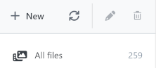
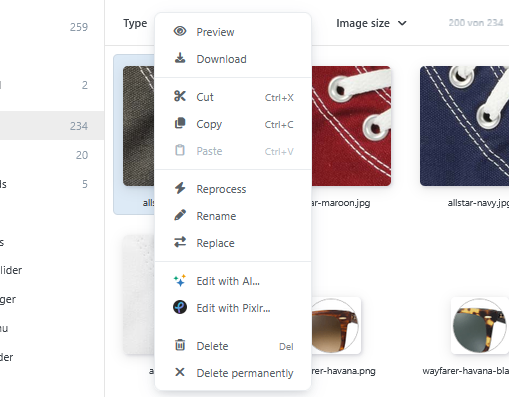

# Managing files and folders

Organize your media library using albums and folders, move or copy files, and use the context menus for quick access to all important actions.



## Distinguishing between albums and folders

Albums are the top-level storage areas provided by the system. They assign media files to specific application areas of the store. System albums cannot be renamed, moved, or deleted.

You can create your own folders within an album. The number to the right of a folder indicates how many files are assigned to it.

## Creating folders

1. Select the album or folder in which you want to create the new folder.
2. Click **New** in the folder pane.
3. Enter a name.
4. Confirm your entry.

The following characters are not permitted in folder names:

```text
: * ? & " < > |
```

## Renaming folders

1. Select the folder.
2. Click **Rename folder** or open the context menu.
3. Enter the new name and confirm your entry.

System albums and special views cannot be renamed.

## Copying or moving folders

You can cut or copy a folder using the context menu and then paste it into a destination folder.

Alternatively, drag and drop the folder onto the destination folder:

- Drag without a modifier key to move the folder.
- Drag while holding `Ctrl` to copy the folder.

A folder can only be moved within the same album. It can be copied to a different album.

## Deleting folders

Deleting a folder also removes its subfolders. There are three options for the files it contains:

- move the files to the Trash,
- move the files to the album root folder,
- delete the files permanently.

Files that are in use or locked may not be deleted. The Media Manager informs you about skipped files.

## Downloading folders

Open a folder's context menu and select **Download**. The files it contains are provided as a ZIP archive.


A folder download contains a maximum of 1,000 files. If this limit is exceeded, the system displays a message.


## Copying or moving files

Select one or more files. You can then cut or copy the files using the context menu and paste them into a destination folder.

Alternatively, drag the selected files onto the destination folder:

- Drag without a modifier key to move the files.
- Drag while holding `Ctrl` to copy the files.

If files with the same name exist, the conflict resolution dialog appears with the options **Replace**, **Rename**, and **Skip**.

## Renaming a file

1. Select a single file.
2. Open the context menu.
3. Select **Rename**.
4. Enter the new file name.

## Replacing a file

Use **Replace** to exchange the file content without first deleting and reassigning the file.

1. Select a single file.
2. Open the context menu and select **Replace**.
3. Select the new file.

The replacement must match the media type of the existing file and comply with the applicable upload restrictions.

## Downloading files

- A single file is downloaded in its original format.
- Multiple selected files are provided as a ZIP archive.

## Folder context menu


Right-click an album or folder.

| Action | Availability and effect |
| --- | --- |
| **New folder** | Creates a subfolder. Not available in special views. |
| **Download** | Downloads the files in the folder as a ZIP archive. Disabled for an empty folder. |
| **Extension actions** | Displays additional commands from installed plugins, such as image generation. |
| **Detect orphaned files** | Checks the references of files in a suitable system album. |
| **Cut** | Marks a regular folder to be moved. |
| **Copy** | Marks a regular folder to be copied. |
| **Paste** | Pastes previously cut or copied files or folders. |
| **Rename** | Changes the name of a regular folder. |
| **Delete** | Deletes a regular folder and asks how to handle the files it contains. |

## File context menu



The file context menu applies to the current file selection.

| Action | Availability and effect |
| --- | --- |
| **Select** | Applies the selection when the Media Manager was opened as a selection dialog. |
| **Preview** | Opens a single file in the preview. |
| **Download** | Downloads one file directly or multiple files as a ZIP archive. |
| **Cut** | Marks the selected files to be moved. |
| **Copy** | Marks the selected files to be copied. |
| **Paste** | Pastes previously cut or copied items into the current folder. |
| **Restore** | Restores eligible files from the Trash. |
| **Reprocess** | Re-encodes selected image files using the current media settings. |
| **Rename** | Changes the name of a single file. |
| **Replace** | Replaces the content of a single file. |
| **Extension actions** | Displays additional commands from installed plugins. |
| **Delete** | Moves the selection to the Trash. |
| **Delete permanently** | Deletes the selection without moving it to the Trash. |


**Delete permanently** is also available outside the Trash. Files deleted this way cannot be restored through the Media Manager.


For a complete overview, see [Keyboard shortcuts](../mediamanager.md#keyboard-shortcuts) on the main page.
