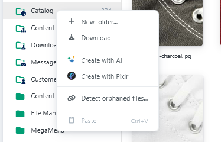

# Media Manager extensions

Enhance the Media Manager with image optimization, AI-assisted image generation, and external image editing.


The following integrations are paid plugins. Their availability depends on installation, configuration, and licensing.


## TinyImage

[TinyImage](../tinyimage.md) compresses uploaded images and generated thumbnails. Depending on its configuration, the module processes PNG, JPEG, and GIF files and can provide WebP variants.

If TinyImage is configured for uploads, optimization also runs when images are reprocessed.

## Smartstore AI

If [Smartstore AI](../ai.md) is installed, active, and licensed, additional actions may appear in the Media Manager:

- generate images with AI within a folder,
- edit one or more selected images with AI.

The exact operation and available providers depend on the AI module configuration.

## Pixlr Media Editor

If the [Pixlr Media Editor](../pixlr.md) is installed, configured, and licensed, you can:

- create new images with Pixlr in a folder,
- open and edit existing images in Pixlr.

Valid Pixlr credentials must be configured before use.

## Extending your media workflows

The Media Manager can be enhanced with image optimization, AI-assisted content creation, and external image editing features. The right combination depends on your media library, workflows, and store requirements.

The Smartstore team will be happy to help you identify suitable modules and an appropriate configuration.

<a href="https://smartstore.com/en/personal-consultation/" class="button primary">Request a personal consultation</a>
