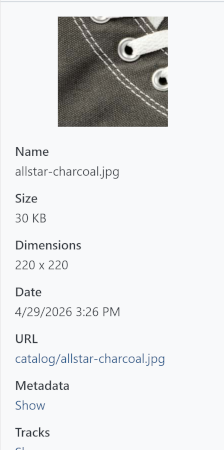

# Managing file information and metadata

Review file information, maintain ALT text, titles, and tags, and identify where a file is used in the store.

## Displaying previews and file information

Select a file to display additional information in the pane on the right. Images are displayed directly; video and audio files can be played.

Depending on the file type, the Media Manager displays information including:

- file name,
- ALT text,
- file size,
- image dimensions,
- date,
- media path or URL,
- administrator comment.

You can use the media path to open the file in a new browser window.

## Displaying EXIF and IPTC metadata

For image files, use **Metadata > View** to load existing EXIF and IPTC data. Depending on the file, this may include capture information, camera data, or editorial image information.

The displayed EXIF and IPTC data cannot be edited in the Media Manager.

## Displaying file references

Use **References > View** to see which data entities reference a file. If a backend page is available for the entity, you can open it directly.

This feature helps you determine whether a file is still needed and where changes to it will be visible.

## Editing file information

Click **Edit** in the details pane. You can maintain the following information:

- ALT attribute,
- title,
- tags,
- administrator comment.

### Maintaining ALT attributes

The ALT attribute describes the image content. It supports accessibility and can help search engines interpret the image.

Keep ALT text concise and meaningful. Avoid simply repeating the file name.

### Maintaining titles

The title is an additional editorial label for the media file. Whether and where it is displayed in the frontend depends on the particular use case and theme.

### Maintaining language-specific information

If multiple languages are configured, you can enter the ALT attribute and title separately for each language. The **Default** tab contains the language-independent base value.

### Using tags

Tags are freely definable keywords. They help you find files independently of their folder structure.

- Select an existing tag.
- Enter a new term to create a tag.
- Remove a tag from the selection to remove its assignment to the file.

A tag is automatically removed completely when it is no longer assigned to any media file.

### Adding an administrator comment

The administrator comment is an internal note. It is displayed in the Media Manager details pane and is not intended for display in the frontend.

## Editing multiple files together

Select multiple files and click **Edit all**. The entered values are applied to all selected files. Language-specific titles and ALT text can also be set together.


When editing multiple files, the ALT attribute, title, tags, and administrator comment are saved together. Empty fields can remove existing values from the selected files. Therefore, carefully check the selection and the values entered.

