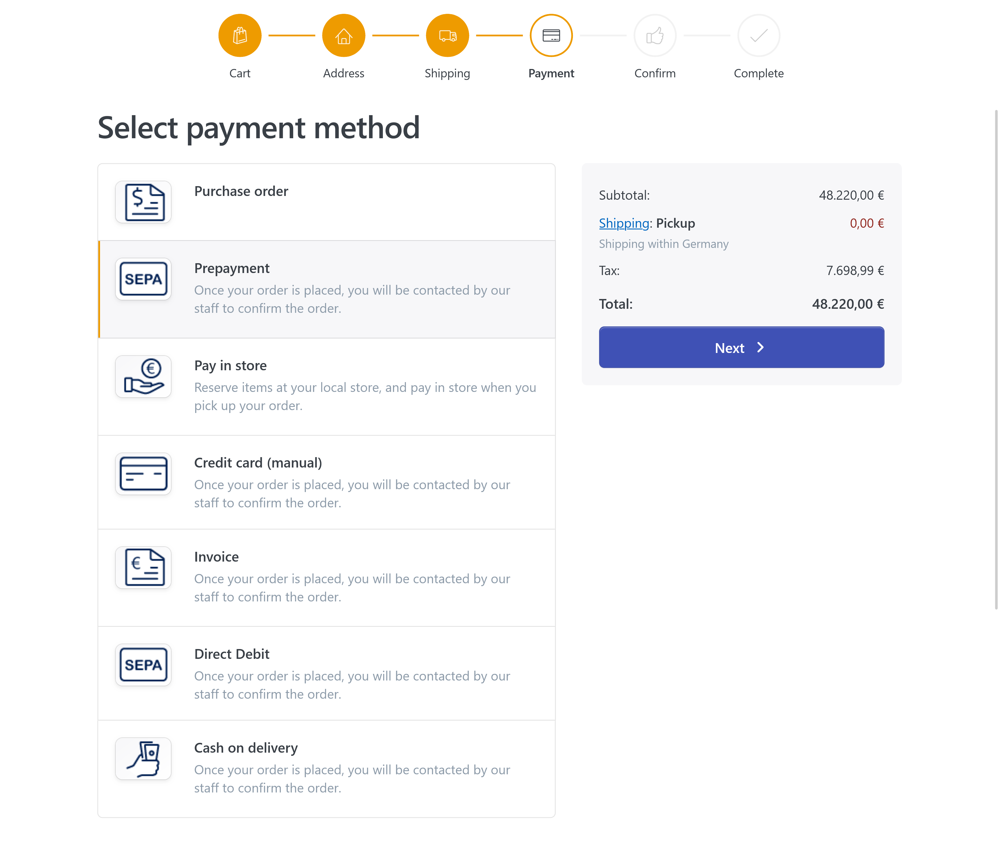
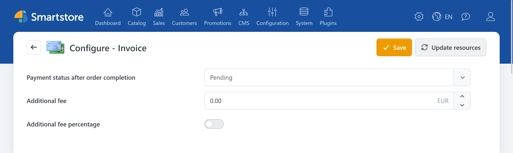
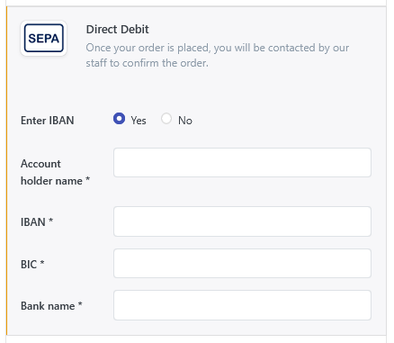
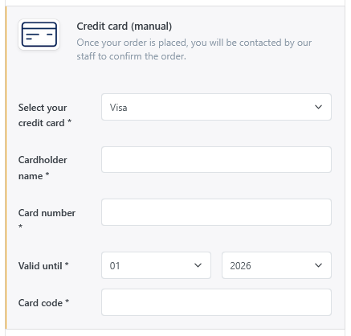
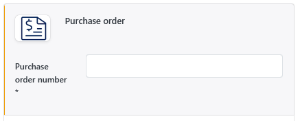

# OfflinePayment

The **OfflinePayment** plugin provides traditional payment methods that are not processed through an external payment service provider. Smartstore records the order and sets the configured payment status. The merchant must handle payment receipt, capture, refunds, and cancellations outside a payment gateway.

The plugin includes payment methods for cash on delivery, invoice, payment in store, prepayment, direct debit, manually processed credit cards, and customer purchase order numbers.


Offline payment methods do not transfer funds or verify that a payment has actually been received. The **Authorized** and **Paid** payment statuses are also set only within Smartstore.

For a comparison with other payment plugins, see [Payment Providers and Payment Methods](paymentproviders.md).


You do not need an account with an external payment service provider. The required payment methods must be activated under **Configuration > Payment Methods**.

For more information about activating, sorting, and restricting payment methods, see [Setting up Payment Methods](../configuration/setting-up-payment-methods.md).

## Available payment methods

| Payment method | Customer information | Usage |
|---|---|---|
| **Cash on delivery** | No additional information | The customer typically pays when the goods are handed over. The plugin does not connect to a shipping provider or confirm receipt of payment. |
| **Invoice** | No additional information | Payment is made after the customer receives the goods or payment request. The plugin does not create an accounting transaction or monitor a payment deadline. |
| **Pay in store** | No additional information | Products can be reserved for collection and paid for at the physical store, for example. |
| **Prepayment** | No additional information | The customer pays outside the store, for example by bank transfer. The plugin does not provide bank account details. |
| **Direct Debit** | Account holder and bank details | Bank details are collected during checkout. No automatic debit is performed. |
| **Credit Card (manual)** | Card type, cardholder, card number, expiration date, and card verification code | Card details are collected but not sent to a payment service provider. Authorization and capture are handled manually. |
| **Purchase order** | Customer purchase order or reference number | For procurement processes in which the customer must provide their own reference number. |

## Configuration

In the administration area, go to **Configuration > Payment Methods** and click **Configure** for the required offline payment method. Each payment method is configured separately. You can therefore define different payment statuses and fees for invoice and prepayment, for example.

The settings support the store scope and can therefore be configured differently for each store.

| Setting | Description |
|---|---|
| **Payment status after order completion** | Defines the payment status that Smartstore assigns immediately after the order is completed. The available options are **Pending**, **Authorized**, and **Paid**. |
| **Additional fee** | Defines a surcharge for the payment method. If percentage calculation is not enabled, the value is used as a fixed amount in the store's primary currency. |
| **Additional fee. Use percentage** | Interprets the entered fee value as a percentage of the order amount. |
| **Excluded credit cards** | Available only for **Credit Card (manual)**. Defines which configured card types are **not** offered during checkout. |

By default, the additional fee is `0` and the payment status after order completion is **Pending**.


Selecting **Authorized** or **Paid** does not authorize or capture a payment. Choose either status only if the associated business process ensures that the order is handled accordingly.


### Additional fees

Additional fees can be calculated as a fixed amount or as a percentage. They are displayed to the customer during checkout and included in the order total.


Payment surcharges may be restricted or prohibited depending on the country, customer group, and payment method. Check the requirements that apply to your store before enabling an additional fee.


## Checkout behavior

The plugin's payment methods differ depending on whether the customer needs to enter additional payment information during checkout.

### Payment methods without additional information

Cash on delivery, invoice, pay in store, and prepayment do not require any further customer input. If one of these is the only available payment method, Smartstore can skip payment method selection depending on the checkout configuration.

### Payment methods with additional information

Smartstore displays additional input fields for direct debit, manual credit card payment, and purchase order number:

- For **Direct Debit**, the customer enters their bank details.
- For **Credit Card (manual)**, the card details are collected.
- For **Purchase order**, an order-specific customer reference is required.

During Quick Checkout, Smartstore can reuse valid direct debit or credit card details from the signed-in customer's most recent matching order. A purchase order number is not reused because it is intended to be entered again for each order.

## Direct debit

For **Direct Debit**, the customer can choose between two input methods:

- **IBAN method:** Account holder, IBAN, BIC, and bank name
- **Traditional bank details:** Account holder, account number, bank code, country, and bank name.

IBAN and BIC are checked against their respective formats. Smartstore displays only an abbreviated summary of the bank details in the order summary.

The entered bank details are stored with the order in encrypted form. Smartstore can reuse them for Quick Checkout on a later order, provided that they are still valid.


The plugin does not perform a direct debit or create a SEPA mandate. The merchant is responsible for collection, mandate management, privacy, and compliance with the applicable legal requirements.


## Credit card (manual)

The **Credit Card (manual)** payment method collects card details during checkout without connecting to a credit card provider or payment gateway.

The following card types are available by default:

- Visa
- MasterCard
- Discover
- American Express.

Individual card types can be removed from the selection through **Excluded credit cards**.

Smartstore verifies that the cardholder, card number, and card verification code have been entered and that the card number and verification code have a generally valid format. No online authorization, availability-of-funds check, or capture takes place.

Only the card type and masked card number are displayed to the customer in the order summary. The plugin can store the full card details, including the card verification code, with the order in encrypted form and reuse them for a later Quick Checkout.

The payment method also supports manually processed recurring payments. However, it does not perform an automatic subsequent charge or cancellation with the credit card provider. For more information, see [Managing Recurring Payments](../sales/managing-recurring-payments.md).


With manual credit card payments, the store operator is fully responsible for processing, storing, and protecting the card details. Before activation, check the applicable PCI DSS, privacy, and security requirements in particular. This payment method is not a substitute for a certified payment gateway.


## Payment by purchase order number

With the **Purchase order** payment method, the customer enters their own purchase order or reference number. The field is required and the value is stored directly with the Smartstore order.

The plugin checks only whether a value has been entered. It does not check:

- whether the number is actually unique,
- whether it matches a specific format,
- whether it exists in an ERP or procurement system,
- whether it is assigned to the signed-in customer.

Because the number is intended to be entered again for each order, it is not copied from a previous order.


The purchase order number entered here is a customer reference. It is not the same as the order number generated by Smartstore.


## Managing payments

The OfflinePayment plugin does not provide functions for automatic capture, refunds, or cancellation through a payment service provider.

Depending on the payment status, manual payment actions may still be displayed in Smartstore's order management. These actions change the internal payment status without initiating an external transaction.

In particular, the plugin does not support:

- online authorization or capture,
- subsequent capture through a payment gateway,
- automatic full or partial refunds,
- cancellation of an external transaction,
- payment notifications or webhooks,
- automatic verification that a payment has been received.

For more information about the order view, see [Managing Orders](../sales/managing-orders.md). For an explanation of manual payment actions, see [Payment Plugin Features](../configuration/setting-up-payment-methods.md#payment-plugin-features).

## Customizing customer information

The plugin contains general default instructions for cash on delivery, invoice, prepayment, direct debit, and manual credit card payment. These primarily inform the customer that they will be contacted after completing the order.

The plugin does not automatically add bank details, payment deadlines, collection addresses, or other payment instructions. Add this information according to your operational process.

The names and descriptions of payment methods can be customized under **Configuration > Payment Methods** and maintained for multiple languages. Other text can be changed through the language resources. For more information, see [Managing Languages](../configuration/managing-languages.md).

## Further information

- [Payment Providers and Payment Methods](paymentproviders.md)
- [Setting up Payment Methods](../configuration/setting-up-payment-methods.md)
- [Managing Orders](../sales/managing-orders.md)
- [Managing Recurring Payments](../sales/managing-recurring-payments.md)
- [Managing Languages](../configuration/managing-languages.md)
