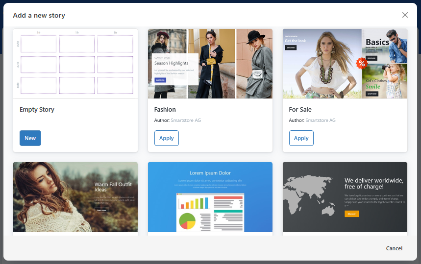
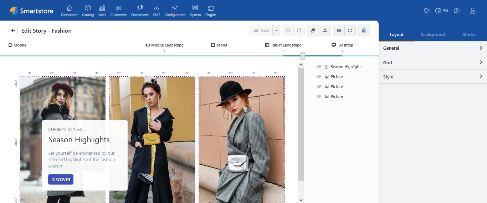
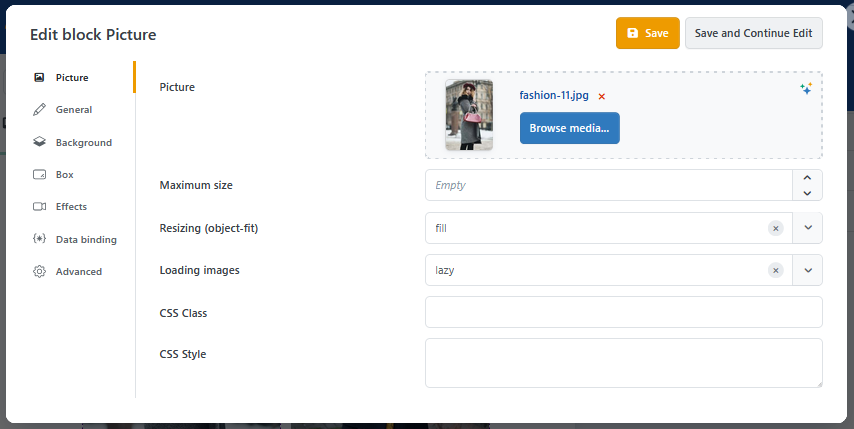
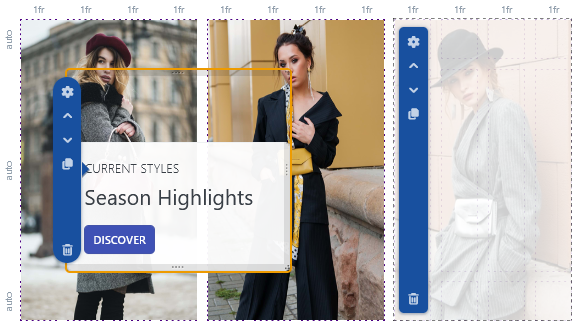
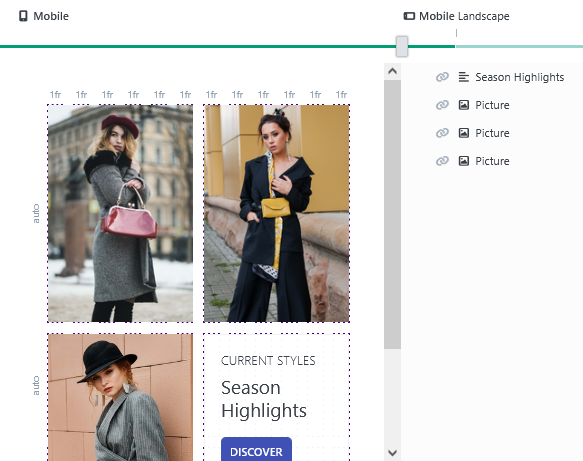
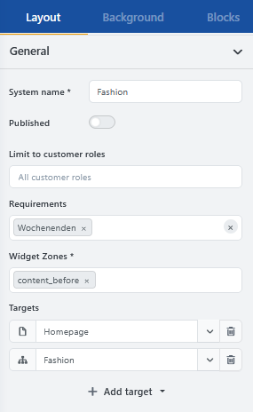

# Page Builder

> Create content quickly and easily using drag and drop

The **Page Builder** lets you create visually designed content areas for your store. Text, images, videos, and product presentations can be combined into banners, promotional areas, or complete landing pages without requiring HTML or CSS knowledge.


The available blocks and features depend on the plugins that are installed.


## Basic concepts

Content created with the Page Builder is called a **story**. A story can be a single teaser, a larger page section, or a complete landing page.

Stories consist of **blocks**. Each block contains a specific type of content, such as text, an image, a video, or a product list. For an overview, see [Blocks](pagebuilder/blocks.md).

The positions and sizes of blocks are controlled using a **grid**. For more information, see [Working with the grid](pagebuilder/grid.md).

## Opening the Page Builder

In the backend, go to **CMS** &rarr; **Page Builder**.

The overview displays the existing stories. From here, you can create new stories and open, duplicate, or manage existing content.

## Creating a story

1. Click **Add new**.
2. Select an empty story or a suitable template.
3. Enter a meaningful name.
4. Save the story.
5. Open the story for editing.


We recommend starting with an existing template. Replace the included text and images first, then adjust the layout.


## Getting to know the user interface

In the editor, you modify the structure, content, and appearance of your story.

The main areas include:

- the workspace with the grid,
- the toolbox with blocks and settings,
- the overview of blocks used in the story,
- the screen-size selector,
- the controls for saving and displaying the preview.

For a detailed description of the workspace, see [User interface](pagebuilder/editor.md).

## Adding content

Open the available block selection in the toolbox. Then drag the desired block to an empty position in the grid.

To edit a block:

1. Select the block in the workspace.
2. Open its settings.
3. Enter or select the desired content.
4. Adjust its appearance and spacing if necessary.
5. Save your changes.

Depending on the block, you can format text, select images, assemble products, or embed videos. For information about the available block types and their main settings, see [Blocks](pagebuilder/blocks.md).

Images, videos, and other files are selected using the [Media Manager](mediamanager.md). For information about uploading and organizing your own files, see [Managing files and folders](mediamanager/files-and-folders.md).

## Designing the layout

The grid divides the story into rows and columns. Within this grid, you can place, move, and resize blocks.

Start with a simple structure. Complex overlaps and different layouts for individual screen sizes can be added later.

For more information about structuring a story, see [Working with the grid](pagebuilder/grid.md).

## Checking the display on different devices

The Page Builder supports different screen sizes. Start with the mobile view and then check the result at larger resolutions.

Pay particular attention to:

- the order of the content,
- the readability of text,
- image cropping,
- the size and position of buttons,
- sufficient spacing between elements.

Check the result regularly in **Preview mode**. The preview displays the story without the editing grid and includes the intended media and effects.

## Placing the story in the store

For a story to appear in the store, it needs a target page and a position on that page.

The position is defined by a **widget zone**. Widget zones are predefined areas on store pages in which content or widgets can be rendered.

For more information about selecting and using these positions, see [Widget zones](../content-management/widget-zones.md).


If a story does not appear in the store, check its publication status, selected target page, and assigned widget zone.


## Publishing a story

Before publishing, check the following:

- Is all text complete and correct?
- Are the images displayed at a sufficient quality?
- Do links and buttons work?
- Is the layout suitable for mobile devices and desktop screens?
- Are the target page and widget zone correct?
- Has a publication period been configured, if required?

Then enable **Published** and save the story. Finally, check the result directly in the store.

## Extensions and integrations

The Page Builder can be extended with additional Smartstore modules and features. Depending on the installed plugins, additional blocks, content sources, or editing options may be available.

For an overview of supported extensions and how to use them, see [Integrations](pagebuilder/integrations.md).

## Further documentation

- [User interface](pagebuilder/editor.md)
- [Blocks](pagebuilder/blocks.md)
- [Working with the grid](pagebuilder/grid.md)
- [Integrations](pagebuilder/integrations.md)
- [Widget zones](../content-management/widget-zones.md)
