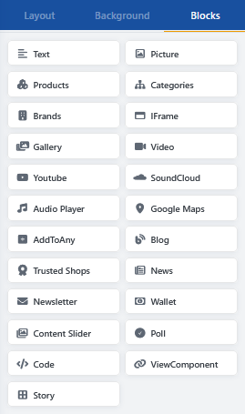
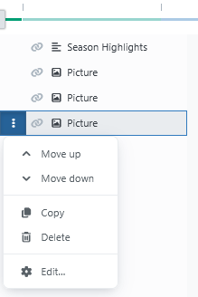

# Using blocks

Blocks are the individual content elements of a story. Each block performs a specific task, such as displaying text, embedding an image, or presenting products.

The available blocks depend on the plugins that are installed and licensed.

## Adding a block

1. In the Page Builder editor, open the **Blocks** area.
2. Drag the desired block to an empty position in the grid.
3. Select the inserted block.
4. Click **Edit** or the gear icon to open its content settings.
5. Save the story.


A newly created story must be saved before you can add blocks.


## Block types

### Text

The **Text** block displays headings, taglines, introductory text, body text, icons, and buttons. The individual text elements can be formatted independently.

A button requires at least display text or an icon as well as a link target. Use heading tags deliberately to preserve the semantic structure of the page.

The Text block also supports [data binding](integrations.md#binding-content-to-catalog-data).

### Picture

The **Picture** block displays a single image from the Media Manager. You can limit the image size, adjust its presentation, and add a link to the block.

Check the image crop at every screen size. For more information about uploading and organizing images, see the [Media Manager](../mediamanager.md).

The Picture block also supports [data binding](integrations.md#binding-content-to-catalog-data).

### Products

The **Products** block presents products as a list, grid, or slider. Products can be selected manually or determined from a category.

Depending on the display type, you can specify the number of entries and columns, among other options. Information such as price, short description, rating, manufacturer, delivery time, SKU, or buttons can also be shown or hidden.

### Categories

The **Categories** block presents selected categories as a list, grid, or slider. It is suitable for a topic overview or as an entry point to important product ranges.

Use meaningful names and images for the underlying categories because the block retrieves this catalog data.

### Brands

The **Brands** block displays selected manufacturers as a list, grid, or slider. You can use it to create brand worlds or a compact brand overview.

The displayed names, images, and links are retrieved from the respective manufacturer data.

### Gallery

The **Gallery** block combines multiple images or videos into a media gallery. Depending on its configuration, the media can be presented as a list, grid, or slider and opened in an enlarged view.

Prepare images with consistent aspect ratios whenever possible to create a balanced and consistent gallery.

### Video

The **Video** block embeds a video file from the Media Manager. You can configure files for different browser formats, a preview image, the aspect ratio, and player controls, among other options.

Use MP4 as the primary format whenever possible and check the file size and loading time.

### YouTube

The **YouTube** block embeds a YouTube video using its URL or video ID. Depending on the settings, you can adjust the aspect ratio, start position, and playback behavior, among other options.

When embedding external videos, take your store's privacy and consent configuration into account.

### Audio Player

The **Audio Player** block plays an audio file from the Media Manager. It is suitable for audio samples, interviews, or supplementary product information.

Check whether the selected file format is supported by the intended browsers.

### SoundCloud

The **SoundCloud** block embeds a SoundCloud track, playlist, or profile using the complete SoundCloud URL.

Because the content is loaded from an external service, consider the availability of that service as well as your privacy and consent configuration.

### Newsletter

The **Newsletter** block provides Smartstore newsletter registration within a story. It can be used on landing pages or in promotional areas, for example.

Before publishing, test the complete registration process and verify the required privacy information.

### Google Maps

The **Google Maps** block displays a location based on its longitude and latitude. A valid Google Maps API key and a zoom level are also required.

Depending on the configuration, the Street View control can be shown or hidden. Take the privacy and consent configuration into account here as well.

### IFrame

The **IFrame** block displays an external page in an embedded area. To use it, enter the URL of the target page.

Whether a page can be embedded depends on its security settings. Not every external website permits display in an IFrame.

### Story

The **Story** block inserts an existing story into another story. This allows recurring content areas to be maintained centrally and used in multiple places.

Avoid unnecessarily deep nesting. It makes editing and troubleshooting display or visibility issues more difficult.

### Code

The **Code** block embeds custom HTML, CSS, or JavaScript. It is intended for custom content that cannot be implemented using the other blocks.

### ViewComponent

The **ViewComponent** block embeds a ViewComponent provided by a developer. Which components can be used and which parameters are required depend on the respective implementation.


Use the **Code**, **IFrame**, and **ViewComponent** blocks only when you understand the content and its technical impact. Incorrect or untrusted code can affect the appearance, security, and operation of the store.


## Blocks from other plugins

Installed plugins can add their own content types to the block selection. Depending on installation and licensing, blocks for the following content may be available:

- blog posts, news, FAQs, or polls,
- a Content Slider,
- social sharing features,
- Trusted Shops content,
- wallet or credit features,
- additional banners or slide-ins.

These blocks are provided by their respective plugins. Their settings and requirements therefore differ from the Page Builder's standard blocks.

For more information about connections to Smartstore features and external services, see [Integrations](integrations.md).

## Selecting and editing a block

Click a block in the workspace. The selected block is highlighted and can be edited using its actions.

Alternatively, select the block in the Block Manager. This is particularly helpful when several blocks overlap.

Depending on the block, the following actions are available:

- **Edit** or gear icon: Opens the content settings.
- **Move up** or **Move down:** Changes the display order.
- **Copy:** Creates a copy of the block.
- **Delete:** Removes the block from the story.

## Positioning and resizing a block

Drag a block to the desired position in the grid. To resize it, drag one of the displayed edges or corner handles.

The available position and size are determined by the rows and columns of the grid. For more information, see [Working with the grid](grid.md).

## Common settings

In addition to its actual content, a block can have general settings.

### Visibility

You can show or hide a block for individual screen sizes. This makes it possible to provide different content for mobile devices and desktop screens, for example.

Check hidden blocks at every screen size. If visibility has not been specified, the setting can be inherited from the preceding smaller resolution level.

### Alignment and order

You can align the content horizontally and vertically within the block. The display order determines which block appears in front of or behind other blocks when they overlap.

### Background and box

Depending on the design, you can use colors, images, gradients, spacing, borders, and shadows. Use effects sparingly and ensure sufficient contrast between the background and text.

### Effects

Fade-in and hover effects may be available for blocks. Some effects are only displayed completely in Preview mode or directly in the store.

### Data binding

Supported Text and Picture blocks can retrieve data from a product, category, or manufacturer. The configured placeholders are replaced with the corresponding values when the block is rendered.

For more information, see [Integrations](integrations.md#binding-content-to-catalog-data).
