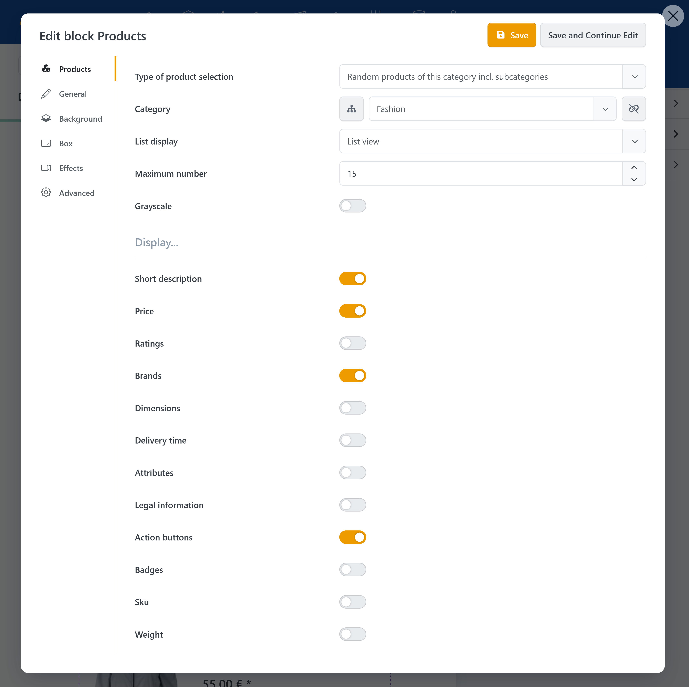
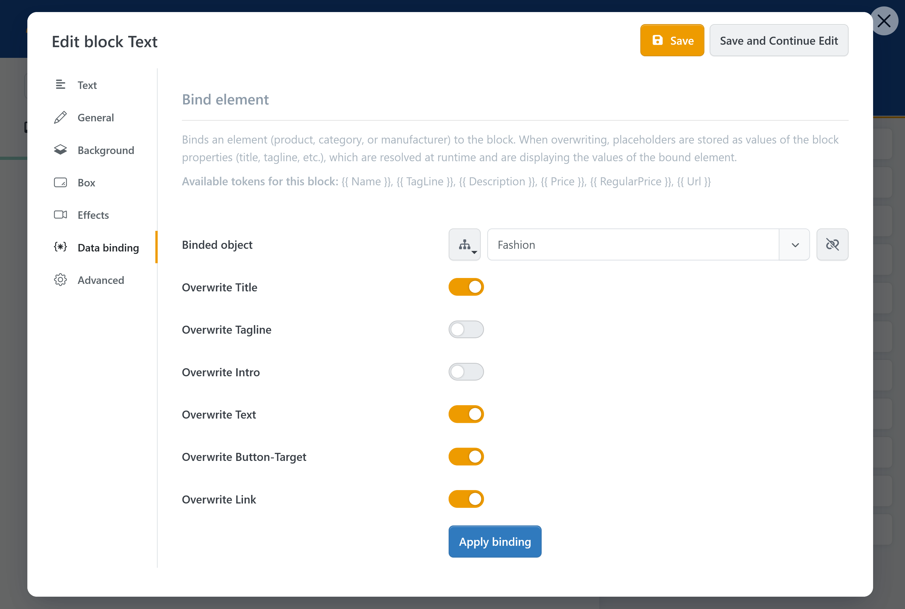

# Integrations

The Page Builder uses content and features from different areas of Smartstore. External services or technical components can also be embedded.


The available integrations and blocks depend on the installed plugins, configuration, user permissions, and, where applicable, licensing.


## Media Manager

Picture, Gallery, Video, and Audio Player blocks access files in the Smartstore Media Manager. You can upload, organize, and select files for use in the store there.

For more information, see [Media Manager](../mediamanager.md) and [Managing files and folders](../mediamanager/files-and-folders.md).


When exporting a story, its media can be included as associated resources. Nevertheless, check an imported story for missing files and invalid links.


## Displaying catalog content

Use the **Products**, **Categories**, and **Brands** blocks to include existing catalog content in a story.

Depending on the block, you can select entries and present them as a list, grid, or slider. Changes to the underlying catalog data are reflected in the output.

## Binding content to catalog data

Supported Text and Picture blocks can be bound to a product, category, or manufacturer. Block properties are populated with placeholders that are replaced with values from the selected catalog entity when rendered.

Data binding is useful for connecting a designed teaser to a product name, image, or link, for example.

To configure data binding:

1. Open the settings of a supported block.
2. Open the **Data binding** tab.
3. Select a product, category, or manufacturer as the source.
4. Apply the data binding. Matching block properties are populated with the intended placeholders.
5. Save the block and check the result in Preview mode.

## Rendering stories in widget zones

A published story is rendered in one or more widget zones. You also specify the target pages to which the assignment applies.

Depending on the configuration, the following page types can be used as targets:

- pages and topics,
- URLs,
- categories,
- manufacturers,
- products.

A story can be assigned to multiple widget zones and target pages. **Display order** determines the sequence when several stories use the same widget zone.

For more information about positioning, see [Widget zones](../../content-management/widget-zones.md).

## Restricting visibility

Stories can be restricted to specific stores or customer roles. Visibility rules can also be assigned.

Test restrictions with a suitable account. A story may be visible in the editor even though it is hidden in the frontend for the current store or customer role.


Restrict a new story to the Administrators role while setting it up. This lets you test the published story on its actual target page without making it visible to other visitors. Remove or change the restriction only after testing has been completed successfully.


## Newsletter registration

The **Newsletter** block provides Smartstore newsletter registration within a story. Use it to add a registration option to an existing landing page or promotional area.

## External media and services

### YouTube

The **YouTube** block embeds a video using a YouTube URL or video ID. Depending on the settings, display and playback options can be adjusted.

### SoundCloud

The **SoundCloud** block embeds a complete SoundCloud URL. The source can be a track, playlist, or profile, for example.

### Google Maps

The **Google Maps** block displays a location based on its coordinates. A valid Google Maps API key must be configured.

### IFrame

The **IFrame** block displays an external page within the story. Whether embedding works also depends on the security settings of the target page and browser.


External content may set additional cookies or transfer personal data. Take your privacy and consent configuration into account when embedding it.


## Embedding an existing story

Use the **Story** block to include an existing story in another story. This is useful for recurring content areas that should be maintained centrally.

Avoid unnecessarily deep nesting. It makes editing and troubleshooting display or visibility issues more difficult.

## Technical extensions

The **Code** and **ViewComponent** blocks are intended for technical extensions:

- **Code** embeds custom HTML, CSS, or JavaScript.
- **ViewComponent** uses a component provided by a developer.

Installed modules can also provide their own block types for the Page Builder. These then appear in the block selection.


Custom code and individual components should only be embedded by appropriately qualified personnel and should be tested again after store or theme updates.


For a complete overview of the standard content elements, see [Using blocks](blocks.md).
