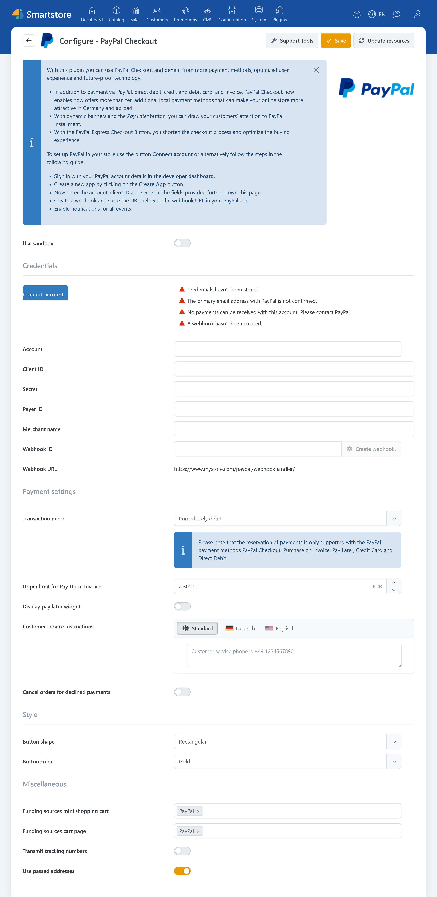

# PayPal

The **PayPal** plugin integrates PayPal Checkout and additional payment methods provided by PayPal with Smartstore. In addition to standard PayPal payments, it supports express payments in the cart, local payment methods, credit and debit cards, Pay upon Invoice, Apple Pay, and Google Pay.

Depending on the payment method, payments can be captured immediately or authorized first. Full and partial refunds and payment status updates through PayPal webhooks are also supported.


The payment methods actually offered depend on factors such as the PayPal merchant account, country, currency, order value, device, and the properties of the individual transaction. For a comparison with other payment plugins, see [Payment Providers and Payment Methods](paymentproviders.md).


## Supported payment methods

After configuration, the required payment methods must be enabled under **Configuration > Payment methods**. Enabling a payment method in Smartstore does not guarantee that PayPal will make it available for every merchant account and transaction.

The plugin provides the following payment methods:

- PayPal Checkout
- Pay upon Invoice
- SEPA Direct Debit
- PayPal Pay Later
- Credit and debit cards
- Google Pay
- Apple Pay
- Trustly
- Bancontact
- BLIK
- eps
- iDEAL
- MyBank
- Przelewy24

For more information about enabling, sorting, and restricting payment methods, see [Setting up Payment Methods](../configuration/setting-up-payment-methods.md).

## Requirements

For live operation, you need a suitable PayPal merchant account with a confirmed primary email address and permission to receive payments. You also need valid credentials for a PayPal app, a configured webhook, and a publicly accessible store domain using HTTPS with a valid SSL certificate.


You can use the PayPal sandbox for setup and testing. The sandbox and live environments use separate credentials and must be configured independently.


## Configuration

The configuration connects Smartstore to your PayPal merchant account. It also defines payment behavior, the appearance of PayPal buttons, and additional features such as transmitting tracking numbers.

### Credentials and account connection

| Setting | Description |
|---|---|
| **Use sandbox** | Uses the PayPal test environment. For live operation, disable this option and configure the live PayPal connection. |
| **Account** | Name or identifier of the connected PayPal account. |
| **Client ID** | Public identifier of the PayPal app. PayPal buttons and payment forms cannot be loaded without a Client ID and Secret. |
| **Secret** | Secret key for server-to-server communication with PayPal. Keep it confidential and do not publish it. |
| **Payer ID** | Identifier of the PayPal merchant account. It is used by the Support Tools and for risk assessment, among other purposes. |
| **Merchant name** | Required in particular for Pay upon Invoice and its associated risk assessment. This field is mandatory and must not contain spaces. |
| **Webhook ID** | Identifier of the webhook configured with PayPal. Smartstore uses it to validate incoming PayPal notifications. |
| **Webhook URL** | Read-only HTTPS address of the PayPal endpoint in the store. When configuring the webhook manually, enter this address as the webhook URL in the PayPal app. |

Use **Connect account** to start the guided PayPal account connection. After successful sign-in, the plugin imports the required credentials. The button is displayed as long as no Client ID and Secret have been entered.

Use **Create webhook** after saving the credentials to configure a webhook for the displayed store address. If the plugin finds a matching webhook, it imports its ID.


Do not mix sandbox and live credentials. Before going live, also verify that the primary PayPal email address is confirmed and that the merchant account can receive payments.


### Payment settings

| Setting | Description |
|---|---|
| **Transaction mode** | Determines whether the payment is captured immediately or authorized first. |
| **Upper limit for Pay Upon Invoice** | Defines the maximum order value for which Pay upon Invoice can be offered. The order value must also be above EUR 5, and the currency must be EUR. Final approval is provided by PayPal or Ratepay. |
| **Display pay later widget** | Displays a PayPal Pay Later or installment payment message on product detail pages. |
| **Customer service instructions** | Localizable information about how to contact customer service, such as a telephone number. This information is required in particular for Pay upon Invoice and must be provided. |
| **Cancel orders for declined payments** | Cancels an order if PayPal declines the payment. If this option is disabled, the plugin sets the payment status to **Pending**. |

### Display and additional settings

| Setting | Description |
|---|---|
| **Button shape** | Defines the shape of the PayPal buttons. |
| **Button color** | Defines the color of the PayPal buttons. |
| **Funding sources mini shopping cart** | Determines which express payment options may appear in the slide-out mini cart. |
| **Funding sources cart page** | Determines which express payment options may appear on the full cart page. |
| **Transmit tracking numbers** | Sends new or changed tracking numbers for PayPal orders to PayPal. The transmission is recorded in the order notes. |
| **Use passed addresses** | Adds billing and shipping addresses returned by PayPal to the customer account if they do not already exist. |

The following express payment options can be selected for the cart and mini cart:

- PayPal
- SEPA
- Pay Later
- Google Pay
- Apple Pay

Selecting an option does not guarantee that it will be displayed. The payment method must be enabled in the store and available for the specific transaction, country, and device.


The settings can be saved separately for individual stores. In a multi-store system, select the required store scope before configuring the plugin. For more information, see [Multi-Store Configuration](../configuration/general-settings-preferences/defining-the-scope-of-settings.md).


## Account status and Support Tools

The **Support Tools** allow Smartstore to query the status of the connected PayPal account. The results are displayed in a pop-up and include:

- merchant name and Payer ID
- status of the primary email address
- permission to receive payments
- PayPal products enabled for the account
- available PayPal capabilities
- status of each capability
- presence of a stored Webhook ID.

The Payer ID, Client ID, and Secret must be entered before the status can be queried.


The **Webhook was created** status means that a Webhook ID is stored in the plugin configuration. The Support Tools do not check whether the webhook is still active with PayPal.


## Automatic capture and authorization

With **Capture immediately**, the amount is captured during payment processing. This option is suitable for most standard order processes.

With **Authorize**, the amount is reserved first. The merchant can then capture it in Smartstore's order management. This option can be useful when an order or product availability needs to be reviewed before capture.

The plugin supports authorization for the following payment methods:

- PayPal Checkout
- Pay upon Invoice
- Pay Later
- Credit and debit cards
- SEPA Direct Debit.

Other local payment methods are processed immediately. Authorizations also cannot be held indefinitely. The applicable time limit is determined by PayPal and the payment method used.

For more information about general automatic capture settings, see [Payment](../configuration/general-settings-preferences/payment.md).

## Pay Later on product pages

When **Display pay later widget** is enabled, PayPal can display a dynamic Pay Later or installment payment message on product detail pages.

PayPal determines whether the message is displayed and what it contains based on the currency, amount, country, and merchant account.

After a customer changes the language, the embedded PayPal message may remain in the previously selected language. In this case, the page must be reloaded completely.

## Passed addresses

After a successful sign-in, PayPal can return billing and shipping addresses. When **Use passed addresses** is enabled, Smartstore adds these addresses to the customer account if a matching address does not already exist.

PayPal may not provide all the fields required for an address in the store. In particular, a telephone number may be missing. Disable this option if only addresses that satisfy all store validation requirements should be saved in the customer account.

The addresses required for the current order can be processed during checkout independently of this setting.

## Managing payments

Depending on the payment method used and the current payment status, the PayPal plugin supports the following actions in Smartstore's order management:

- capturing a previously authorized payment
- canceling or voiding an authorization
- issuing a full refund
- issuing a partial refund.

Not every action is available for every PayPal payment method. Local payment methods, for example, are processed immediately and cannot be captured later.

For more information about the order view, see [Managing Orders](../sales/managing-orders.md). For a general overview, see [Payment Plugin Features](../configuration/setting-up-payment-methods.md#payment-plugin-features).

## Transmitting tracking numbers

When **Transmit tracking numbers** is enabled, the plugin sends newly entered tracking numbers for PayPal orders to PayPal.

If a tracking number is changed, the plugin removes the previous association and then transmits the new number. Successful transmissions and errors are recorded in the internal order notes.

Include the transfer of shipping and tracking information in your privacy notices.

## Cookies and privacy

When a corresponding PayPal payment method is active, the plugin registers the PayPal service as **required** in the Smartstore Cookie Manager. The provided notice explains that PayPal uses cookies to display and process the payment transaction.

Depending on the enabled payment methods, the plugin embeds content from the following providers:

| Provider or service | Purpose |
|---|---|
| `www.paypal.com` | PayPal JavaScript SDK for buttons, payment forms, availability checks, card fields, and PayPal, SEPA, and Pay Later features. |
| `c.paypal.com` | PayPal FraudNet for fraud prevention and risk assessment with Pay upon Invoice. |
| `pay.google.com` | Google Pay interface when Google Pay is enabled. |
| `applepay.cdn-apple.com` | Apple Pay interface when Apple Pay is enabled. |

The plugin assigns these scripts to the **Required** category. For browsers without JavaScript, Pay upon Invoice may additionally load an invisible image from PayPal.

According to the plugin, alternative local payment methods such as BLIK, iDEAL, and Przelewy24 do not require PayPal cookies on the store page itself. After the customer is redirected, the cookie and privacy policies of the respective payment service provider apply.

During payment processing, customer, address, order, payment, and technical session data may be transferred to PayPal and participating payment service providers. Pay upon Invoice additionally processes the customer's date of birth and telephone number. If tracking number transmission is enabled, shipping information is also sent to PayPal.

For card payments, the card number, expiration date, and security code are entered in fields provided by PayPal. The store does not process the actual card data directly.


The classification as **required** is the plugin's technical default. Verify whether this classification and the provided information are legally sufficient for your specific store and the payment methods offered.


Include PayPal, Ratepay where applicable, the external scripts used, the categories of data transferred, and possible international data transfers in the store's privacy policy.

For more information about managing cookie notices, see [Cookie Manager](../configuration/cookie-manager.md).

## Further information

- [Payment Providers and Payment Methods](paymentproviders.md)
- [Setting up Payment Methods](../configuration/setting-up-payment-methods.md)
- [Payment settings](../configuration/general-settings-preferences/payment.md)
- [Managing Orders](../sales/managing-orders.md)
- [Multi-Store Configuration](../configuration/general-settings-preferences/defining-the-scope-of-settings.md)
- [Cookie Manager](../configuration/cookie-manager.md)
