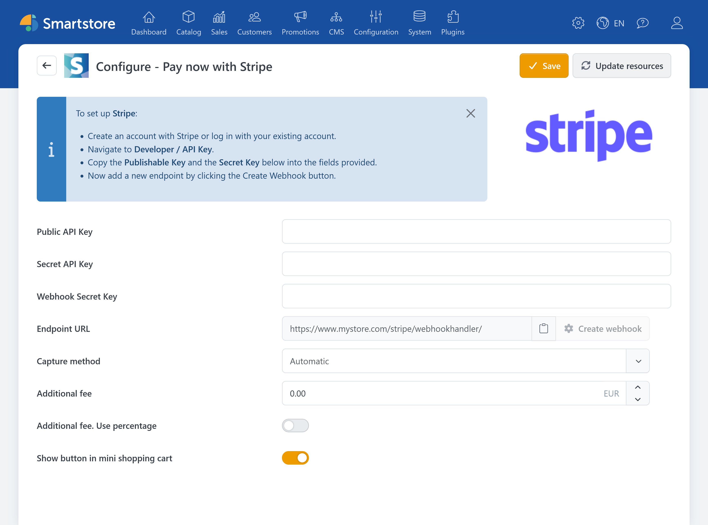

# Stripe

The **Stripe** plugin integrates the Stripe payment provider with Smartstore. Customers pay through a payment interface provided by Stripe. The plugin supports Stripe Elements, additional customer authentication such as 3-D Secure, express checkout in the cart, automatic or manual capture, and full or partial refunds. Payment statuses are synchronized with Smartstore through Stripe webhooks.


The payment methods actually offered depend on factors such as the Stripe account, country, currency, device, and the properties of the individual transaction. For a comparison with other payment plugins, see [Payment Providers and Payment Methods](paymentproviders.md).


To use the plugin, you need:

- an active Stripe account
- the corresponding API keys
- a webhook signing secret.

The store must be publicly accessible over HTTPS, and the **Stripe Elements** payment method must be active in Smartstore. For more information about activating, sorting, and restricting payment methods, see [Setting up Payment Methods](../configuration/setting-up-payment-methods.md).

## Configuration

The configuration connects Smartstore to your Stripe account and defines the basic payment behavior. The main settings include the Stripe credentials, webhook validation, capture method, and optional payment fees. You can also specify whether to display the Stripe button in the mini cart.

| Setting | Description |
|---|---|
| **Public key** | The publishable key from the Stripe Dashboard. |
| **Secret key** | The secret API key for server-to-server communication between Smartstore and Stripe. Keep this key confidential and do not publish it. |
| **Webhook Secret Key** | The signing secret of the webhook endpoint configured in Stripe. It allows Smartstore to update an order's payment status even if the response does not arrive directly in the customer's browser. |
| **Endpoint URL** | The URL provided by Smartstore for Stripe webhooks. Enter this URL for the webhook endpoint in the Stripe Dashboard. |
| **Capture method** | Determines whether successful payments are captured automatically or authorized first. |
| **Additional fee** | Defines a surcharge for payments made with Stripe. The fee is shown to the customer as part of the order calculation during checkout. |
| **Additional fee. Use percentage** | Calculates the entered fee as a percentage based on the cart. If this option is not enabled, the value is used as a fixed amount in the store's primary currency. |
| **Show button in mini shopping cart** | Also displays the Stripe express checkout button in the slide-out mini cart. |


Payment surcharges may be restricted or prohibited depending on the country, customer group, and payment method. Check the requirements that apply to your store before enabling an additional fee.


### Automatic and manual capture

With **Automatic** capture, the amount is captured immediately after successful payment confirmation. This option is suitable for most standard order processes.

With **Manual** capture, Stripe initially authorizes the payment. The merchant can then capture the amount in Smartstore's order management. This option can be useful when an order needs to be reviewed before capture. Authorizations cannot be held indefinitely. The applicable time limit is determined by Stripe and the payment method used.

For more information about general automatic capture settings, see [Payment](../configuration/general-settings-preferences/payment.md).

## Managing payments

The Stripe plugin supports further payment processing directly in Smartstore's order management. Depending on the current payment status, the following actions are available:

- capturing a previously authorized payment,
- issuing a full refund,
- issuing a partial refund,
- canceling a payment that has not yet been completed.

The Stripe PaymentIntent ID is stored with the order as the authorization transaction ID. For a refund, the refund ID generated by Stripe can also be stored.

Refunds initiated directly in the Stripe Dashboard can be reported back to Smartstore through the corresponding webhook.

For more information about the order view, see [Managing Orders](../sales/managing-orders.md). For an overview of the management features provided by payment plugins, see [Payment Plugin Features](../configuration/setting-up-payment-methods.md#payment-plugin-features).

## Cookies and privacy

When Stripe is active as a payment provider, Smartstore loads the external Stripe JavaScript from `https://js.stripe.com/v3/`. The associated service is treated as technically required in the Cookie Manager because it is needed to display and process the payment.

Payment processing transfers data to Stripe. Include Stripe in your store's privacy policy and inform customers about the nature and purpose of the data transfer.

For more information about managing cookie notices, see [Cookie Manager](../configuration/cookie-manager.md).

## Further information

- [Payment Providers and Payment Methods](paymentproviders.md)
- [Setting up Payment Methods](../configuration/setting-up-payment-methods.md)
- [Payment settings](../configuration/general-settings-preferences/payment.md)
- [Managing Orders](../sales/managing-orders.md)
- [Cookie Manager](../configuration/cookie-manager.md)
- [Payment methods supported by Stripe](https://docs.stripe.com/payments/payment-methods)
