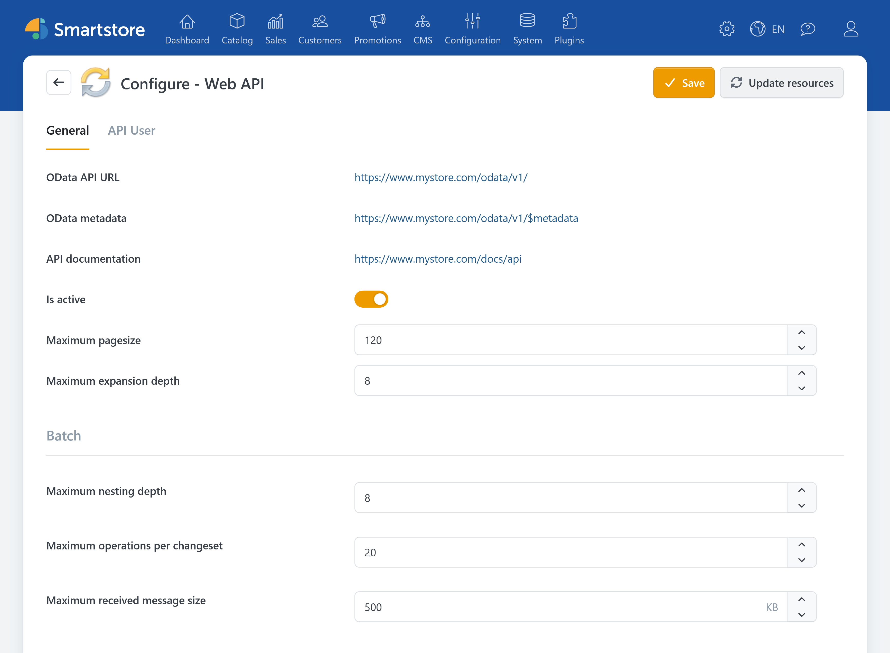
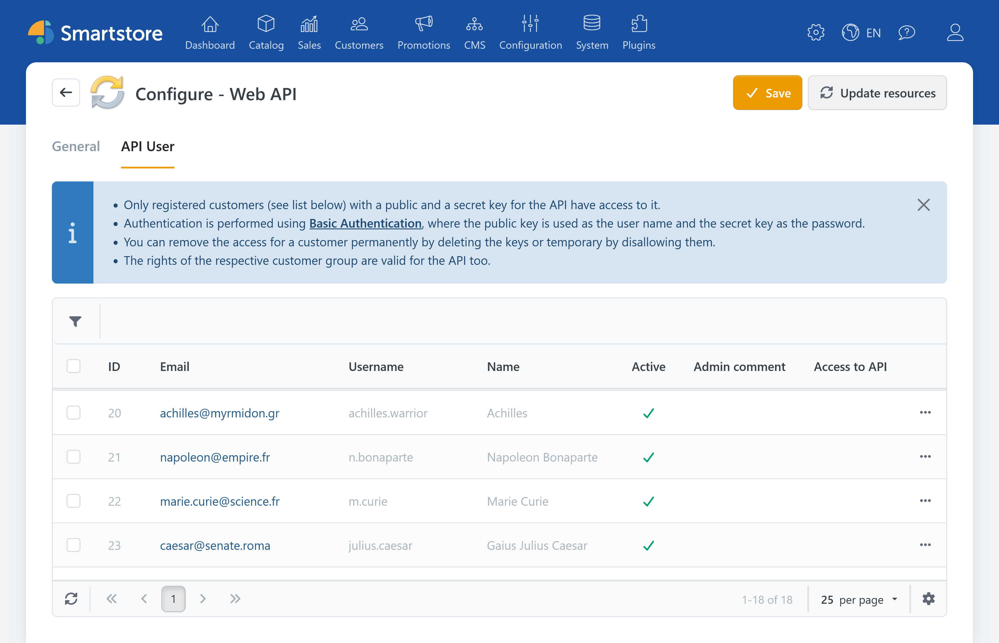
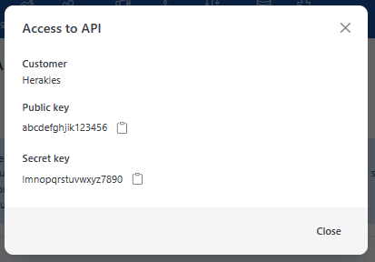
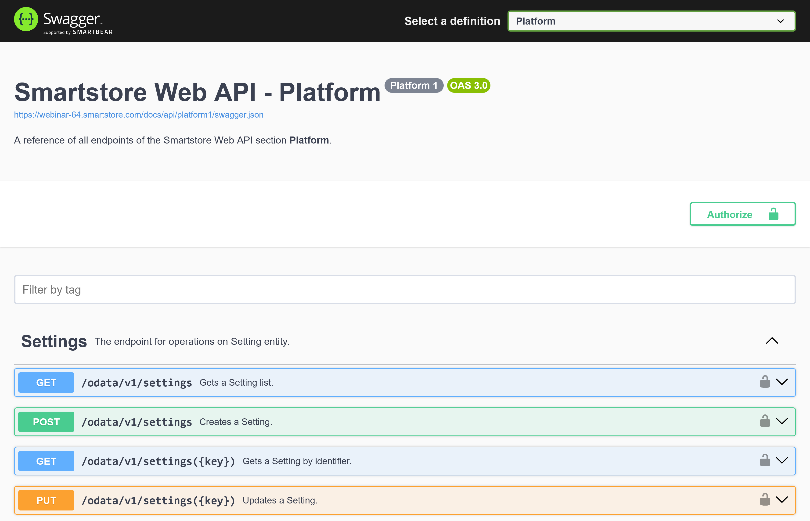

# Setting Up and Managing the Web API

The **Smartstore Web API** allows external applications to retrieve and modify data in your store. Typical use cases include connecting ERP systems, mobile applications, marketplaces, or custom integrations.

The Web API is based on **OData**. The available data and functions depend on the Smartstore version and the installed plugins.


This page explains how to set up and manage the Web API in the administration area. For information about developing an API client, see the [Web API developer documentation](https://docs.smartstore.com/developer/framework/web-api).


## Prerequisites

Before external applications can access the Web API, the following requirements must be met:

- The Web API is enabled in the plugin configuration.
- An API key pair has been generated for a registered customer.
- API access is allowed for this customer.
- The customer's customer roles have the required access permissions.
- Production requests are sent over HTTPS.

For information about installing and managing plugins, see [Installing Plugins](installing-plugins.md) and [Managing Plugins](managing-plugins.md).

## Opening the Web API

In the administration area, go to **Plugins > Manage Plugins**. Find the **Web API** plugin and click **Configure**.

The configuration page has two tabs:

| Tab | Purpose |
|---|---|
| **General** | Enable the Web API, view addresses, and configure query limits |
| **API User** | Generate API keys and manage access for individual customers |

## General settings

The **General** tab contains the Web API addresses and settings for OData queries and batch requests.

### API addresses

Smartstore displays the complete addresses for your installation. The following paths are used by default:

| Display | Default path | Meaning |
|---|---|---|
| **OData API URL** | `/odata/v1/` | Base address for API requests |
| **OData metadata** | `/odata/v1/$metadata` | Machine-readable description of the available data model |
| **API documentation** | `/docs/api` | Interactive Swagger documentation for the available endpoints |
| **OData endpoints** | `/$odata` | Technical overview of the OData mappings, displayed only in development environments |

Applications can use **OData metadata** to read the current Entity Data Model, or EDM. The metadata can be used to generate client code, among other things.

The **API documentation** shows the endpoints available in your installation. It is therefore more reliable than a static list, because other plugins can provide additional API resources.

For more information, see [Metadata, Swagger, and Tools](https://docs.smartstore.com/developer/framework/web-api/help-and-tools).

### Enabling the Web API

Use **Is active** to specify whether the Web API accepts requests.

If the setting is disabled, API requests are rejected. Normal store operation is not affected.


Do not enable the Web API until you have prepared the required API users and access permissions.


### Setting query limits

Query limits protect the store from excessively large or deeply nested API requests.

| Setting | Default value | Meaning |
|---|---:|---|
| **Maximum pagesize** | 120 | Maximum number of records that can be requested using the OData `$top` option |
| **Maximum expansion depth** | 8 | Maximum nesting depth for relationships included using `$expand` |

If a list request does not specify `$top`, Smartstore automatically limits the response to the configured maximum page size.

Increasing these limits can place a greater load on the database and memory, and can increase response times. Change the values only when required by the connected application, then test the impact under realistic conditions.

For technical information about `$filter`, `$select`, `$expand`, `$skip`, `$top`, and other OData options, see [Web API in Detail](https://docs.smartstore.com/developer/framework/web-api/web-api-in-detail).

### Limiting batch requests

Batch requests allow an application to submit several API operations in a single request.

| Setting | Default value | Meaning |
|---|---:|---|
| **Maximum nesting depth** | 8 | Limits the nesting depth of recursive batch payloads |
| **Maximum operations per changeset** | 20 | Limits the number of write operations in one changeset |
| **Maximum received message size** | 500 KB | Limits the size of an incoming batch request |


The batch limits apply globally to the entire installation.


## Setting up API users

The Web API does not use separate technical user accounts. Instead, a public and a secret API key are assigned to a registered Smartstore customer.

Create a dedicated customer for each external application. This allows you to grant or revoke access individually and use the last access time to monitor activity.

For information about creating and editing customers, see [Managing Customers](../customers/managing-customers.md).

### Recommended procedure

1. Create a dedicated registered customer for the application you want to connect.
2. Assign one or more suitable customer roles to the customer.
3. Grant these customer roles only the required access permissions.
4. Open the **API User** tab in the Web API configuration.
5. Find the customer you created.
6. Click **Generate keys**.
7. Send the public and secret keys to the responsible person or application through a secure channel.
8. Test access with a read request first.
9. Test only the write operations that are actually required.


Whenever possible, do not use personal administrator accounts for integrations. A dedicated customer for each application makes it easier to grant minimum permissions and revoke individual access later.


### Generating keys

Click **Generate keys** for the required customer. Smartstore generates:

- a **public key**,
- a **secret key**.

The public key is used as the user name for Basic Authentication. The secret key is used as the password.

If the customer already has a key pair, generating new keys replaces the previous keys. An application using the old keys can no longer authenticate.


Treat the secret key like a password. Do not store it in publicly accessible files, source code, tickets, or unprotected logs.


### Managing API access

The following actions are available for each customer, depending on the current status:

| Action | Effect |
|---|---|
| **Generate keys** | Generates a new key pair and enables API access |
| **Show keys** | Displays the public and secret keys |
| **Don't allow** | Temporarily disables the existing API access |
| **Allow** | Enables previously disabled access again |
| **Delete keys** | Removes the key pair and permanently revokes access |

The **Last access** column shows when the credentials were last used successfully. Review this information regularly to identify access that is no longer required or activity that you did not expect.


A disabled account retains its key pair and can be allowed again later. If the keys are deleted, a new key pair must be generated before the account can be used again.


## Setting access permissions

A valid key pair does not grant unrestricted access to all store data. For API requests, Smartstore applies the customer roles and access permissions of the associated customer.

Access is checked at three levels:

| Level | Check |
|---|---|
| **Web API** | Is the plugin installed and the Web API enabled? |
| **API user** | Does the customer have valid keys, and is API access allowed? |
| **Endpoint** | Do the customer's roles include the access permission required for the specific operation? |

For example, a customer may be allowed to read products but not modify them if the assigned customer role has only the relevant read permission.

Apply the principle of least privilege when assigning permissions:

- Grant only the permissions required by the integration.
- Separate read and write access if different applications are used.
- Use a dedicated customer for each integration.
- Remove customer roles and permissions that are no longer required.
- Disable unused API access or delete its keys.

For more information, see [Managing Customer Roles](../customers/managing-customer-roles.md) and [Controlling Access Permissions](../configuration/controlling-access-permissions.md).

## Authentication

Smartstore uses **Basic Authentication** for the Web API:

- The public key is used as the user name.
- The secret key is used as the password.
- Both values are sent in the `Authorization` header with every request.
- Production requests must use HTTPS.


Basic Authentication does not encrypt the credentials. Security is provided by the encrypted HTTPS connection. Outside a local development environment, never use the Web API over unencrypted HTTP.


For details about the header format, Base64 encoding, and authentication errors, see [Authentication](https://docs.smartstore.com/developer/framework/web-api/authentication) in the developer documentation.

## Testing the connection with Swagger

The integrated Swagger interface is suitable for an initial connection test.

1. Open the **API documentation** address displayed on the configuration page.
2. Select an area such as **Catalog**, **Content**, **Identity**, or **Checkout**.
3. Click **Authorize**.
4. Enter the public key as the user name.
5. Enter the secret key as the password.
6. Confirm the authentication.
7. Start by opening a read-only `GET` endpoint.
8. Click **Try it out**, then click **Execute**.
9. Review the status code and response content.


Swagger sends real requests to your store. Use `POST`, `PUT`, `PATCH`, or `DELETE` only when the resulting change is explicitly intended.


The displayed areas and endpoints depend on your installation. Installed plugins can add further resources to the Web API.

## Rotating keys or revoking access

Generate a new key pair if:

- a key may have been exposed,
- an employee or service provider should no longer have access,
- credentials were accidentally published,
- an integration has moved to a new system,
- regular key rotation is required.

To disable access temporarily, select **Don't allow**. To revoke access permanently, select **Delete keys**.

## Troubleshooting

| Symptom | Possible cause and check |
|---|---|
| `401 Unauthorized` | Check whether the Web API is enabled, the keys are transmitted correctly, and API access is allowed for the customer. |
| `403 Forbidden` | Authentication may have succeeded, but the customer role does not have the access permission required for the endpoint. |
| `421 Misdirected Request` | The request was sent over HTTP. Use HTTPS. |
| Customer does not appear under **API User** | Check whether the account belongs to a registered, active, and non-deleted customer. |
| Request using `$top` is rejected | The requested value exceeds the configured maximum page size. |
| Request using `$expand` is rejected | The requested nesting exceeds the maximum expansion depth. |
| Batch request is rejected | Check the message size, nesting depth, and number of operations in the changeset. |
| An expected endpoint is missing | Check the Swagger documentation for your installation and whether the responsible plugin is installed. |
| Old keys no longer work | A new key pair may have been generated for the same customer, or the previous pair may have been deleted. |
| Access works only for certain endpoints | Compare the access permissions of the customer roles with the required operations. |

For detailed information about authentication responses and error codes, see the [Authentication developer documentation](https://docs.smartstore.com/developer/framework/web-api/authentication).

## Related documentation

### User documentation

- [Installing Plugins](installing-plugins.md)
- [Managing Plugins](managing-plugins.md)
- [Managing Customers](../customers/managing-customers.md)
- [Managing Customer Roles](../customers/managing-customer-roles.md)
- [Controlling Access Permissions](../configuration/controlling-access-permissions.md)
- [Defining the Scope of Settings](../configuration/general-settings-preferences/defining-the-scope-of-settings.md)

### Developer documentation

- [Web API: Overview](https://docs.smartstore.com/developer/framework/web-api)
- [Prerequisites](https://docs.smartstore.com/developer/framework/web-api/prerequisites)
- [Authentication](https://docs.smartstore.com/developer/framework/web-api/authentication)
- [Web API in Detail](https://docs.smartstore.com/developer/framework/web-api/web-api-in-detail)
- [Metadata, Swagger, and Tools](https://docs.smartstore.com/developer/framework/web-api/help-and-tools)
- [Examples](https://docs.smartstore.com/developer/framework/web-api/examples)
- [Breaking Changes in Web API 5](https://docs.smartstore.com/developer/framework/web-api/breaking-changes-in-web-api-5)
