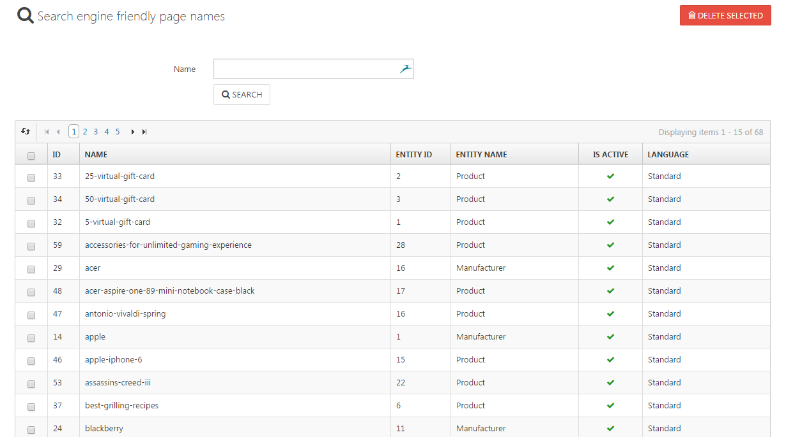

# Managing SEO Names

In this section, you'll get an overview of all assigned search engine friendly page names. You can delete one or more of them by selecting it/them and clicking on **Delete Selected**.

